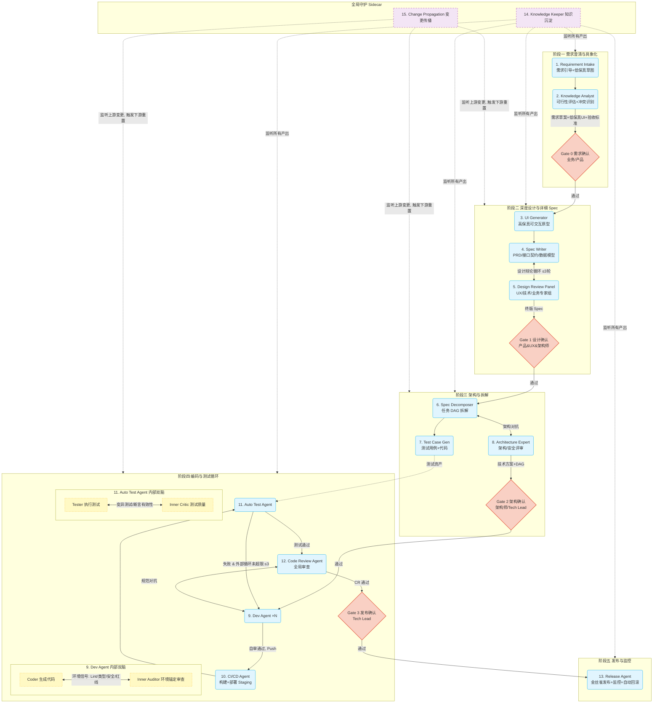

# AI Native 研发协同系统 · 多 Agent 编排架构与设计规格

> **文档定位**：工程蓝图向 · 面向架构师、研发负责人、Agent / 平台工程师
> **回答的问题**：系统怎么分层？有哪些 Agent、各自的契约是什么？怎么编排、怎么防死循环、怎么管上下文、怎么守门禁、数据模型长什么样？
> **配套文档**：`01 · 调研与立项报告`（为什么做，含全部外部数据出处）、`03 · 人机协同与指挥舱产品总览`（人怎么用）、`00 · 总纲与导读`（术语表）
> **版本**：v2.0

---

## 〇、阅读前提：本规格修正的三处逻辑问题

本版本在保持原始构想骨架（5 阶段、双脑、防死循环、HITL）的基础上，修正了早期草稿中的三处自相矛盾，使全篇逻辑自洽：

1. **"抛弃 LLM 互评" 与 "引入双脑互审" 的矛盾** → 收敛为 **环境锚定的 Critic**（§5）：Critic 的"通过/打回"判定必须由客观环境信号（编译、测试、变异得分、静态分析、安全扫描）背书，LLM 只做"生成"与"失败解释"，**不为自己打通过分**。
2. **Agent 编号与流程图不一致**（原图跳过了 Knowledge Analyst） → 重排为 **Orchestrator + 15 个 Agent** 的连续编号，且端到端流程图（§10）包含全部节点。
3. **Gate 体系前后不一**（一处 3 道门、一处 4 道门） → 统一为 **Gate 0–3 四道门**（§7），并给出与已落地前端规格（Gate 1/2/3）的映射。

---

## 一、设计公理与总体架构

### 1.1 五条设计公理

| # | 公理 | 工程含义 |
|---|---|---|
| A1 | **环境即裁判（Environment as Critic）** | 一切质量判定落到客观信号；LLM 不自评通过 |
| A2 | **双脑自审，上下文隔离** | Generator 与 Critic 拆分，Critic 只看产物+环境信号，看不到 Generator 思考过程 |
| A3 | **循环必有界，超限即降级** | 任何 Agent 循环都有最大轮次与熔断；不收敛则清理上下文/升级/转人 |
| A4 | **人在关键点掌控（HITL）** | 方向、设计、技术债、生产四条底线由人在 Gate 拍板；高危操作白名单+沙箱 |
| A5 | **上下文是一等公民** | 主动构建、隔离、压缩、清理上下文；不无差别堆料 |

### 1.2 三层架构 + 指挥舱

```
┌──────────────────────────────────────────────────────────────────────┐
│                      🖥️ MISSION CONTROL（指挥舱 / 人机协同界面）          │
│   需求价值流 · Agent 活动直播 · 协作拓扑 · 测试洞察 · 审批中心 · 效能仪表盘    │
│                         （详见 03 文档）                                  │
├──────────────────────────────────────────────────────────────────────┤
│                      🧠 CONTROL PLANE（控制面）                          │
│  Orchestrator(编排大脑) · 状态机 · DAG 调度 · 熔断引擎 · Gate 引擎          │
│  Context Builder · Event Bus · Knowledge Base(RAG+图谱) · MCP Gateway     │
├───────────────┬───────────────┬───────────────┬──────────────────────┤
│  Agent Matrix（执行面）：阶段化 15 Agent，含内部双脑与外部对抗               │
│  P1 需求(1,2) │ P2 设计(3,4,5) │ P3 拆解(6,7,8) │ P4 编码测试(9,10,11,12) │
│                         P5 交付(13)                                      │
├──────────────────────────────────────────────────────────────────────┤
│  🛰️ GLOBAL SIDECAR（全局守护，旁路监听 Event Bus）                        │
│        14. Knowledge Keeper(知识沉淀)   15. Change Propagation(变更传播)   │
├──────────────────────────────────────────────────────────────────────┤
│  ⚙️ WORKER NODES（执行节点，经 AITP/MCP 接入）                            │
│   Claude Code CLI │ Cursor/VSCode │ Codex/云端无头 │ Auto Agent(沙箱)      │
└──────────────────────────────────────────────────────────────────────┘
```

- **Control Plane（控制面）**：系统的"中枢神经"。负责状态机流转、DAG 调度、防死循环熔断、Gate 拦截、上下文构建、事件分发、知识检索。**本身不写代码**，只编排。
- **Agent Matrix（执行面）**：15 个阶段化 Agent，是"做事的手脚"，内部含双脑微循环、相互间含外部对抗循环。
- **Global Sidecar（全局守护）**：两个旁路 Agent，实时监听 Event Bus，跨阶段做知识沉淀与变更传播，不阻塞主流程。
- **Mission Control（指挥舱）**：面向人的全局可观测与审批界面（产品细节见 `03`）。
- **Worker Nodes（执行节点）**：真正运行 Agent 的载体——开发者的 IDE/CLI，或云端沙箱。系统是"大脑"，Worker 是"手脚"，二者通过 AITP/MCP 解耦（§3）。

---

## 二、Control Plane 控制面详解

### 2.1 Orchestrator（编排大脑，Agent #0）

采用 Anthropic 的 **Orchestrator-Workers** 模式[见 `01`]：中央 LLM 动态拆解任务、派发给 Worker Agent、汇总结果。但与纯自治多 Agent 不同，本系统的 Orchestrator 运行在**确定性状态机 + DAG**之上——*流程骨架是代码，节点内是 Agent*，以规避"Agent 间实时协调能力弱"的已知短板。

职责：① 推进需求状态机；② 调度 DAG（并行/串行）；③ 触发熔断与降级；④ 拦截 Gate；⑤ 调用 Context Builder 为每个 Agent 打包上下文；⑥ 维护全局 token / 成本预算。

### 2.2 需求状态机

```
draft ──> analyzing ──> designing ──> reviewing ──> approved
                                          │ (Gate1 打回)
                                          └──> designing
approved ──> decomposing ──> developing ──> testing ──> reviewing(code)
                 │(Gate2)        ↑              │
                 │               └──────────────┘ (外部循环, 测试失败回退)
                 ▼
            (Gate2 打回) 
testing/code-review 通过 ──> releasing ──(Gate3)──> done
任意态 ──> blocked（熔断/超限/等待人工）──> 人工处置后回到原态或 done
```

- **粗粒度看板分组**（用于指挥舱 Kanban）：`pool / designing / developing / testing / releasing / done`，是上面细粒度状态的视图聚合。
- `blocked` 是所有"熔断/降级/等待人工"的统一汇聚态，便于 Mission Control 高亮。

### 2.3 DAG 调度

Spec Decomposer（#6）产出任务 DAG；Orchestrator 据此并行/串行调度 Dev Agent。**调度纪律**（呼应 `01` 第八章的成本边界）：

- 仅对**真正可并行**的子任务开多实例（编码任务可并行度天然低于研究类任务）；
- 每个并行 Dev Agent 在**独立沙箱 + 独立上下文窗口**中工作（上下文隔离，规避 Context Rot）；
- 合并阶段由 Code Review Agent（#12）做跨模块一致性检查。

### 2.4 Event Bus（事件总线）

全系统异步解耦的主干。核心事件（命名约定 `<domain>.<action>`）：

| 事件 | 触发方 | 订阅方 |
|---|---|---|
| `gate.{0..3}.approved/rejected/resubmitted` | Gate 引擎 | 下游 Agent / 指挥舱 |
| `agent.status.changed` | 任一 Agent | 指挥舱 / 熔断引擎 |
| `task.completed / task.failed` | Dev/Test/CI Agent | Orchestrator / 拓扑图 |
| `prototype.annotated` | 指挥舱（人） | UI Generator |
| `spec.changed / api.changed` | Spec Writer | Change Propagation(#15) |
| `artifact.produced` | 任一 Agent | Knowledge Keeper(#14) |
| `loop.tripped`（熔断） | 熔断引擎 | Orchestrator / 指挥舱 / 告警 |

### 2.5 熔断引擎与 Gate 引擎

见 §6（防死循环）与 §7（HITL Gate）。

### 2.6 Context Builder（上下文构建器）——落实公理 A5

为每个 Agent 调用前打包"此刻它需要知道的一切"，并执行 LangChain 式四策略[见 `01`]：

- **write**：把中间产物写入知识库/工作区，而非堆在对话里；
- **select**：按任务用语义检索（RAG）只取相关代码/Spec/契约，**关键信息置于上下文首尾**（规避 Lost-in-the-Middle）；
- **compress**：工具输出在进入上下文前先在沙箱内压缩（可缩小高达 ~99%）；
- **isolate**：子任务交由独立窗口的子 Agent，避免单窗口膨胀。

**上下文污染清理（Context Sanitization）**：当外部循环连续失败（见 §6），Orchestrator **强制清空被污染的对话历史**，重注入「原始 Spec + 最新失败日志 + System Prompt：『你之前的修复均失败，原因见 [总结]，请跳出原思路重审代码』」，以打断"自条件化错误"的正反馈。

---

## 三、接入协议 AITP 与 Worker 接入

系统不绑定具体 IDE，通过轻量协议层 **AI Task Protocol（AITP）** 与各类 Worker 交互（底层走 MCP / Agent SDK / Git Hooks）。

```
AITP 六动作
1. Context Pull   ← Worker 拉取任务上下文（Spec/代码/设计/测试要求）
2. Task Assign    → 系统推送任务给 Worker
3. Progress Push  ← Worker 实时上报进度（驱动活动直播）
4. Artifact Push  ← Worker 提交产出物（代码/文档）
5. Help Request   ← Worker 求助（触发升级/对抗）
6. Review Request → 系统请求 Worker 执行 Review
```

| Worker 类型 | 接入方式 | 适用场景 |
|---|---|---|
| **Claude Code CLI** | MCP Server + `CLAUDE.md` 动态注入 + `ai-task` CLI 包装 | 本地开发者主力 |
| **Cursor / VSCode / Windsurf** | 扩展 + 侧边栏（任务/Spec/验收/相关文件）+ `.cursorrules` 动态生成 + Git Hook | 本地开发者 |
| **Codex / 云端无头 Agent** | 直接 API + 独立 Docker 沙箱 + Git Clone | 标准化/批量任务、并行跑测试 |

> 关键点：**系统主动把上下文"打包推送"给开发者正在用的 AI 工具**，开发者不改变肌肉记忆。详细的侧边栏交互见 `03`。

---

## 四、Agent 矩阵规格（Orchestrator + 15 Agent）

### 4.1 统一 Agent 契约模板

每个 Agent 按如下契约定义（保证全篇一致、可实现）：

```
Agent 契约
- 编号/名称/阶段/类型
- 核心职责
- 输入（消费的 artifact / 事件）
- 输出（产出的 artifact / 事件）
- 核心 Skills/Tools
- 内部循环（是否双脑；Generator/Critic；环境信号源）
- 关联 Gate
- 熔断与降级
```

### 4.2 Agent 全景表

| # | 名称 | 阶段 | 类型 | 是否双脑 | 关联 Gate |
|---|---|---|---|---|---|
| 0 | Orchestrator | 控制面 | 编排 | — | 全部 |
| 1 | Requirement Intake | P1 需求 | 生成 | 否（人为 Critic） | Gate 0 |
| 2 | Knowledge Analyst | P1 需求 | 检索/评估 | 否 | Gate 0 |
| 3 | UI Generator | P2 设计 | 生成 | 否（人/对比为 Critic） | Gate 1 |
| 4 | Spec Writer | P2 设计 | 生成 | 否 | Gate 1 |
| 5 | Design Review Panel | P2 设计 | 外部对抗 | 专家组 | Gate 1 |
| 6 | Spec Decomposer | P3 拆解 | 生成 | 否 | Gate 2 |
| 7 | Test Case Generator | P3 拆解 | 生成 | 否 | Gate 2 |
| 8 | Architecture Expert | P3 拆解 | 外部对抗 | 否 | Gate 2 |
| 9 | **Dev Agent**（多实例） | P4 编码 | 生成+自审 | **是**（Coder/Auditor） | — |
| 10 | CI/CD Agent | P4 编码 | 执行 | 否（CI 即环境） | — |
| 11 | **Auto Test Agent** | P4 测试 | 执行+自审 | **是**（Tester/Critic） | — |
| 12 | Code Review Agent | P4 测试 | 外部对抗 | 否（环境+跨模块分析） | Gate 3 |
| 13 | Release Agent | P5 交付 | 执行 | 否（监控即环境） | Gate 3 |
| 14 | Knowledge Keeper | 全局 | 旁路 | 否 | — |
| 15 | Change Propagation | 全局 | 旁路 | 否 | — |

### 4.3 阶段一：需求澄清与具象化

**#1 Requirement Intake Agent（需求引导与具象化）**
- 职责：引导业务方描述需求，产出**低保真 UI 草图 + 核心验收标准**，让业务方"看图提需求"。
- 输入：多源自然语言需求（飞书群聊/会议/文档/手动，见 `03`）。输出：《需求草案 + 低保真 UI + 验收标准（Given-When-Then）》→ Gate 0。
- Skills：`NLP_Intent_Extractor`（抽取业务实体与动作）、`Wireframe_Generator`（基于 Shadcn/AntD 简化版出线框）、`BDD_Drafter`（生成 GWT 验收标准）。
- 内部循环：与人多轮澄清（人为 Critic）；选项≤5；30min 无响应挂起。

**#2 Knowledge Analyst Agent（知识检索与可行性评估）**
- 职责：检索企业知识库，评估技术/业务可行性，识别与现有系统的冲突。
- 输入：需求草案。输出：《可行性评估 + 待确认清单 + 冲突点》→ 并入 Gate 0。
- Skills：`RAG_Knowledge_Search`（检索历史 PRD/架构图/API 字典）、`Conflict_Detector`（比对新旧业务逻辑冲突）。

### 4.4 阶段二：深度设计与详细 Spec

**#3 UI Generator Agent（高保真原型生成）**
- 职责：基于低保真草图 + 企业 Design System，生成高保真、可交互前端原型。
- Skills：`Design_Token_Mapper`（映射标准色/排版/组件）、`Interactive_Prototype_Builder`（产出可运行 React/Vue + 状态流转）。
- 内部循环：响应指挥舱里的人工标注（`prototype.annotated`）热更新；**Critic = 设计稿像素对比**（差异 >10% 阻止通过，见 `03`）——典型的环境锚定。

**#4 Spec Writer Agent（详细 Spec 与契约编写）**
- 职责：将需求+原型转为标准 PRD，输出接口契约（OpenAPI）与数据模型（DDL）。
- Skills：`API_Schema_Generator`（OpenAPI/Swagger）、`ERD_Designer`（ERD + DDL）。
- 输出：终版 Spec → 触发 `spec.changed`（Change Propagation 订阅）。

**#5 Design Review Panel（设计评审专家组 — 外部对抗）**
- 职责：UX / 技术 / 业务三子 Agent **基于不同 Rubric 独立打分挑刺**，汇总后打回 Spec Writer。
- Skills：`UX_Heuristic_Evaluator`（可用性启发式）、`API_N+1_Detector`（接口性能隐患）。
- 内部循环：设计辩论循环 ≤3 轮（见 §6），不收敛生成《设计分歧报告》上 Gate 1 由人裁决。

### 4.5 阶段三：架构与拆解

**#6 Spec Decomposer Agent（任务 DAG 拆解）**
- 职责：把终版 Spec 拆成可执行任务 DAG，识别依赖，标记需人工介入节点。
- Skills：`Task_DAG_Builder`（依赖识别 + 并行/串行图）、`Complexity_Estimator`（复杂度评估）。

**#7 Test Case Generator Agent（测试用例与代码生成）**
- 职责：依据 Spec + API 契约生成单测/集成/E2E 用例及可执行代码。**与开发并行**，实现"测试先行/同行"。
- Skills：`Boundary_Value_Analyzer`（边界数据）、`Test_Scaffold_Builder`（Jest/Playwright 脚手架）。

**#8 Architecture Expert Agent（架构评审 — 外部对抗）**
- 职责：评审拆解方案与技术选型的架构合理性、安全与性能风险。
- Skills：`Architecture_Rules_Checker`（对比企业架构红线，如禁止跨层调用）。输出 → Gate 2。

### 4.6 阶段四：编码与测试循环（核心双脑对抗区）

**#9 Dev Agent（多实例并行开发，含内部双脑）** — 详见 §5.1
- 职责：按 DAG 任务并行编码、自测自修。
- Skills：`Codebase_Context_Retriever`、`Static_Analysis_Runner`（ESLint/SonarQube）、`Security_Scanner`。

**#10 CI/CD Agent（持续集成与部署）**
- 职责：监听提交，触发构建/Lint，部署到 Staging。**CI 本身就是环境裁判的一环**。
- Skills：`Pipeline_Trigger`、`Docker_Builder`、`Staging_Deployer`。

**#11 Auto Test Agent（自动化测试执行与质量评估，含内部双脑）** — 详见 §5.2
- 职责：在 Staging 执行测试，分析失败，驱动 Dev Agent 修复。
- Skills：`Test_Runner`、`Log_Analyzer`（StackTrace 关键信息抽取）、`Assertion_Mutation_Checker`（变异测试审查）。

**#12 Code Review Agent（全局代码审查 — 外部对抗）**
- 职责：CI 通过后做全局视角审查（跨模块一致性、复杂逻辑合理性），并尝试自动修复。
- Skills：`Cross_Module_Impact_Analyzer`、`Auto_Fix_Patcher`。输出 → Gate 3。

### 4.7 阶段五与全局守护

**#13 Release Agent（发布与监控）**
- 职责：执行金丝雀发布，监控错误率/延迟，异常自动回滚。**线上指标即环境裁判**。
- Skills：`Canary_Deployer`、`Metrics_Monitor`、`Auto_Rollback`。

**#14 Knowledge Keeper Agent（知识沉淀 — 全局旁路）**
- 职责：监听 Event Bus，把高价值产出（终版 Spec、恶性 Bug 修复记录）结构化写入知识库，让系统"越用越聪明"。
- Skills：`Artifact_Vectorizer`、`Knowledge_Graph_Updater`。

**#15 Change Propagation Agent（变更传播 — 全局旁路）**
- 职责：监听上游核心资产（Spec/API）变更，评估影响面，防抖后通知下游 Agent 重置状态。直接对治"改 A 坏 B"。
- Skills：`Dependency_Graph_Traverser`、`Event_Debouncer`。

---

## 五、双脑机制详解（Generator–Critic + 环境锚定）

这是全系统的智力核心，也是修正"LLM 互评"矛盾的关键。

### 5.1 Dev Agent 内部双脑（Inner Loop）

```
        ┌─────────────┐   生成代码    ┌──────────────────────────┐
        │  Coder      │ ───────────▶ │  Inner Auditor            │
        │ (生成者)     │              │ (环境锚定审查者)            │
        │ 专注业务逻辑  │ ◀─────────── │ 只看最终代码，看不到思考过程  │
        └─────────────┘  打回+证据     └──────────┬───────────────┘
                                                   │ 调用客观信号
                          ┌────────────────────────┼────────────────────┐
                          ▼            ▼            ▼            ▼
                       Linter      类型检查     安全扫描     架构红线检查
```

- **Coder（生成者）**：专注实现，产出代码。
- **Inner Auditor（环境锚定审查者）**：**不凭主观判断**，而是组织并解释客观信号——`Static_Analysis_Runner`（ESLint/SonarQube）、类型检查、`Security_Scanner`（SQL 注入等）、`Architecture_Rules_Checker`。**Auditor 看不到 Coder 的思考过程，只看最终代码 + 信号**（强制上下文隔离，杜绝幻觉共振）。
- 通过条件：所有客观信号绿灯，才允许 Push。

### 5.2 Auto Test Agent 内部双脑（变异测试 Critic）

直接借鉴 Meta TestGen-LLM 的"变异测试逼迫高质量断言"[见 `01`]：

- **Tester（执行者）**：运行测试，收集 Log 与报错。
- **Inner Critic（测试质量审查者）**：评估**测试本身**是否有效——
  - 弱断言检测：标记 `expect(true).toBe(true)`、"仅检查 statusCode===200" 等；
  - **变异测试**：对源码做变异（如把 `>` 改成 `>=`、删一行），若测试**抓不出**变异体，则判定断言无效、打回重写；
  - 边界覆盖度、重复度检测。
- 这把"AI 写废话测试"从"事后发现"变成"门内拦截"。Meta 的产线数据（75% 编译通过 / 57% 稳定通过 / 25% 提覆盖率 / 73% 被采纳）佐证了这条路径的工业可行性。

### 5.3 为什么 Critic 必须环境锚定（逻辑闭环）

| | 纯 LLM 互评（被否定） | 环境锚定 Critic（本系统） |
|---|---|---|
| 判定依据 | 另一个 LLM 的主观意见 | 编译/测试/变异/扫描的客观信号 |
| 失效模式 | 评判者分不清好坏 → 幻觉共振 | 信号是确定性的，不会"共振" |
| 与 §`01` 趋势 | 违背"环境即裁判" | 正是"环境即裁判"的落地 |

> 一句话：**双脑不是"两个 LLM 互相打分"，而是"一个 LLM 生成 + 一套环境信号裁判（由另一个 LLM 负责组织与解释）"。** 这样既保留了"自审左移"的收益，又不踩"互评幻觉"的坑。

---

## 六、防死循环与降级（Loop Prevention & Fallback）

### 6.1 为什么循环必须有界：一个量化论证

设端到端有 N 个串行步骤，每步一次成功率为 p，则**不做任何纠错**时端到端成功率为 pⁿ：

| p（单步可靠率） | N=5 | N=10 | N=20 |
|---|---|---|---|
| 0.95 | 77% | 60% | **36%** |
| 0.90 | 59% | 35% | 12% |

即便单步 95% 可靠，20 步链路也只剩 36%。这正是为什么**每步都要环境裁判即时纠错 + Gate 拦截兜底**——把"一次做对"变成"快速收敛到做对"，并用熔断防止收敛失败时的 token 爆炸。

### 6.2 三级循环熔断矩阵

| 循环层级 | 参与方 | 最大次数 | 策略升级 | 熔断降级动作 |
|---|---|---|---|---|
| **内部微循环** | Coder↔Auditor / Tester↔Critic | **2 次** | 第 2 次强制加载 Few-shot 优秀示例 | 停止内部修改，连同《内部审计失败报告》推入外部循环 |
| **外部大循环** | Dev↔Auto Test / Dev↔Code Review | **3 次** | 第 2 次切更强模型(Opus)；第 3 次开强制 CoT 反思 | 触发开发阻断 → **上下文清理** → 生成《深度诊断 Trace》→ 转人工在 IDE 接手 |
| **设计辩论循环** | Spec Writer↔Review Panel | **3 轮** | 第 2 轮引入"妥协 Prompt"（优先核心功能） | 生成《设计分歧报告》→ 推 Gate 1 由产品经理裁决 |

### 6.3 上下文污染清理（与外部循环联动）

外部循环**连续失败第 2 次**时，触发 §2.6 的 Context Sanitization：清空被污染历史、重注入原始 Spec + 最新失败日志 + "跳出原思路"的 System Prompt，打断自条件化错误。每次熔断都发 `loop.tripped` 事件到指挥舱与告警。

---

## 七、Human-in-the-Loop：四道门禁

| Gate | 名称 | 把关人 | 守的底线 | SLA（预警/超时升级） |
|---|---|---|---|---|
| **Gate 0** | 需求确认 | 业务方/产品 | 方向性错误 | 1h / 2h → 产品总监 |
| **Gate 1** | 设计确认 | 产品 & UX & 架构师 | 设计缺陷（确认高保真原型 + API 契约） | 1h / 2h → 产品总监 |
| **Gate 2** | 架构确认 | 架构师 / Tech Lead | 技术债（复杂任务 DAG + DB 变更） | 2h / 4h → 技术总监 |
| **Gate 3** | 发布确认 | Tech Lead | 生产底线（Code Review 结果 + 最终 Diff） | 1h / 2h → 技术总监 |

- **打回闭环**：任一 Gate 打回 → 结构化打回原因 → 对应 Agent 自动醒来生成针对性修订 → 重提（`gate.x.resubmitted`）。
- **与已落地前端的映射**：现有 Mission Control 前端实现了 `Gate1/Gate2/Gate3`（设计评审 / 代码审查 / 发布批准）；本规格新增 **Gate 0（需求确认）**，其余一一对应。
- **高危操作**：`rm -rf`、`git push --force`、生产 DB 变更等走命令白名单 + 沙箱 + 强制 Gate，绝不由 Agent 自主执行。

---

## 八、人机协同界面（Mission Control）概述

控制面的状态、事件、Agent 活动通过 WebSocket/SSE 实时投射到 Mission Control，供人观测与干预。本规格只列**控制面需要对外暴露的能力**，产品交互细节见 `03`：

- **需求价值流**：每个需求的全生命周期时间轴 + 阶段耗时对比基线 + AI 贡献占比。
- **Agent 活动直播 + 协作拓扑**：实时 think/tool_call/code_gen/test/commit 流；节点状态（running/idle/waiting/error/done）与连线（数据流/事件触发/资源依赖）。
- **测试洞察**：通过率/覆盖率/AI 生成占比 + 测试质量雷达（边界/断言/变异/去重）+ E2E 回放 + 视觉回归。
- **审批中心**：Gate 0–3 集中处理；Agent 评审意见汇总。
- **效能仪表盘**：周期时间、吞吐量、AI 贡献度、代码质量、Bug 逃逸率、瓶颈分布。
- **可干预性**：任一 Agent 可"暂停/介入接管/查看完整日志/查看 Diff"。

---

## 九、核心数据模型（与已落地前端对齐）

```typescript
interface Requirement {
  id: string;                       // e.g. "REQ-789"
  title: string;
  status: 'draft' | 'analyzing' | 'designing' | 'reviewing' |
          'approved' | 'decomposing' | 'developing' | 'testing' |
          'releasing' | 'done' | 'blocked';
  currentGate: 0 | 1 | 2 | 3 | null;
  priority: 'P0' | 'P1' | 'P2' | 'P3';
  version: string;                  // e.g. "V2.3.0"
  spec: Spec | null;
  specSections?: SpecSection[];     // 渐进生长，见 03
  tasks: Task[];                    // DAG 节点
  timeline: TimelineEvent[];
  aiCompletion: number;             // 0-100，AI 贡献占比
  humanInterventions: number;
  blocked: boolean; blockReason?: string;
}

interface AgentActivity {
  id: string; agentId: string;
  agentType: 'requirement'|'knowledge'|'ui'|'spec'|'review'|'decomposer'
            |'testgen'|'arch'|'dev'|'ci'|'test'|'codereview'|'release'
            |'keeper'|'propagation';
  taskId: string;
  status: 'thinking'|'tool_call'|'generating'|'waiting'|'error'|'done';
  currentAction: string;
  toolCalls: ToolCall[]; toolSuccess: number; toolFailed: number;
  codeAdded: number; codeRemoved: number;
  anomaly?: 'stuck'|'failed'|'slow'|'tool_fault'|'timeout'|'idle'|null;
  workerType: 'claude_cli'|'cursor'|'codex'|'cloud_agent';
  innerLoop?: { role:'coder'|'auditor'|'tester'|'critic'; round:number };
}

interface TestExecution {
  id: string; taskId: string; round: number;
  totalCases:number; passed:number; failed:number; skipped:number;
  coverage:number; aiGeneratedRatio:number;
  qualityScore: {                   // 测试质量雷达
    boundaryCoverage:number; assertionQuality:number;
    mutationScore:number; deduplication:number;
  };
  failedCases: FailedCase[]; traces: PlaywrightTrace[]; visualDiffs: VisualDiff[];
}

interface LoopState {               // 熔断引擎状态
  scope:'inner'|'outer'|'design-debate';
  participants:string[]; round:number; maxRound:2|3;
  escalation:'fewshot'|'stronger-model'|'forced-cot'|'compromise'|null;
  tripped:boolean; fallbackAction?:string;
}

interface Gate {
  id:0|1|2|3; name:string; status:'pending'|'approved'|'rejected'|'overdue';
  approver:string; slaDeadline:string;
  agentReviews:{ agent:string; verdict:'pass'|'warn'|'fail'; comment:string }[];
}
```

> **异常枚举对齐前端**：`stuck`(同态>5min) / `failed` / `slow`(单步>3×均值) / `tool_fault`(连续3次工具失败) / `timeout`(>2×预估) / `idle`(30min 无代码改动)。

---

## 十、端到端流程图（修正版，含全部节点）



---

## 十一、技术栈选型

```yaml
Mission Control（前端，已落地原型见 03）:
  框架: Next.js 16 + React 19
  可视化: @xyflow/react(协作拓扑) · ECharts(图表) · Monaco Diff(代码) · Playwright Trace Viewer(回放)
  状态/数据: Zustand · React Query · react-grid-layout(Widget) · framer-motion
  实时: WebSocket + SSE

Control Plane（后端）:
  框架: Python(FastAPI) / Node(Hono)
  编排: LangGraph / Temporal（确定性工作流引擎承载状态机+DAG）
  消息: NATS / Redis Streams（轻）或 Kafka（重）
  知识库: PostgreSQL + pgvector(RAG) + 知识图谱 + S3(artifact)
  调度: Celery / Bull

Worker 接入:
  MCP Server: TypeScript/Python
  IDE 扩展: VSCode API · CLI: Commander.js · Git: Husky Hooks
  沙箱: Docker（云端无头 Agent，每任务独立）
```

---

## 术语表（与 00 总纲一致）

- **环境即裁判 / 环境锚定 Critic**：质量判定以编译/测试/变异/扫描等客观信号为准。
- **双脑（Generator–Critic）**：Agent 内部"生成者 + 环境锚定审查者"，上下文隔离。
- **内/外/辩论循环**：内部微循环 ≤2、外部大循环 ≤3、设计辩论 ≤3 轮。
- **Gate 0–3**：需求 / 设计 / 架构 / 发布四道人工门禁。
- **三层架构**：Control Plane（控制面）/ Agent Matrix（执行面）/ Global Sidecar（全局守护）+ Mission Control（指挥舱）。
- **AITP**：AI Task Protocol，Worker 接入的六动作协议。
