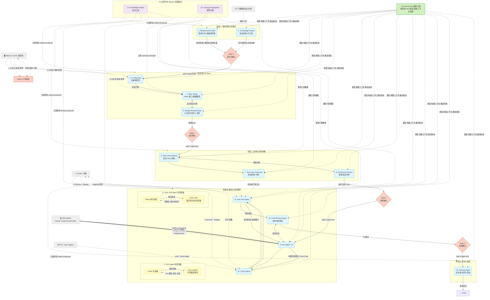

# AI Native 研发协同系统 · Agent 协作与触发机制详规

> **文档定位**：Agent 工程师 / 平台开发者 / 架构师
> **回答的问题**：15 个 Agent + Orchestrator 各自怎么工作、怎么互相触发、怎么被外部环境调用？事件流、数据流、控制流的三维协作全景。
> **配套文档**：`02 · 多 Agent 编排架构与设计规格`（契约与架构总览）、`00 · 总纲与导读`（术语表）
> **版本**：v2.0

---

## 〇、阅读指南

- **§一** 端到端流程图（带触发标注）：先看图建立全局直觉
- **§二** Agent × Agent 触发矩阵：一张表查清"谁通知谁、怎么通知"
- **§三** 每个 Agent 的详细工作规格：职责 | 触发条件 | 输入 | 处理流程 | 输出 | 内部循环 | Skills/Tools | 环境依赖 | 熔断
- **§四** 外部环境（开发者 IDE / 飞书 / CI 流水线 / 沙箱）如何与系统交互
- **§五** Event Bus 完整事件词典
- **§六** 一个需求在系统里的完整状态变化追踪（日志式）
- **§七** 所有 Agent Skills 的 API 签名（入参 / 出参 / 错误码）——实现时当接口文档查
- **§八** Context Builder 详细伪代码（select / compress / order / isolate / sanitize）
- **§九** Dev Agent 内部双脑完整交互时序图（Mermaid Sequence）——Coder↔Auditor 两轮循环全步骤
- **§十** 基于 OpenTelemetry 的可观测性方案（Traces / Metrics / Logs / 告警规则）
- **§十一** 快速通道：简单需求轻量化编排——"改个按钮颜色"不需要 15 个 Agent 全跑，但要做好防滥用
- **§十二** UI 测试用例查看/修改 → Agent 交互——人在 MC 里改测试，A7 校验、A11 补强，完整闭环

---

## 一、端到端流程图（全节点 + 触发标注）



---

## 二、Agent × Agent 触发矩阵

行 = 触发方 / 列 = 被触发方。标注方式：`事件名` [方式] → 被触发动作。

| 触发方 ↓ \ 被触发方 → | 1.Req | 2.Know | 3.UI | 4.Spec | 5.Rev | 6.Dec | 7.TestG | 8.Arch | 9.Dev | 10.CI | 11.Tst | 12.CR | 13.Rel | 14.KK | 15.CP | Orch |
|---|---|---|---|---|---|---|---|---|---|---|---|---|---|---|---|---|
| **外部: 飞书** | `msg_received` [Webhook] | — | — | — | — | — | — | — | — | — | — | — | — | — | — | — |
| **外部: Mission Control** | — | — | `prototype.annotated` [SSE] | `spec.edited` [SSE] | — | — | — | — | `agent.pause`/`agent.resume` | — | — | — | — | — | — | `gate.action` |
| **1. Req Intake** | — | `requirement.drafted` [Event] | — | — | — | — | — | — | — | — | — | — | — | `artifact.produced` | — | `status.changed` |
| **2. Knowledge Analyst** | — | — | — | — | — | — | — | — | — | — | — | — | — | `artifact.produced` | `conflict.detected` | `status.changed` |
| **3. UI Generator** | — | — | — | `prototype.generated` [Event] | — | — | — | — | — | — | — | — | — | `artifact.produced` | — | `status.changed` |
| **4. Spec Writer** | — | — | — | — | `spec.submitted` [Event] | — | — | — | — | — | — | — | — | `artifact.produced` | `spec.changed` `api.changed` | `status.changed` |
| **5. Design Review Panel** | — | — | — | `review.feedback` [Event 打回] | — | — | — | — | — | — | — | — | — | — | — | `review.completed` |
| **Gate 0 通过** | — | — | `gate.0.approved` [Orch] | — | — | — | — | — | — | — | — | — | — | — | — | 推进状态到 designing |
| **Gate 1 通过** | — | — | — | — | — | `gate.1.approved` [Orch] | — | — | — | — | — | — | — | — | — | 推进状态到 decomposing |
| **6. Spec Decomposer** | — | — | — | — | — | — | `dag.created` | `dag.created` 供评审 | — | — | — | — | — | `artifact.produced` | — | `status.changed` |
| **7. Test Case Generator** | — | — | — | — | — | — | — | — | — | — | `test.ready` [预注入] | — | — | `artifact.produced` | — | `status.changed` |
| **8. Architecture Expert** | — | — | — | — | — | `arch.feedback` [Event 打回] | — | — | — | — | — | — | — | — | — | `review.completed` |
| **Gate 2 通过** | — | — | — | — | — | — | — | — | `gate.2.approved` [Orch] | — | — | — | — | — | — | 推进状态到 developing |
| **9. Dev Agent** | — | — | — | — | — | — | — | — | — | `code.pushed` [Git Hook] | — | — | — | `artifact.produced` | — | `task.completed` |
| **10. CI/CD Agent** | — | — | — | — | — | — | — | — | — | — | `build.deployed` [Event] | — | — | — | — | `pipeline.passed`/`failed` |
| **11. Auto Test Agent** | — | — | — | — | — | — | — | — | `test.failed` ≤3 [Event 打回] | — | — | `test.passed` [Event] | — | `artifact.produced` | — | `test.completed` |
| **12. Code Review Agent** | — | — | — | — | — | — | — | — | `cr.issues` [Event 打回] | — | — | — | — | `artifact.produced` | — | `review.completed` |
| **13. Release Agent** | — | — | — | — | — | — | — | — | — | — | — | — | — | `artifact.produced` | — | `release.completed` |
| **15. Change Propagation** | — | — | — | — | — | `reset.task` [防抖后] | `reset.test` [防抖后] | — | `reset.dev` [防抖后] | — | `reset.test` [防抖后] | — | — | — | — | `propagation.triggered` |
| **Orchestrator** | `context.ready` | `context.ready` | `context.ready` | `context.ready` | `context.ready` | `context.ready` | `context.ready` | `context.ready` | `context.ready`[含 DAG 任务] | — | — | — | — | — | — | — |
| **熔断引擎(Orch)** | — | — | — | — | — | — | — | — | `loop.tripped` → 清理上下文 | — | `loop.tripped` | — | — | — | — | — |

> **图例**：`[Event]` = Event Bus 异步事件 | `[Orch]` = Orchestrator 推进状态机后触发 | `[Webhook/SSE]` = 外部系统直接推入 | `[Git Hook]` = Git 生命周期钩子 | `[防抖后]` = Change Propagation 经防抖再发布

---

## 三、每个 Agent 的详细工作规格

### 3.0 Orchestrator（编排大脑）

| 维度 | 规格 |
|---|---|
| **ID** | ⓪（Control Plane 核心，非 Agent Matrix 成员） |
| **职责** | 需求状态机推进 · DAG 调度（并行/串行决策） · 防死循环熔断 · Gate 审批流驱动 · Context Builder 调用 · 全局 token/成本预算管控 |
| **触发条件** | ① 外部 Event Bus 事件到达（`gate.*`/`task.*`/`agent.status.*`/`loop.tripped`）② 定时轮询超时检查 |
| **输入** | 全系统 Event Bus 流 + 需求状态机当前态 |
| **处理流程** | `接收事件 → 状态机计算下一态 → 必要时走 Gate 审批判定 → 必要时熔断判定 → 构建上下文 → 调度目标 Agent（组装上下文 + 注入 System Prompt + 设置温度/模型）` |
| **输出** | `context.ready` 事件（含完整上下文包）→ 目标 Agent 被唤醒 |
| **内部循环** | 无（Orchestrator 本身不做生成/审查，只做编排） |
| **关联 Gate** | Gate 0/1/2/3 全部——Orch 负责推进 "待审批" 态、拦截 "已打回" 态、下发 "已通过" 信号 |
| **熔断/降级** | 熔断引擎是 Orch 的子模块（见 §3.0b） |
| **环境依赖** | Event Bus（NATS/Redis）· 状态存储（PostgreSQL）· Context Builder (RAG + 向量库 + 知识图谱) |

**Orchestrator 状态机推进规则**：

```
当前状态        触发事件                下一状态         调度动作
draft           msg_received            analyzing        → A1(Requirement Intake)
analyzing       status.changed(A1,A2)   analyzing        → A2(Knowledge Analyst)
analyzing       gate.0.submitted        (待 Gate 0)      → 通知 Gate 引擎
(待 Gate 0)     gate.0.approved         designing        → A3(UI Generator)
(待 Gate 0)     gate.0.rejected         analyzing        → A1(重开澄清, 带打回原因)
designing       status.changed(A3)      designing        → A4(Spec Writer)
designing       spec.submitted          reviewing        → A5(Design Review Panel)
reviewing       review.completed(通过)   (待 Gate 1)      → 通知 Gate 引擎
reviewing       review.completed(打回)   designing        → A4(带 Review 反馈)
(待 Gate 1)     gate.1.approved         decomposing      → A6(Spec Decomposer)
(待 Gate 1)     gate.1.rejected         designing        → A4(带打回原因)
decomposing     dag.created             decomposing      → A7(Test Case Gen) + A8(Arch Expert)
decomposing     review.completed(通过)   (待 Gate 2)      → 通知 Gate 引擎
decomposing     review.completed(打回)   decomposing      → A6(重拆)
(待 Gate 2)     gate.2.approved         developing       → A9(Dev Agent ×N, 含 DAG 任务)
(待 Gate 2)     gate.2.rejected         decomposing      → A6(重拆)
developing      task.completed(N)       developing       → 如全部完成→A10(CI/CD)
developing      code.pushed             developing       → A10(CI/CD)
developing      pipeline.failed         testing          → A11(Test Agent, CI 失败也要测已有资产)
developing      pipeline.passed         testing          → A11(Test Agent)
testing         test.passed             reviewing(code)  → A12(Code Review Agent)
testing         test.failed+loop ≤3     developing       → A9(打回, 附测试失败)
testing         test.failed+loop >3     blocked          → 转人工
reviewing(code) review.completed(通过)   (待 Gate 3)      → 通知 Gate 引擎
reviewing(code) review.completed(打回)   developing       → A9(打回)
(待 Gate 3)     gate.3.approved         releasing        → A13(Release Agent)
(待 Gate 3)     gate.3.rejected         developing       → A9(打回)
releasing       release.completed       done             → 归档
任意态          loop.tripped            blocked          → 转人工
任意态          propagation.triggered   (重置对应子态)    → 被影响 Agent 重新执行
```

### 3.0b 熔断引擎（Orchestrator 子模块）

| 维度 | 规格 |
|---|---|
| **监测指标** | 循环轮次 · 同一状态持续时间 · 连续失败次数 · 单步耗时/预估比 · 上下文填充率 |
| **三级熔断** | 内部微循环 ≤2 → 外部大循环 ≤3 → 设计辩论 ≤3（详见 §3.9/§3.11/§3.5） |
| **熔断动作** | ① 升级策略（Few-shot → 强模型 Opus → 强制 CoT）② 上下文清理重注入 ③ 转 blocked + 出诊断 Trace + 通知人 |
| **监控事件** | `loop.tripped` 发送到 Event Bus → 告警中心 + Mission Control 高亮 |

---

### 3.1 Requirement Intake Agent（需求引导与具象化）

| 维度 | 规格 |
|---|---|
| **ID** | 1 |
| **阶段** | P1 需求澄清 |
| **类型** | 生成 + 交互 |
| **触发条件** | ① 外部消息到达：飞书群聊 @Bot / 会议纪要提取 / 文档解析 / Mission Control 手动创建 → `msg_received` ② Gate 0 打回后 Orch 重新调度 → `context.ready` |
| **输入** | 自然语言需求文本 + 信息来源元数据（来源类型、原文链接/时间戳） |
| **处理流程** | `NLP 意图抽取(实体+动作) → 多轮对话补全缺口(模式A/B/C) → 生成低保真线框 → 生成 GWT 验收标准 → 输出需求草案` |
| **输出** | `requirement.drafted` 事件 +《需求草案 + 低保真 UI + Given-When-Then 验收标准》→ 提交 Gate 0 |
| **内部循环** | **人即 Critic**：与业务方多轮澄清（选项 ≤5；超时 30min 挂起）；LLM 不自评通过 |
| **Skills / Tools** | `NLP_Intent_Extractor` · `Wireframe_Generator`(Shadcn/AntD 简化版) · `BDD_Drafter` |
| **环境依赖** | 飞书 Bot Webhook · Mission Control 需求录入 UI · UI 组件库模板 |
| **熔断** | 对话轮次 ≤10；30min 无响应 → 挂起 + 提醒 |

### 3.2 Knowledge Analyst Agent（知识检索与可行性评估）

| 维度 | 规格 |
|---|---|
| **ID** | 2 |
| **阶段** | P1 需求澄清 |
| **类型** | 检索 + 评估 |
| **触发条件** | A1 输出 `requirement.drafted` → Orch 调度 `context.ready` |
| **输入** | 需求草案（来自 A1） |
| **处理流程** | `RAG 检索历史 PRD/架构/API → 业务逻辑冲突比对 → 技术可行性评估 → 输出报告 + 待确认清单` |
| **输出** | `artifact.produced` + `conflict.detected`（如有冲突）→《可行性评估报告 + 待确认清单 + 冲突点标注》→ 合并到 Gate 0 |
| **内部循环** | 无（确定性检索 + 分析，不参与对抗循环） |
| **Skills / Tools** | `RAG_Knowledge_Search` · `Conflict_Detector` |
| **环境依赖** | pgvector 向量库 · 知识图谱 · 历史 PRD/架构/API 字典 |
| **熔断** | 检索超时 30s；冲突过多(>10)时标记为高风险并告警 |

### 3.3 UI Generator Agent（高保真原型生成）

| 维度 | 规格 |
|---|---|
| **ID** | 3 |
| **阶段** | P2 深度设计 |
| **类型** | 生成 + 交互式修改 |
| **触发条件** | ① Gate 0 通过 → Orch 调度 `context.ready` ② 人工在 Mission Control 标注原型 → `prototype.annotated` |
| **输入** | 低保真草图 + 企业 Design System + （标注事件时）标注坐标/类型/优先级/作者角色 |
| **处理流程** | `映射 Design Token → 生成可交互原型(React/Vue) → 沙箱渲染 → 监听 prototype.annotated 热更新 → 设计稿像素对比反馈` |
| **输出** | `prototype.generated` + `artifact.produced` → 可交互原型（带版本快照 v3→v4→v5…）→ 推送给 A4(Spec Writer) |
| **内部循环** | **Critic = 设计稿像素对比 + 人工标注**：差异 >10% 强制修复；人工标注触发增量修改（环境锚定） |
| **Skills / Tools** | `Design_Token_Mapper` · `Interactive_Prototype_Builder` · Sandpack 沙箱 |
| **环境依赖** | Mission Control 原型面板 · 企业 Design System 资产 · 像素对比引擎 |
| **熔断** | 标注-修改循环 >5 轮 → 生成版本差异报告推人裁决 |

### 3.4 Spec Writer Agent（详细 Spec 与契约编写）

| 维度 | 规格 |
|---|---|
| **ID** | 4 |
| **阶段** | P2 深度设计 |
| **类型** | 生成 |
| **触发条件** | A3 输出 `prototype.generated` → Orch 调度 `context.ready`；设计辩论打回时再次触发 |
| **输入** | 需求草案 + 高保真原型 + 交互状态定义 |
| **处理流程** | `分析 UI 交互推导后端所需数据结构与 API → 生成 OpenAPI 规范 → 生成 ERD + DDL → 输出终版 Spec` |
| **输出** | `spec.submitted` + `artifact.produced` + **`spec.changed` + `api.changed`**（这两个事件是 Change Propagation 的核心订阅源） |
| **内部循环** | 无自身循环；外部通过 Design Review Panel(A5) 的打回驱动设计辩论（≤3 轮） |
| **Skills / Tools** | `API_Schema_Generator`(OpenAPI/Swagger) · `ERD_Designer`(DDL) · Spec 章节状态管理 |
| **环境依赖** | Spec 面板（Mission Control）· OpenAPI 规范库 |
| **熔断** | 设计辩论 ≤3 轮（见 §3.5） |

### 3.5 Design Review Panel（设计评审专家组）

| 维度 | 规格 |
|---|---|
| **ID** | 5 |
| **阶段** | P2 深度设计 |
| **类型** | **外部对抗**（三个子 Agent 并行评审） |
| **触发条件** | A4 输出 `spec.submitted` → Orch 调度三个子 Agent 并行启动 |
| **输入** | 终版 Spec + 高保真原型 |
| **处理流程** | `并行评审: UX Heuristic Evaluator 检查可用性 + API N+1 Detector 检查性能 + Business Reviewer 检查业务完整性 → 汇总打分 → 通过 or 打回附原因` |
| **输出** | `review.completed`（含三个 Rubric 的得分 + 挑刺清单）→ 通过则推进 Gate 1；打回则 A4 重写 |
| **内部循环** | **设计辩论循环**：A4↔A5 ≤3 轮——第 2 轮引入"妥协 Prompt"（优先核心功能）；第 3 轮仍不收敛 → `review.completed`(分歧) →《设计分歧报告》→ 推 Gate 1 由产品经理裁决 |
| **Skills / Tools** | `UX_Heuristic_Evaluator` · `API_N+1_Detector` · `Business_Completeness_Checker` |
| **环境依赖** | UX 启发式规则库 · 性能反模式库 |
| **熔断** | ≤3 轮，超限自动生成分歧报告交 Gate 1 人工 |

### 3.6 Spec Decomposer Agent（任务 DAG 拆解）

| 维度 | 规格 |
|---|---|
| **ID** | 6 |
| **阶段** | P3 架构与拆解 |
| **类型** | 生成 |
| **触发条件** | Gate 1 通过 → Orch 调度；`propagation.triggered`(防抖后) → Change Propagation 要求重置 |
| **输入** | 终版 Spec + API 契约 + DB Schema |
| **处理流程** | `识别任务依赖关系 → 标记可并行/串行子任务 → 评估复杂度 → 标记高风险节点(需人工介入) → 输出 DAG` |
| **输出** | `dag.created` + `artifact.produced` → DAG 节点列表（含依赖、并行标记、复杂度、预估工时） |
| **内部循环** | 无；外部通过 Architecture Expert(A8) 的打回驱动架构对抗 |
| **Skills / Tools** | `Task_DAG_Builder` · `Complexity_Estimator` |
| **环境依赖** | 无特殊依赖 |
| **熔断** | 架构对抗 ≤3 轮（见 §3.8） |

### 3.7 Test Case Generator Agent（测试用例与代码生成）

| 维度 | 规格 |
|---|---|
| **ID** | 7 |
| **阶段** | P3 架构与拆解 |
| **类型** | 生成 |
| **触发条件** | A6 输出 `dag.created` → Orch 调度；`propagation.triggered` → 重置测试资产 |
| **输入** | Spec + API 契约 + DAG 任务列表 |
| **处理流程** | `分析边界条件 → 生成单测/集成/E2E 用例骨架 → 生成可执行测试代码(Jest/Playwright) → 打包为测试资产` |
| **输出** | `test.ready` + `artifact.produced` → 测试资产包（预注入到 A11 的测试上下文，**不直接触发 A11**，而是随 DAG 任务一起作为 A9/A11 的上下文注入） |
| **内部循环** | 无 |
| **Skills / Tools** | `Boundary_Value_Analyzer` · `Test_Scaffold_Builder`(Jest/Playwright) |
| **环境依赖** | 测试框架模板库 |
| **熔断** | 无特殊熔断 |

### 3.8 Architecture Expert Agent（架构评审）

| 维度 | 规格 |
|---|---|
| **ID** | 8 |
| **阶段** | P3 架构与拆解 |
| **类型** | **外部对抗** |
| **触发条件** | A6 输出 `dag.created` → Orch 同时调度 A7 与 A8（A7 生成测试、A8 评审架构） |
| **输入** | DAG + 技术方案 + DB 变更 |
| **处理流程** | `检查架构红线(跨层调用等) → 安全风险评估 → 性能风险评估 → 通过 or 打回` |
| **输出** | `review.completed` → 通过则推进 Gate 2；打回则 A6 重新拆解 |
| **内部循环** | 架构对抗 ≤3 轮 |
| **Skills / Tools** | `Architecture_Rules_Checker` |
| **环境依赖** | 企业架构红线规则库 |
| **熔断** | ≤3 轮，超限 → 转 Gate 2 人工裁决 |

### 3.9 Dev Agent（多实例并行开发 · 内部双脑）⭐

| 维度 | 规格 |
|---|---|
| **ID** | 9 |
| **阶段** | P4 编码 |
| **类型** | 生成 + 内部双脑 |
| **实例数** | N = DAG 可并行子任务数（通常 1–3，不超过 5） |
| **触发条件** | Gate 2 通过 → Orch 按 DAG 为每个实例组装 `context.ready`(含子任务 Spec + 相关代码上下文 + 测试资产)；外部循环打回时再次触发 |
| **输入** | 子任务 Spec · 相关代码片段(Context Builder 语义检索) · 测试资产包(来自 A7) · 架构红线 · `CLAUDE.md`/项目规范 |
| **处理流程** | `Coder 读取上下文 → 生成代码 → 调用 Auditor 审查 → (通过) → Git Commit + Push → 上报 task.completed` |
| **内部双脑（Inner Loop）** | **Coder（生成者）**：专注业务逻辑，产出代码 → **Inner Auditor（环境锚定审查者）**：调用 `Static_Analysis_Runner`(ESLint/SonarQube) + 类型检查 + `Security_Scanner` + `Architecture_Rules_Checker`。**Auditor 看不到 Coder 的思考过程，只看最终代码 + 环境信号。** 任一信号红灯 → 打回 Coder（附信号详情）。≤2 轮。第 2 轮强制注入 Few-shot 优秀示例。 |
| **通过条件** | 全部客观信号绿灯 → `code.pushed`（Git Hook） |
| **输出** | `task.completed` + `artifact.produced` + Git commit/Push（触发 CI） |
| **Skills / Tools** | `Codebase_Context_Retriever` · `Static_Analysis_Runner` · `Security_Scanner` · `Architecture_Rules_Checker` |
| **环境依赖** | Worker Node（Claude Code CLI / Cursor / Codex 沙箱）· Git · Lint 工具链 |
| **熔断与降级** | 内部 ≤2 轮（不通过推外部循环）→ 外部 ≤3 轮（第 2 轮切 Opus / 第 3 轮强制 CoT / 超限后上下文清理 +《深度诊断 Trace》+ 转人工 IDE） |

### 3.10 CI/CD Agent（持续集成与部署）

| 维度 | 规格 |
|---|---|
| **ID** | 10 |
| **阶段** | P4 编码 |
| **类型** | 执行（CI 本身即环境裁判） |
| **触发条件** | A9 Push 代码 → Git Hook → `code.pushed` |
| **输入** | Git commit/webhook 携带的变更元数据 |
| **处理流程** | `拉取代码 → 依赖安装 → 构建(Build) → Lint(全量) → Docker Build → 部署 Staging` |
| **输出** | `pipeline.passed` 或 `pipeline.failed` → 发 `build.deployed`（成功时含 Staging URL） |
| **内部循环** | 无（确定性 CI 流水线；失败即阻断，不进循环） |
| **Skills / Tools** | `Pipeline_Trigger` · `Docker_Builder` · `Staging_Deployer` |
| **环境依赖** | Docker 沙箱 · Git Runner · Staging K8s/容器平台 |
| **熔断** | 构建超时 30min → 标记失败 |

### 3.11 Auto Test Agent（自动化测试 · 内部双脑 + 变异测试）⭐

| 维度 | 规格 |
|---|---|
| **ID** | 11 |
| **阶段** | P4 测试 |
| **类型** | 执行 + 内部双脑 |
| **触发条件** | A10 输出 `build.deployed` → Orch 调度（含 A7 预注入的测试资产）；外部循环打回时再次触发 |
| **输入** | Staging 环境 URL · 测试资产包(来自 A7) · Spec/验收标准 · 失败历史(如为重试) |
| **处理流程** | `Tester 执行测试 → 收集 Log/StackTrace/截图/Trace → Critic 审查测试质量 → (通过) 上报 test.passed` |
| **内部双脑（Inner Loop）** | **Tester（执行者）**：运行单测/集成/E2E，收集客观信号 → **Inner Critic（测试质量审查员）**：① 弱断言检测（标记 `expect(true).toBe(true)`、"仅检查 statusCode===200"）；② **变异测试**（对源码注入变异体如 `>`→`>=`/删行，若测试抓不出变异 → 断言无效，打回 Tester 重写测试）；③ 边界覆盖度 + 重复度分析。**Critic 只看测试代码 + 执行结果，看不到 Tester 的思考过程。** ≤2 轮。 |
| **通过条件** | 所有测试通过 + 断言质量达标 + 变异得分达标 |
| **输出** | `test.passed`(触发 A12) 或 `test.failed`(含失败详情 + StackTrace + Agent 分析 + 修复建议, ≤3 次时打回 A9) 或 `loop.tripped`(>3 次, 触发熔断转人工) |
| **Skills / Tools** | `Test_Runner`(Jest/Playwright) · `Log_Analyzer` · `Assertion_Mutation_Checker` |
| **环境依赖** | Staging 环境 · 变异测试引擎 · Playwright Trace Viewer |
| **熔断** | 内部 ≤2 轮（不通过推外部循环）→ 外部 ≤3 轮 |

### 3.12 Code Review Agent（全局代码审查）

| 维度 | 规格 |
|---|---|
| **ID** | 12 |
| **阶段** | P4 测试 |
| **类型** | **外部对抗** |
| **触发条件** | A11 输出 `test.passed` → Orch 调度 |
| **输入** | 全量 Diff · 跨模块依赖图 · 原始 Spec · 架构红线 |
| **处理流程** | `跨模块影响分析 → 复杂业务逻辑合理性 → 代码风格/规范 → 生成 Review 意见 → 通过 or 打回 + Auto Fix Patch` |
| **输出** | `review.completed` → 通过则推进 Gate 3；打回则 A9 修复（附 Auto Fix Patch 供参考） |
| **内部循环** | 外部规范对抗 ≤3 轮（A9↔A12） |
| **Skills / Tools** | `Cross_Module_Impact_Analyzer` · `Auto_Fix_Patcher` |
| **环境依赖** | 跨模块依赖图 · 代码规范库 |
| **熔断** | ≤3 轮，超限 → Gate 3 人工裁决 |

### 3.13 Release Agent（发布与监控）

| 维度 | 规格 |
|---|---|
| **ID** | 13 |
| **阶段** | P5 交付 |
| **类型** | 执行 |
| **触发条件** | Gate 3 通过 → Orch 调度 |
| **输入** | 最终 Diff · Staging 验证结果 · 发布配置 |
| **处理流程** | `金丝雀部署(5% → 20% → 50% → 100%) → 监控核心指标(错误率/延迟) → 异常回滚` |
| **输出** | `release.completed` → 需求状态 = done |
| **内部循环** | **环境即裁判**：线上指标是客观信号，异常自动回滚；LLM 不做"能不能发布"的主观判断 |
| **Skills / Tools** | `Canary_Deployer` · `Metrics_Monitor` · `Auto_Rollback` |
| **环境依赖** | K8s/容器平台 · 监控系统(Prometheus/Grafana) · Feature Flag |
| **熔断** | 错误率 > 阈值 × 2 → 自动回滚；金丝雀渐进期间任一步异常即停止 |

### 3.14 Knowledge Keeper Agent（知识沉淀 · 全局旁路）

| 维度 | 规格 |
|---|---|
| **ID** | 14 |
| **阶段** | Global Sidecar |
| **类型** | 旁路（不阻塞主流程） |
| **触发条件** | 实时订阅 Event Bus 中所有 `artifact.produced` 事件 |
| **输入** | 各 Agent 产出的 artifact（终版 Spec / 恶性 Bug 修复记录 / 通过的测试资产 / 架构决策） |
| **处理流程** | `artifact 结构化 → 向量化写入 pgvector → 更新知识图谱节点与边 → 标记过期/冲突内容` |
| **输出** | 知识库增量更新（异步，不影响流水线） |
| **内部循环** | 无 |
| **Skills / Tools** | `Artifact_Vectorizer` · `Knowledge_Graph_Updater` |
| **环境依赖** | pgvector · 知识图谱(Neo4j) · S3(原始 artifact 存储) |
| **熔断** | 写入失败重试 3 次后告警 |

### 3.15 Change Propagation Agent（变更传播 · 全局旁路）

| 维度 | 规格 |
|---|---|
| **ID** | 15 |
| **阶段** | Global Sidecar |
| **类型** | 旁路（不阻塞主流程，但触发下游重置） |
| **触发条件** | 订阅 `spec.changed` / `api.changed`（来自 A4） |
| **输入** | 变更后的 Spec/API 契约 + 依赖图 |
| **处理流程** | `解析变更内容 → 沿依赖图追溯受影响下游 → 评估影响面(breaking/non-breaking) → 防抖(30s 窗口内合并) → 发布 propagation.triggered` |
| **输出** | `propagation.triggered` 事件（含影响范围 + 需重置的 Agent 列表）→ Orch 据此重置受影响任务 |
| **内部循环** | 无 |
| **Skills / Tools** | `Dependency_Graph_Traverser` · `Event_Debouncer`(30s 窗口) |
| **环境依赖** | 资产依赖图 |
| **熔断** | 防抖窗口 30s；影响面 > 50% 所有下游时告警 + 需人工确认 |

---

## 四、外部环境如何与系统交互

### 4.1 飞书生态 → 系统

```
飞书群聊 → Webhook → Event Bus: msg_received
飞书会议 → 录制转写 → 会议纪要 Bot → Webhook → Event Bus: msg_received
飞书文档 → 用户粘贴链接在 Mission Control → SSE → Event Bus: msg_received
                                      ↓
                             Orchestrator 推到 analyzing → A1 启动

飞书卡片交互 → Webhook → Event Bus: msg_received.card_action
```

### 4.2 Mission Control 指挥舱 ↔ 系统

```
方向: 指挥舱 → 系统
├─ 审批操作: gate.{0..3}.approved/rejected → WebSocket → Event Bus → Orchestrator
├─ 人工标注: prototype.annotated → SSE → Event Bus → A3(UI Generator) 热更新
├─ Agent 干预: agent.pause/resume/intervene → WebSocket → Orchestrator 暂停/恢复 Agent
└─ Spec 编辑: spec.edited → SSE → Event Bus

方向: 系统 → 指挥舱
├─ agent.status.changed → SSE → Agent 活动直播 + 拓扑图实时更新
├─ artifact.produced → SSE → 需求流/知识库更新
├─ test.completed → WebSocket → 测试洞察面板刷新
├─ loop.tripped → WebSocket → 告警中心 + 拓扑图高亮
└─ gate.action.required → SSE + 推送 → 个人工作台"优先处理" + 飞书通知
```

### 4.3 IDE Worker（Claude Code / Cursor / Codex）↔ 系统

```
AITP 六动作（底层 MCP / Agent SDK / Git Hook）：

1. Context Pull  ← Worker 调 MCP: get_task_context(TASK_ID)
                  → 系统返回: Spec片段 | 相关代码 | 测试要求 | 禁止修改列表 | CLAUDE.md

2. Task Assign   → 系统通过 MCP 推任务给 Claude Code / 或 Cursor 插件侧边栏显示

3. Progress Push ← Worker 调 MCP: report_progress(action, detail)
                  → Event Bus: agent.status.changed → 指挥舱活动直播更新
                  示例: { type:"tool_call", content:"read_file('src/...')" }

4. Artifact Push ← Worker 调 MCP: submit_artifact(type, content)
                  → Event Bus: artifact.produced

5. Help Request  ← Worker 调 MCP: request_help(blocker)
                  → Orchestrator 评估后升级 / 转人

6. Review Request→ 系统调 Worker(Code Review 场景): request_review(diff)

Claude Code CLI 具体:
  ai-task start TASK_ID    → Context Pull + 创建分支 + 注入 CLAUDE.md
  ai-task progress <msg>    → Progress Push
  ai-task submit            → Artifact Push + commit + push
  ai-task help <desc>       → Help Request
  git push                  → post-push Hook 自动上报
```

### 4.4 Docker 沙箱 / CI ↔ 系统

```
Git Push → Git Hook → Event Bus: code.pushed
         → CI Runner 拉取 → Docker Build → Staging Deploy
         → CI 脚本上报: pipeline.passed/failed (HTTP → Event Bus)

Staging 环境:
  Auto Test Agent 经 HTTP/SSH 调 Test Runner
  Playwright Trace 回传 S3 URL → Mission Control 嵌入回放
```

---

## 五、Event Bus 事件词典

| 事件名 | 发布者 | 载荷（关键字段） | 订阅者 | 语义 |
|---|---|---|---|---|
| `msg_received` | 飞书 Webhook / MC | `{source, channel, raw_text, metadata}` | Orchestrator | 新需求消息到达 |
| `requirement.drafted` | A1 | `{req_id, draft_spec, wireframe_url, acceptance_criteria}` | Orch, K14 | 需求草案产出 |
| `conflict.detected` | A2 | `{req_id, conflicts: [{entity, description}]}` | Orch, MC | 业务冲突检测 |
| `gate.{0\|1\|2\|3}.submitted` | Gate 引擎 | `{req_id, gate, artifacts}` | MC(审批中心) | 门禁提交 |
| `gate.{0\|1\|2\|3}.approved` | MC(审批人操作) | `{req_id, gate, approver, comment}` | Orch | 门禁通过 |
| `gate.{0\|1\|2\|3}.rejected` | MC(审批人操作) | `{req_id, gate, approver, reasons[]}` | Orch | 门禁打回 |
| `gate.{0\|1\|2\|3}.resubmitted` | MC(修订后) | `{req_id, gate, changes_summary}` | Orch | 打回后重提 |
| `prototype.generated` | A3 | `{req_id, prototype_url, version}` | A4, K14 | 原型产出 |
| `prototype.annotated` | MC(人工标注) | `{req_id, annotation: {x,y,type,priority,author,comment}}` | A3 | 原型标注反馈 |
| `spec.submitted` | A4 | `{req_id, spec_url, openapi_url, ddl}` | A5, K14 | Spec 提交评审 |
| `spec.changed` | A4 | `{req_id, changed_sections[], diff}` | **K15**(核心) | Spec 内容变更 |
| `api.changed` | A4 | `{req_id, endpoint, change_type:breaking\|non-breaking, diff}` | **K15**(核心) | API 契约变更 |
| `review.completed` | A5 / A8 / A12 | `{req_id, reviewer, verdict:pass\|fail, scores, issues[]}` | Orch | 评审完成 |
| `dag.created` | A6 | `{req_id, nodes:TaskNode[], edges:Dependency[]}` | A7, A8, K14 | DAG 产出 |
| `test.ready` | A7 | `{req_id, test_assets: {unit[], integration[], e2e[]}}` | K14(预注入到 A11 上下文) | 测试资产就绪 |
| `context.ready` | Orchestrator | `{target_agent, context_package}` | 各 Agent | 上下文构建完毕，Agent 可启动 |
| `task.completed` | A9 | `{req_id, task_id, diff_url, files_changed}` | Orch, K14 | 子任务开发完成 |
| `code.pushed` | Git Hook | `{req_id, commit_sha, branch, diff}` | A10 | 代码推送 |
| `pipeline.passed` | A10 | `{req_id, build_id, staging_url}` | Orch, A11 | CI 通过 + Staging 就绪 |
| `pipeline.failed` | A10 | `{req_id, build_id, error_log}` | Orch, MC | CI 失败 |
| `test.passed` | A11 | `{req_id, test_report, quality_score}` | Orch, A12 | 测试通过 |
| `test.failed` | A11 | `{req_id, failed_cases[], suggestions[]}` | Orch, A9(打回) | 测试失败 |
| `test.completed` | A11 | `{req_id, round, summary}` | Orch, MC | 测试轮次结束 |
| `cr.issues` | A12 | `{req_id, issues[], auto_fix_patches[]}` | A9(打回) | CR 发现问题 |
| `release.completed` | A13 | `{req_id, version, deployed_at}` | Orch, K14 | 发布完成 |
| `rollback.triggered` | A13 | `{req_id, reason, metric}` | Orch, MC(告警) | 自动回滚 |
| `loop.tripped` | 熔断引擎(Orch) | `{req_id, scope, round, fallback_action}` | Orch(转 blocked), MC(告警) | 熔断触发 |
| `propagation.triggered` | K15 | `{req_id, affected_agents[], change_summary}` | Orch(重置受影响任务) | 变更波及 |
| `artifact.produced` | 各 Agent | `{req_id, phase, artifact_type, storage_url, metadata}` | K14 | 产出物生成 |
| `agent.status.changed` | 各 Agent | `{agent_id, status, current_action, tool_calls, anomaly}` | MC(活动直播+拓扑) | Agent 状态变更 |
| `agent.pause` / `agent.resume` | MC(人工操作) | `{agent_id}` | Orch, 对应 Agent | 人工暂停/恢复 |

---

## 六、一个需求的全生命周期事件日志（示例）

以 REQ-789 "订单批量导出" 为例，记录系统里实际触发的事件序列：

```
T+00:00  [外部→系统] msg_received {source:feishu_chat, raw:"订单详情页加个批量导出..."}
T+00:00  [Orch] 状态推进 draft→analyzing, 调度 A1
T+00:00  [Orch→A1] context.ready {target:A1, context:{msg, source_meta}}
T+00:03  [A1→Orch] agent.status.changed {status:understanding}
T+00:05  [A1→Orch] agent.status.changed {status:generating}
T+00:10  [A1→Orch] agent.status.changed {status:waitingForUser}  # 等人在飞书点确认
T+00:12  [MC→Orch] gate.0.submitted {artifacts:[draft, wireframe, acceptance]}
T+00:12  [Orch] 状态推进到"待 Gate 0", 通知 Gate 引擎
T+00:15  [外部→MC] gate.0.approved {approver:张三, comment:"方向没问题"}
T+00:15  [Orch] 状态推进 analyzing→designing, 调度 A3+A2
T+00:15  [Orch→A3] context.ready {target:A3}
T+00:15  [Orch→A2] context.ready {target:A2}
T+00:18  [A2→Event] artifact.produced {type:feasibility_report}
T+00:20  [A3→Event] prototype.generated {version:v1}
T+00:20  [Orch] 状态推进 designing→(继续), 调度 A4
T+00:20  [Orch→A4] context.ready {target:A4, context:{draft, prototype, feasibility}}
T+00:25  [A4→Event] spec.changed + api.changed {endpoint:POST /api/orders/export}
T+00:25  [K15] 订阅到 spec/api.changed → 尚无下游任务，暂不触发
T+00:30  [A4→Event] spec.submitted
T+00:30  [Orch] 调度 A5(Design Review Panel)
T+00:35  [A5→Event] review.completed {verdict:pass, scores:{ux:85, api:90, business:95}}
T+00:35  [Orch] 推进到 "待 Gate 1"
T+00:35  [MC] 审批中心显示 Gate 1 待审批
T+01:00  [MC→Orch] gate.1.approved {approver:张三}
T+01:00  [Orch] 推进 designing→decomposing, 调度 A6
T+01:00  [Orch→A6] context.ready {target:A6, context:{spec, api, prototype}}
T+01:15  [A6→Event] dag.created {nodes:[{id:T1,并行},{id:T2,并行},{id:T3,串行}]}
T+01:15  [Orch] 调度 A7+A8 并行
T+01:20  [A7→Event] test.ready {assets:{unit:6, integration:3, e2e:2}}
T+01:25  [A8→Event] review.completed {verdict:pass}
T+01:25  [Orch] 推进到 "待 Gate 2"
T+01:30  [MC→Orch] gate.2.approved {approver:架构师李四}
T+01:30  [Orch] 推进 decomposing→developing, 调度 A9×2(后端API+前端页面)
T+01:30  [Orch→A9-1] context.ready {task:T1, spec+code_snippets+tests}
T+01:30  [Orch→A9-2] context.ready {task:T2, spec+code_snippets+tests}
T+02:30  [A9-1] Inner Loop: Coder→Auditor→(Lint✅ 类型✅ 安全✅)→通过
T+02:30  [A9-1→Event] code.pushed {commit:"feat: export API"}
T+02:45  [A9-2] Inner Loop: Coder→Auditor→(Lint⚠️)→Coder修正→Auditor✅→通过
T+02:45  [A9-2→Event] code.pushed {commit:"feat: export UI"}
T+02:45  [Orch] 全部 task.completed, 推进 developing→(pending CI)
T+03:00  [CI] pipeline.passed {staging_url:https://staging-789.example.com}
T+03:00  [Orch] 推进 developing→testing, 调度 A11
T+03:00  [Orch→A11] context.ready {context:{staging_url, test_assets, spec}}
T+03:10  [A11] Tester 执行测试→47 条, 2 条失败
T+03:10  [A11] Inner Critic 审查: 失败 2 条为真实业务失败, 其余 45 条断言有效(变异得分 72)
T+03:10  [A11→Event] test.failed {round:1, failed:[UNIT-028, VISUAL-001]}
T+03:10  [Orch] 外部循环 round=1, ≤3, 打回 A9
T+03:10  [Orch→A9] context.ready {context:{原始spec, 失败日志, "请修复以下2个失败用例..."}}
T+03:30  [A9] 修复完成 → code.pushed → pipeline.passed
T+03:30  [Orch] 推进 testing, 调度 A11 round=2
T+03:40  [A11] 执行 47 条, 全部通过, 质量评分 86
T+03:40  [A11→Event] test.passed {round:2, quality_score:{...}}
T+03:40  [Orch] 推进 testing→reviewing(code), 调度 A12
T+03:50  [A12→Event] review.completed {verdict:pass, issues:[]}
T+03:50  [Orch] 推进到 "待 Gate 3"
T+04:00  [MC→Orch] gate.3.approved {approver:Tech Lead 王五}
T+04:00  [Orch] 推进 reviewing(code)→releasing, 调度 A13
T+04:00  [Orch→A13] context.ready
T+04:30  [A13] 金丝雀 5%→20%→50%→100%, 错误率正常
T+04:30  [A13→Event] release.completed ✅
T+04:30  [Orch] 状态 done
T+04:30  [K14] 异步写入: Spec + API 契约 + 测试资产 + 修复记录 → 知识库
T+04:30  [MC] 效能仪表盘更新: 吞吐量+1, 周期时间 4.5h
```

---

## 七、Agent Skills API 签名（入参 / 出参 / 错误码）

> 所有 Skill 以 HTTP/gRPC 或内部函数调用的方式暴露，遵循统一的响应信封 `{ok, data?, error?}`。
> `[Caller]` 标注了主要调用方。

### 7.1 NLP_Intent_Extractor（意图抽取）

- **所属 Agent**: A1 Requirement Intake
- **调用方**: A1

```
POST /skills/nlp/intent-extract
Request {
  raw_text:     string;            // 原始自然语言（飞书消息/会议转录/文档）
  source_type:  "feishu_chat" | "feishu_meeting" | "feishu_doc" | "manual";
  context_hint?: string;           // 可选上下文（如频道名、会议标题）
}
Response 200 {
  ok: true;
  data: {
    entities:     { name: string; type: "actor"|"object"|"action"; }[];
    primary_action: string;        // 核心动作短语
    confidence:   number;          // 0–1
    missing_info: { field: string; question: string; options?: string[]; }[];
  };
}
Response 400 { ok: false; error: "EMPTY_TEXT" | "UNSUPPORTED_LANGUAGE" | "TEXT_TOO_LONG(max:8000)"; }
Response 500 { ok: false; error: "LLM_TIMEOUT" | "LLM_RATE_LIMITED"; }
```

### 7.2 Wireframe_Generator（低保真线框生成）

- **所属 Agent**: A1 Requirement Intake
- **调用方**: A1

```
POST /skills/wireframe/generate
Request {
  entities:      { name:string; type:string; }[];
  primary_action: string;
  platform:      "web" | "mobile";
  component_lib: "shadcn" | "antd" | "mui";
  style:         "lo-fi";          // 低保真，区别于高保真 Interactive_Prototype_Builder
}
Response 200 {
  ok: true;
  data: {
    jsx_code:    string;            // React/Vue 代码字符串
    preview_url: string;            // Sandpack 即时预览 URL
    screens:     { name:string; description:string; }[];
    version:     string;            // e.g. "v1-wireframe"
  };
}
Response 422 { ok: false; error: "INSUFFICIENT_ENTITIES(min:1)"; }
Response 500 { ok: false; error: "RENDER_FAILED" | "LLM_TIMEOUT"; }
```

### 7.3 BDD_Drafter（BDD 验收标准生成）

- **所属 Agent**: A1 Requirement Intake
- **调用方**: A1

```
POST /skills/bdd/draft
Request {
  intent:       { entities:...; primary_action:string; };
  wireframe:    { screens:{ name:string; description:string; }[]; };
  style:        "gherkin";         // Given-When-Then 格式
}
Response 200 {
  ok: true;
  data: {
    scenarios: {
      name: string;
      given: string[];
      when:  string;
      then:  string[];
      boundary_notes?: string;     // 边界条件提示（如"空数据时应提示"）
    }[];
    coverage_gaps: string[];       // 未被覆盖的边界
  };
}
Response 500 { ok: false; error: "LLM_TIMEOUT"; }
```

### 7.4 RAG_Knowledge_Search（知识库语义检索）

- **所属 Agent**: A2 Knowledge Analyst
- **调用方**: A2

```
POST /skills/knowledge/rag-search
Request {
  query:        string;            // 搜索意图自然语言
  top_k:        number;            // 返回条数 1–50，默认 10
  filters?: {
    doc_types:  ("prd"|"architecture"|"api_spec"|"db_schema"|"bug_report")[];
    date_range?: { from:string; to:string; };  // ISO 8601
    project?:    string;
    min_score?:  number;           // 相似度阈值 0–1，默认 0.7
  };
}
Response 200 {
  ok: true;
  data: {
    results: {
      doc_id:    string;
      title:     string;
      snippet:   string;            // 相关段落摘要
      score:     number;            // 余弦相似度
      doc_type:  string;
      source_url:string;
      updated_at:string;
    }[];
    total_hits: number;
    search_ms:  number;
  };
}
Response 408 { ok: false; error: "SEARCH_TIMEOUT(30s)"; }
Response 500 { ok: false; error: "VECTOR_STORE_DOWN" | "EMBEDDING_FAILED"; }
```

### 7.5 Conflict_Detector（业务逻辑冲突检测）

- **所属 Agent**: A2 Knowledge Analyst
- **调用方**: A2

```
POST /skills/knowledge/detect-conflicts
Request {
  new_requirement: {
    entities:      { name:string; type:string; }[];
    primary_action: string;
    affected_domains: string[];     // e.g. ["order", "payment"]
  };
  existing_artifacts: { doc_id:string; snippet:string; doc_type:string; }[];  // 来自 RAG 结果
}
Response 200 {
  ok: true;
  data: {
    conflicts: {
      severity:     "blocker" | "warning" | "info";
      entity:       string;        // 冲突涉及的业务实体
      existing_behavior: string;
      proposed_behavior: string;
      recommendation: string;
    }[];
    conflict_count: number;
    overall_risk:   "high" | "medium" | "low";  // >10 conflicts → "high" → 告警
  };
}
Response 500 { ok: false; error: "LLM_TIMEOUT"; }
```

### 7.6 Design_Token_Mapper（设计令牌映射）

- **所属 Agent**: A3 UI Generator
- **调用方**: A3

```
POST /skills/design/token-map
Request {
  wireframe_jsx: string;           // 来自 Wireframe_Generator
  design_system:  string;          // e.g. "acme-corp-v3"
  platform:       "web" | "mobile";
}
Response 200 {
  ok: true;
  data: {
    mapped_jsx:   string;           // 替换为企业 Design Token 后的代码
    token_usage:  { token_name:string; value:string; location:string; }[];
    unmapped:     { original_value:string; suggestion:string; }[];  // 无法映射的样式
  };
}
Response 404 { ok: false; error: "DESIGN_SYSTEM_NOT_FOUND"; }
Response 500 { ok: false; error: "RENDER_FAILED"; }
```

### 7.7 Interactive_Prototype_Builder（可交互原型构建）

- **所属 Agent**: A3 UI Generator
- **调用方**: A3

```
POST /skills/prototype/build
Request {
  mapped_jsx:      string;
  states:          ("default"|"empty"|"loading"|"error"|"unauthorized"|"edge")[];
  device_presets:  (375|414|768|1440)[];
  enable_annotations: boolean;     // 是否启用标注层
}
Response 200 {
  ok: true;
  data: {
    sandbox_url:   string;         // Sandpack 实时预览 URL
    version:       string;         // 递增版本号 e.g. "v5"
    state_urls:    Record<string, string>;  // 每个交互状态的独立 URL
    screenshot_base64?: string;    // 初始截图
  };
}
Response 422 { ok: false; error: "INVALID_JSX_SYNTAX"; details:{ line:number; message:string; }; }
Response 500 { ok: false; error: "SANDBOX_TIMEOUT" | "RENDER_FAILED"; }
```

### 7.8 API_Schema_Generator（OpenAPI 规范生成）

- **所属 Agent**: A4 Spec Writer
- **调用方**: A4

```
POST /skills/spec/generate-api
Request {
  prototype_states: { state_name:string; ui_elements:{ type:string; data_bind:string; }[]; }[];
  entities:         { name:string; fields:{ name:string; type:string; required:boolean; }[]; }[];
  existing_apis?:   { endpoint:string; method:string; schema:object; }[];  // 避免重复
}
Response 200 {
  ok: true;
  data: {
    openapi_spec:   object;         // OpenAPI 3.1 完整规范
    endpoints: {
      method:       "GET"|"POST"|"PUT"|"DELETE"|"PATCH";
      path:         string;
      summary:      string;
      request_body_schema?: object;
      response_schema:     object;
      error_responses:     { code:number; description:string; }[];
    }[];
    n_plus_one_warnings: { endpoint:string; nested_calls:string[]; }[];  // 潜在 N+1
  };
}
Response 500 { ok: false; error: "LLM_TIMEOUT"; }
```

### 7.9 ERD_Designer（数据库实体关系图生成）

- **所属 Agent**: A4 Spec Writer
- **调用方**: A4

```
POST /skills/spec/generate-erd
Request {
  entities:   { name:string; fields:...; }[];
  api_spec:   object;              // 来自 API_Schema_Generator
  existing_ddl?: string;           // 现有 DDL，用于增量变更
}
Response 200 {
  ok: true;
  data: {
    erd_mermaid:   string;         // Mermaid ER 图源码
    ddl:           string;         // PostgreSQL/MySQL DDL
    migration_notes: {
      type:        "new_table" | "alter_table" | "add_index" | "breaking";
      description: string;
      rollback:    string;
    }[];
  };
}
Response 500 { ok: false; error: "LLM_TIMEOUT"; }
```

### 7.10 UX_Heuristic_Evaluator（UX 启发式评估）

- **所属 Agent**: A5 Design Review Panel（子 Agent）
- **调用方**: A5 Orchesrator（并行调度时调用）

```
POST /skills/review/ux-evaluate
Request {
  prototype_url: string;
  spec:          { scenarios:...; wireframe:...; };
  rubric:        "nielsen" | "custom";  // 启发式规则集
}
Response 200 {
  ok: true;
  data: {
    score:        number;          // 0–100
    pass:         boolean;         // score >= 70 → true
    findings: {
      heuristic:  string;          // e.g. "一致性与标准"
      severity:   "critical"|"major"|"minor"|"cosmetic";
      description:string;
      suggestion: string;
      location:   { screen:string; element:string; };
    }[];
  };
}
Response 500 { ok: false; error: "EVAL_TIMEOUT" | "PROTOTYPE_UNREACHABLE"; }
```

### 7.11 API_N+1_Detector（API N+1 性能检测）

- **所属 Agent**: A5 Design Review Panel（子 Agent）
- **调用方**: A5 Orchestrator（并行调度时调用）

```
POST /skills/review/detect-n1
Request {
  endpoints: { method:string; path:string; response_schema:object; }[];
  data_relations: { parent:string; children:string[]; }[];
}
Response 200 {
  ok: true;
  data: {
    score:        number;          // 0–100（越高越好，无 N+1 风险→100）
    pass:         boolean;         // score >= 80 → true
    findings: {
      endpoint:   string;
      risk:       "definite" | "likely" | "possible";
      pattern:    string;          // e.g. "GET /orders → for each → GET /orders/:id/items"
      suggestion: string;          // e.g. "添加 ?include=items 嵌套展开"
      estimated_queries: number;   // 预估额外查询数
    }[];
  };
}
Response 500 { ok: false; error: "DETECTION_TIMEOUT"; }
```

### 7.12 Business_Completeness_Checker（业务完整性检查）

- **所属 Agent**: A5 Design Review Panel（子 Agent）
- **调用方**: A5 Orchestrator（并行调度时调用）

```
POST /skills/review/business-check
Request {
  spec:          { scenarios:...; acceptance_criteria:...; };
  domain_rules:  string[];         // 业务域规则标签 e.g. ["order.export","rbac"]
}
Response 200 {
  ok: true;
  data: {
    score:        number;          // 0–100
    pass:         boolean;
    missing_scenarios: {
      category:   "auth"|"validation"|"error_handling"|"edge_case"|"audit";
      description:string;
      example:    string;          // GWT 示例
    }[];
  };
}
Response 500 { ok: false; error: "LLM_TIMEOUT"; }
```

### 7.13 Task_DAG_Builder（任务 DAG 构建）

- **所属 Agent**: A6 Spec Decomposer
- **调用方**: A6

```
POST /skills/dag/build
Request {
  spec:          { endpoints:...; ddl:...; ui_components:...; };
  existing_tasks?: { id:string; status:string; }[];  // 已有任务避免重复
  max_parallel:  number;           // 最大并行度，默认 5
}
Response 200 {
  ok: true;
  data: {
    nodes: {
      id:          string;         // e.g. "T1"
      title:       string;         // e.g. "后端导出 API"
      type:        "backend"|"frontend"|"db"|"test"|"config";
      estimated_hours: number;
      complexity:  "low"|"medium"|"high";
      needs_human: boolean;        // 复杂度高或高风险 → true → Gate 2 标记
      assigned_to: string | null;  // 代理类型 "dev-agent" | null
    }[];
    edges: {
      from:        string;         // node id
      to:          string;         // node id
      type:        "blocks" | "depends_on";  // blocks=串行阻塞, depends_on=软依赖
    }[];
    parallel_groups: string[][];   // 每组内可并行，组间串行
    critical_path:  string[];      // 关键路径 node ids
  };
}
Response 422 { ok: false; error: "CIRCULAR_DEPENDENCY"; details:{ cycle:string[]; }; }
Response 500 { ok: false; error: "LLM_TIMEOUT"; }
```

### 7.14 Complexity_Estimator（任务复杂度评估）

- **所属 Agent**: A6 Spec Decomposer
- **调用方**: A6

```
POST /skills/dag/estimate-complexity
Request {
  task: { title:string; type:string; spec_fragments:string[]; };
  codebase_stats: { files_touched_estimate:number; loc_estimate:number; cross_module_count:number; };
}
Response 200 {
  ok: true;
  data: {
    complexity:   "low" | "medium" | "high";
    confidence:   number;          // 0–1
    factors:      { factor:string; impact:"+"|"-"; weight:number; }[];
    recommendation: "auto" | "auto_with_review" | "human_required";
    estimated_rounds: number;      // 预估需要的 Inner Loop 轮次
  };
}
Response 500 { ok: false; error: "LLM_TIMEOUT"; }
```

### 7.15 Boundary_Value_Analyzer（边界值分析）

- **所属 Agent**: A7 Test Case Generator
- **调用方**: A7

```
POST /skills/test/analyze-boundaries
Request {
  api_spec:      { endpoints: { method:string; path:string; request_body_schema?:object; }[]; };
  db_schema:     string;           // DDL
}
Response 200 {
  ok: true;
  data: {
    boundary_cases: {
      field:       string;
      type:        "string" | "number" | "array" | "enum" | "date";
      valid:       string[];       // 有效等价类示例值
      invalid:     string[];       // 无效等价类示例值
      edge:        string[];       // 边界值（空、零、最大、溢出、特殊字符）
      edge_behavior: string;       // 期望行为
    }[];
    combinatorial_risks: string[]; // 组合爆炸风险字段组
  };
}
Response 500 { ok: false; error: "LLM_TIMEOUT"; }
```

### 7.16 Test_Scaffold_Builder（测试脚手架生成）

- **所属 Agent**: A7 Test Case Generator
- **调用方**: A7

```
POST /skills/test/build-scaffold
Request {
  boundaries:    { field:string; valid:string[]; invalid:string[]; edge:string[]; }[];
  api_spec:      object;
  scenarios:     { name:string; given:string[]; when:string; then:string[]; }[];  // from BDD
  framework:     "jest" | "playwright" | "pytest";
  language:      "ts" | "js" | "py";
}
Response 200 {
  ok: true;
  data: {
    test_files: {
      path:        string;
      type:        "unit" | "integration" | "e2e";
      content:     string;         // 可执行测试代码
      target:      string;         // 被测试的 endpoint / component
      estimated_coverage: number;  // 预估覆盖率 %
    }[];
    test_config:   string;         // jest.config / playwright.config
    fixtures?:     string;         // 测试 fixture 代码
  };
}
Response 422 { ok: false; error: "UNSUPPORTED_FRAMEWORK"; }
Response 500 { ok: false; error: "LLM_TIMEOUT"; }
```

### 7.17 Architecture_Rules_Checker（架构红线检查）

- **所属 Agent**: A8 Architecture Expert / A9 Dev Agent Inner Auditor
- **调用方**: A8, A9(Auditor)

```
POST /skills/arch/check-rules
Request {
  diff:           string;          // Git diff 文本
  changed_files:  string[];
  rules_profile:  string;          // e.g. "acme-backend" | "acme-frontend"
  dependency_graph?: { file:string; imports:string[]; }[];
}
Response 200 {
  ok: true;
  data: {
    violations: {
      rule_id:     string;         // e.g. "NO_CROSS_LAYER_CALL"
      severity:    "error" | "warning";
      file:        string;
      line:        number;
      description: string;
      suggestion:  string;
    }[];
    pass:          boolean;        // 无 error 级别违规 → true
    score:         number;         // 0–100
  };
}
Response 404 { ok: false; error: "RULES_PROFILE_NOT_FOUND"; }
Response 500 { ok: false; error: "ANALYSIS_FAILED"; }
```

### 7.18 Codebase_Context_Retriever（代码上下文检索）

- **所属 Agent**: A9 Dev Agent
- **调用方**: A9 Coder

```
POST /skills/codebase/retrieve-context
Request {
  task_spec:     { title:string; description:string; affected_files_hint:string[]; };
  repo_path:     string;
  max_tokens:    number;           // 返回的上下文 token 上限
  include_tests: boolean;          // 是否附带已有测试用例
}
Response 200 {
  ok: true;
  data: {
    relevant_files: {
      path:        string;
      snippet:     string;         // 相关代码片段（已 compression）
      relevance:   number;         // 0–1
      position:    "head" | "middle" | "tail";  // 在上下文窗口中应放置的位置
    }[];
    import_graph:  { file:string; imports:string[]; imported_by:string[]; }[];
    existing_tests:{ path:string; content:string; }[];
    project_rules: string;         // 来自 CLAUDE.md / .cursorrules
  };
}
Response 408 { ok: false; error: "RETRIEVAL_TIMEOUT"; }
Response 500 { ok: false; error: "REPO_NOT_FOUND" | "EMBEDDING_DOWN"; }
```

### 7.19 Static_Analysis_Runner（静态分析执行）

- **所属 Agent**: A9 Dev Agent Inner Auditor
- **调用方**: A9 Auditor

```
POST /skills/static-analysis/run
Request {
  files:         string[];         // 要检查的文件路径
  rules:         ("eslint"|"tsc"|"sonarqube"|"prettier")[];
  baseline?:     string;           // 基线 commit SHA，只报新增问题
  auto_fix?:     boolean;          // 是否自动修复（ESLint --fix）
}
Response 200 {
  ok: true;
  data: {
    issues: {
      file:        string;
      line:        number;
      column:      number;
      rule:        string;         // e.g. "no-unused-vars"
      severity:    "error" | "warning";
      message:     string;
      auto_fixable: boolean;
    }[];
    summary: {
      errors:      number;
      warnings:    number;
      fixable:     number;
    };
    pass:          boolean;        // errors === 0 → true
  };
}
Response 408 { ok: false; error: "ANALYSIS_TIMEOUT(120s)"; }
Response 500 { ok: false; error: "TOOL_NOT_INSTALLED" | "INVALID_CONFIG"; }
```

### 7.20 Security_Scanner（安全漏洞扫描）

- **所属 Agent**: A9 Dev Agent Inner Auditor
- **调用方**: A9 Auditor

```
POST /skills/security/scan
Request {
  files:         string[];
  rules:         ("sql_injection"|"xss"|"hardcoded_secret"|"insecure_crypto"|"path_traversal")[];
  severity_threshold: "low" | "medium" | "high" | "critical";  // 默认 medium
}
Response 200 {
  ok: true;
  data: {
    findings: {
      file:        string;
      line:        number;
      rule:        string;
      severity:    "low"|"medium"|"high"|"critical";
      description: string;
      CWE?:        string;         // Common Weakness Enumeration ID
      suggestion:  string;
    }[];
    pass:          boolean;        // 无 high+critical → true
  };
}
Response 500 { ok: false; error: "SCANNER_UNAVAILABLE"; }
```

### 7.21 Pipeline_Trigger / Docker_Builder / Staging_Deployer

- **所属 Agent**: A10 CI/CD Agent
- **调用方**: A10

这三个 Skills 组合成 CI/CD 流水线，由 CI Runner 的 pipeline 引擎串行调用。

```
POST /skills/ci/pipeline-trigger
Request {
  req_id:        string;
  commit_sha:    string;
  branch:        string;
  repo_url:      string;
}
Response 202 { ok: true; data: { build_id:string; status:"queued"; }; }
Response 409 { ok: false; error: "BUILD_IN_PROGRESS"; }

GET /skills/ci/build-status/:build_id
Response 200 { ok: true; data: {
  build_id: string; status:"queued"|"running"|"success"|"failed";
  stages: { name:string; status:string; duration_ms:number; error_log?:string; }[];
}; }

POST /skills/ci/docker-build
Request { build_id:string; dockerfile_path:string; tags:string[]; }
Response 200 { ok: true; data: { image:string; size_mb:number; }; }
Response 408 { ok: false; error: "BUILD_TIMEOUT(1800s)"; }

POST /skills/ci/staging-deploy
Request { build_id:string; image:string; env_vars:Record<string,string>; }
Response 200 { ok: true; data: { staging_url:string; }; }
Response 500 { ok: false; error: "DEPLOY_FAILED" | "K8S_UNAVAILABLE"; }
```

### 7.22 Test_Runner（测试执行）

- **所属 Agent**: A11 Auto Test Agent
- **调用方**: A11 Tester

```
POST /skills/test/run
Request {
  staging_url:   string;
  test_suite:    "unit" | "integration" | "e2e" | "all";
  test_files?:   string[];         // 指定文件则只跑这些
  parallel:      number;           // 并行 worker 数
  timeout_ms:    number;           // 单用例超时
  retry:         number;           // 失败重试次数（用于排除 flaky）
}
Response 200 {
  ok: true;
  data: {
    summary: {
      total:       number;
      passed:      number;
      failed:      number;
      skipped:     number;
      duration_ms: number;
    };
    failed_cases: {
      name:        string;
      file:        string;
      error_message: string;
      stack_trace: string;
      screenshot_url?: string;     // E2E 失败截图
      trace_url?:  string;         // Playwright Trace
      flaky_score: number;         // 0–1（历史不稳定度）
    }[];
    coverage: {
      lines:       number;         // %
      branches:    number;
      functions:   number;
    };
  };
}
Response 408 { ok: false; error: "TEST_TIMEOUT"; }
Response 500 { ok: false; error: "STAGING_UNREACHABLE" | "TEST_RUNNER_CRASH"; }
```

### 7.23 Log_Analyzer（日志分析与失败归因）

- **所属 Agent**: A11 Auto Test Agent
- **调用方**: A11 Tester → Critic 使用其输出

```
POST /skills/test/analyze-failures
Request {
  failed_cases:  { name:string; error_message:string; stack_trace:string; }[];
  source_code:   { file:string; content:string; }[];  // 相关源码
}
Response 200 {
  ok: true;
  data: {
    root_causes: {
      case_name:   string;
      category:    "missing_validation" | "type_mismatch" | "null_ref" | "race_condition"
                 | "api_mismatch" | "ui_drift" | "timeout" | "unknown";
      explanation: string;
      likely_file: string;
      likely_line: number | null;
      fix_hint:    string;         // 给 Dev Agent 的修复建议
      confidence:  number;         // 0–1
    }[];
  };
}
Response 500 { ok: false; error: "LLM_TIMEOUT"; }
```

### 7.24 Assertion_Mutation_Checker（断言变异测试）

- **所属 Agent**: A11 Auto Test Agent Inner Critic
- **调用方**: A11 Critic

```
POST /skills/test/mutation-check
Request {
  test_files:    { path:string; content:string; }[];
  source_files:  { path:string; content:string; }[];
  mutation_operators: ("arithmetic"|"logical"|"relational"|"statement_deletion"|"return_mutation")[];
}
Response 200 {
  ok: true;
  data: {
    total_mutants:  number;
    killed:         number;         // 被测试捕获的变异体
    survived:       number;         // 未被捕获 → 测试弱
    timeout:        number;         // 变异导致超时（也算有效）
    score:          number;         // killed / total × 100
    pass:           boolean;        // score >= 70 → true
    weak_assertions: {
      file:         string;
      line:         number;
      assertion:    string;         // 原始断言
      issue:        "always_true" | "too_weak" | "no_assert" | "status_code_only";
      mutant_survived: string;      // 说明哪个变异逃过了
      suggestion:   string;
    }[];
    coverage_analysis: {
      boundary_score:     number;   // 0–100
      assertion_score:    number;   // 0–100（弱断言扣分）
      deduplication_score:number;   // 0–100（重复越高扣分越多）
    };
  };
}
Response 408 { ok: false; error: "MUTATION_TIMEOUT"; }  // 变异测试极度耗时
Response 500 { ok: false; error: "MUTATION_ENGINE_DOWN"; }
```

### 7.25 Cross_Module_Impact_Analyzer（跨模块影响分析）

- **所属 Agent**: A12 Code Review Agent
- **调用方**: A12

```
POST /skills/review/impact-analysis
Request {
  diff:           string;
  dependency_graph: { file:string; imports:string[]; imported_by:string[]; }[];
}
Response 200 {
  ok: true;
  data: {
    impacted_modules: {
      module:       string;         // e.g. "src/services/payment"
      files:        string[];
      risk:         "high" | "medium" | "low";
      reason:       string;         // e.g. "getOrderStatus 签名变更，3 处引用需更新"
      affected_tests: string[];     // 可能需要更新的测试文件
    }[];
    orphaned_code:   { file:string; symbol:string; }[];  // 引用被删除的代码
    pass:            boolean;       // 无 high risk → true
  };
}
Response 500 { ok: false; error: "LLM_TIMEOUT" | "GRAPH_UNAVAILABLE"; }
```

### 7.26 Auto_Fix_Patcher（自动修复补丁生成）

- **所属 Agent**: A12 Code Review Agent
- **调用方**: A12

```
POST /skills/review/auto-fix
Request {
  issues:        { file:string; line:number; description:string; rule:string; }[];
  source_code:   { file:string; content:string; }[];
  style:         "minimal" | "thorough";  // minimal=只修明确问题, thorough=顺带优化
}
Response 200 {
  ok: true;
  data: {
    patches: {
      file:        string;
      diff:        string;          // unified diff
      description: string;
      auto_apply:  boolean;         // 是否建议自动应用
    }[];
    unpatched:    { file:string; reason:string; }[];  // 无法自动修复的问题
  };
}
Response 500 { ok: false; error: "LLM_TIMEOUT"; }
```

### 7.27 Canary_Deployer（金丝雀发布）

- **所属 Agent**: A13 Release Agent
- **调用方**: A13

```
POST /skills/release/canary-deploy
Request {
  image:         string;
  env:           "production";
  strategy:      { steps: { percentage:number; pause_minutes:number; }[]; };
  rollback_on:   { error_rate_threshold:number; latency_p99_threshold_ms:number; };
}
Response 200 {
  ok: true;
  data: {
    release_id:   string;
    current_step: number;
    current_percentage: number;
    status:       "in_progress" | "completed" | "rolling_back";
  };
}
Response 500 { ok: false; error: "DEPLOY_FAILED"; }

POST /skills/release/rollback/:release_id
Response 200 { ok: true; data: { status:"rolled_back"; previous_version:string; }; }
```

### 7.28 Metrics_Monitor（发布后指标监控）

- **所属 Agent**: A13 Release Agent
- **调用方**: A13

```
GET /skills/release/monitor/:release_id
Response 200 {
  ok: true;
  data: {
    window:       { from:string; to:string; };  // ISO 8601
    metrics: {
      error_rate:   { current:number; baseline:number; threshold:number; };
      latency_p50:  { current:number; baseline:number; };
      latency_p99:  { current:number; baseline:number; threshold:number; };
      throughput:   { current:number; baseline:number; };
    };
    health:       "healthy" | "degraded" | "critical";
    should_rollback: boolean;       // 任一指标超阈值 → true
  };
}
Response 500 { ok: false; error: "METRICS_UNAVAILABLE"; }
```

### 7.29 Artifact_Vectorizer + Knowledge_Graph_Updater

- **所属 Agent**: K14 Knowledge Keeper
- **调用方**: K14

```
POST /skills/knowledge/vectorize
Request {
  artifact:      { type:string; content:string; metadata:object; };
  namespace:     string;           // e.g. "project-acme"
  chunk_size:    number;           // 分块大小 tokens，默认 512
}
Response 200 { ok: true; data: { vector_id:string; chunks:number; }; }
Response 500 { ok: false; error: "EMBEDDING_FAILED"; }

POST /skills/knowledge/update-graph
Request {
  nodes:         { id:string; label:string; properties:object; }[];
  edges:         { from:string; to:string; type:string; properties?:object; }[];
  merge_strategy:"upsert" | "replace";
}
Response 200 { ok: true; data: { nodes_created:number; nodes_updated:number; edges_created:number; }; }
Response 500 { ok: false; error: "GRAPH_DB_DOWN"; }
```

### 7.30 Dependency_Graph_Traverser + Event_Debouncer

- **所属 Agent**: K15 Change Propagation
- **调用方**: K15

```
POST /skills/propagation/traverse
Request {
  changed_assets: { id:string; type:"spec"|"api"; change_type:"breaking"|"non-breaking"; }[];
  dependency_graph_id: string;
}
Response 200 {
  ok: true;
  data: {
    affected_agents: ("A6"|"A7"|"A9"|"A11")[];  // 需重置的 Agent IDs
    impact_radius:   number;       // 影响的 DAG 节点数
    confidence:      number;       // 0–1
    exceeds_threshold: boolean;    // impact_radius > 50% total → true → 需人工确认
  };
}
Response 500 { ok: false; error: "GRAPH_UNAVAILABLE"; }

// Event_Debouncer 是内部机制，非独立 API。
// 逻辑：30s 窗口内到达的所有 spec.changed / api.changed 合并为一次 propagation.triggered
```

### 7.31 Context Builder 核心 API

- **所属**: Orchestrator 子模块
- **调用方**: Orchestrator

```
POST /orchestrator/context/build
Request {
  target_agent:  "A1"|...|"A15";
  req_id:        string;
  task_id?:      string;            // Dev Agent 多实例时需要
  max_tokens:    number;            // 目标 Agent 上下文窗口 token 预算
  freshness:     "latest" | "snapshot";  // latest=实时 RAG, snapshot=冻结态
}
Response 200 {
  ok: true;
  data: {
    context_package: {
      spec_fragment:    string;      // 相关 Spec 片段
      code_snippets:    { file:string; content:string; relevance:number; position:"head"|"tail"; }[];
      test_assets:      { path:string; content:string; }[];
      project_rules:    string;      // CLAUDE.md 摘要
      dependency_hints: string;      // "本次修改可能影响 A, B, C 模块"
      do_not_touch:     string[];    // 禁止修改的文件列表
      previous_failures?: string;    // 外部循环重试时，注入失败总结
    };
    token_budget: {
      total:           number;
      used:            number;
      remaining:       number;
      fill_percentage: number;       // 超过 50% 发 warning，超过 75% 强制 compact
    };
    warnings: string[];              // e.g. "上下文填充率 78%，建议启用子 Agent 拆分"
  };
}
Response 422 { ok: false; error: "CONTEXT_TOO_LARGE"; details:{ max_tokens:number; required_tokens:number; }; }
Response 500 { ok: false; error: "RAG_DOWN" | "KB_UNAVAILABLE"; }
```

---

## 八、Context Builder 详细工作伪代码

> Context Builder 是 Orchestrator 在调度任何 Agent 之前调用的核心模块，负责按 LangChain 四策略（write / select / compress / isolate）组装上下文包。

### 8.1 主流程

```pseudocode
function buildContext(targetAgent, reqId, taskId = null, maxTokens, freshness = "latest"):
    // ── Step 0: 确定预算与策略 ──
    budget = maxTokens
    contextPackage = {}
    warnings = []

    // ── Step 1: SELECT ── 按目标 Agent 类型拉取相关上下文
    selectResult = selectContext(targetAgent, reqId, taskId, budget * 0.7, freshness)
    contextPackage.raw = selectResult.items
    budget -= selectResult.tokensUsed

    // ── Step 2: COMPRESS ── 压缩非关键内容
    compressResult = compressContext(contextPackage.raw, budget * 0.2)
    contextPackage.compressed = compressResult.items
    budget -= compressResult.tokensUsed

    // ── Step 3: ORDER ── 按 "Lost-in-the-Middle" 原则重排
    //  最高相关度 → 头部（模型注意力最强）
    //  次高相关度 → 尾部（模型注意力次强）
    //  中等相关度 → 中间（会被弱化，仅在剩余预算时放入）
    //  最低相关度 → 丢弃或写入 disk（write 策略）
    ordered = orderByPosition(contextPackage.compressed, budget)
    contextPackage.final = ordered.items
    budget -= ordered.overflowTokens

    // ── Step 4: WRITE ── 超预算的内容写入外部存储，附指针
    if ordered.discardedItems.length > 0:
        writeToken = generateWriteToken(reqId, targetAgent)
        storeToExternal(ordered.discardedItems, writeToken)
        contextPackage.final.push({
            type: "external_pointer",
            content: "更多上下文已写入工作区，需要时调用 fetch_more_context('{writeToken}')",
            position: "tail"
        })

    // ── Step 5: ISOLATE 判定 ── 如果填充率超过 50%，建议拆分
    fillPct = tokensUsed(contextPackage.final) / maxTokens * 100
    if fillPct > 50:
        warnings.push("上下文填充率 {fillPct}%，建议使用子 Agent 拆分")

    if fillPct > 75:
        // 强制 compact：压缩到 50% 以下
        contextPackage.final = aggressiveCompact(contextPackage.final, maxTokens * 0.5)
        warnings.push("上下文超过 75%，已强制压缩到 50%")

    // ── Step 6: 注入全局约束 ──
    contextPackage.final.push({ type:"system_prompt", position:"head", content: buildSystemPrompt(targetAgent, reqId) })

    // ── Step 7: 外部循环重试时注入失败总结与"跳出原思路"指令
    if isRetry(reqId, targetAgent) and consecutiveFailures(reqId) >= 2:
        contextPackage.final = sanitizeContext(contextPackage.final, reqId)
        // 清空被污染历史，只保留原始 Spec + 最新失败总结
        contextPackage.final.push({
            type: "sanitization_notice",
            position: "head",
            content: "⚠️ 你之前的修复均失败。失败总结：{getFailureSummary(reqId)}。请跳出原有思路，重新审视代码。"
        })

    return { contextPackage, tokenBudget: { total: maxTokens, used: tokensUsed(contextPackage.final), remaining: budget, fillPercentage: fillPct }, warnings }
```

### 8.2 SELECT 子流程

```pseudocode
function selectContext(targetAgent, reqId, taskId, tokenBudget, freshness):
    items = []
    tokensUsed = 0

    // 1. 总是注入 Spec 摘要（首尾位）
    spec = if freshness == "snapshot"
           then getSpecSnapshot(reqId)           // 冻结版本，避免 Change Propagation 干扰
           else ragSearch("spec for {reqId}", topK=1, minScore=0.8)
    items.push({ type:"spec", content: spec.summary, relevance: 1.0, position: "head", tokens: countTokens(spec.summary) })

    // 2. 按 Agent 类型注入
    switch targetAgent:
        case A1:  // Requirement Intake
            // 只需原始消息 + 来源元数据，不做繁重 RAG
            items.push({ type:"raw_message", content: getRawMessage(reqId), relevance: 1.0, position: "head" })
        case A2:  // Knowledge Analyst
            // RAG 检索历史相关 PRD / 架构 / API
            entities = getEntities(reqId)
            for entity in entities:
                results = ragSearch("{entity.name} {entity.type}", topK=3, minScore=0.7,
                                    docTypes=["prd","architecture","api_spec"])
                for r in results:
                    items.push({ type:"knowledge", content: r.snippet, relevance: r.score, source: r.doc_id })
        case A3:  // UI Generator
            wireframe = getWireframe(reqId)
            designSystem = getDesignSystem()
            items.push({ type:"wireframe", content: wireframe, relevance: 1.0 })
            items.push({ type:"design_tokens", content: designSystem, relevance: 0.9 })
        case A4:  // Spec Writer
            prototype = getPrototype(reqId)
            items.push({ type:"prototype_states", content: extractStates(prototype), relevance: 1.0 })
        case A6:  // Spec Decomposer
            spec = getFullSpec(reqId)
            items.push({ type:"full_spec", content: spec, relevance: 1.0 })
        case A7:  // Test Case Generator
            spec = getFullSpec(reqId)
            apiSpec = getApiSpec(reqId)
            items.push({ type:"spec", content: spec, relevance: 1.0 })
            items.push({ type:"api_spec", content: apiSpec, relevance: 1.0 })
        case A8:  // Architecture Expert
            dag = getDag(reqId)
            items.push({ type:"dag", content: dag, relevance: 1.0 })
        case A9:  // Dev Agent (最复杂)
            // (a) 语义检索相关代码
            taskSpec = getTaskSpec(taskId)
            codeResults = semanticCodeSearch(taskSpec.description, repoPath, topK=5)
            for c in codeResults:
                items.push({ type:"code", content: c.snippet, relevance: c.score, file: c.path,
                             position: c.score >= 0.8 ? "head" : (c.score >= 0.6 ? "tail" : "middle") })
            // (b) 注入相关测试资产
            testAssets = getTestAssets(reqId, taskId)
            for t in testAssets:
                items.push({ type:"test", content: t.content, relevance: 0.85, position: "tail" })
            // (c) 注入项目规则
            rules = loadClaudeMd(repoPath) + "\n" + loadCursorRules(repoPath)
            items.push({ type:"rules", content: rules, relevance: 0.95, position: "head" })
            // (d) 注入依赖图提示
            depHints = getDependencyHints(codeResults.map(c => c.path))
            items.push({ type:"dependency_hints", content: depHints, relevance: 0.7, position: "tail" })
            // (e) 禁止修改清单
            doNotTouch = getDoNotTouchList(repoPath, taskSpec)
            items.push({ type:"do_not_touch", content: doNotTouch, relevance: 1.0, position: "head" })
        case A11: // Auto Test Agent
            testAssets = getTestAssets(reqId)
            stagingUrl = getStagingUrl(reqId)
            items.push({ type:"test_assets", content: testAssets, relevance: 1.0 })
            items.push({ type:"staging_url", content: stagingUrl, relevance: 1.0 })
        case A12: // Code Review Agent
            diff = getFullDiff(reqId)
            depGraph = getDependencyGraph(repoPath)
            items.push({ type:"diff", content: diff, relevance: 1.0 })
            items.push({ type:"dep_graph", content: depGraph, relevance: 0.9 })
            items.push({ type:"spec", content: getSpecSummary(reqId), relevance: 0.8 })
        // ... 其他 Agent 类似

    // 3. 截断：按 relevance 排序，只取 top-k 到 tokenBudget 为止
    items = items.sortBy("relevance", descending=true)
    selectedItems = []
    for item in items:
        if tokensUsed + item.tokens <= tokenBudget:
            selectedItems.push(item)
            tokensUsed += item.tokens
        else:
            break

    return { items: selectedItems, tokensUsed: tokensUsed }
```

### 8.3 COMPRESS 子流程

```pseudocode
function compressContext(items, tokenBudget):
    // 只压缩"中间"相关度的内容（head/tail 位不动）
    compressed = []
    tokensUsed = 0

    for item in items:
        if item.position in ["head", "tail"]:
            // 首尾位不压缩——模型注意力最强的地方
            compressed.push(item)
            tokensUsed += item.tokens
        elif item.type == "code" and item.relevance < 0.7:
            // 代码片段：保留函数签名 + 关键逻辑 + 注释，删实现体
            compacted = compactCode(item.content, mode="signature_and_comments")
            compressed.push({...item, content: compacted, tokens: countTokens(compacted), compressed: true})
            tokensUsed += countTokens(compacted)
        elif item.type == "test" and item.relevance < 0.8:
            // 测试：保留 describe / it 名称 + 关键断言，删辅助代码
            compacted = compactTest(item.content, mode="describe_and_assertions")
            compressed.push({...item, content: compacted, tokens: countTokens(compacted), compressed: true})
            tokensUsed += countTokens(compacted)
        elif item.type == "knowledge" and item.relevance < 0.75:
            // 知识片段：LLM 摘要压缩
            summary = llmSummarize(item.content, targetTokens=item.tokens * 0.3)
            compressed.push({...item, content: summary, tokens: countTokens(summary), compressed: true})
            tokensUsed += countTokens(summary)
        else:
            compressed.push(item)
            tokensUsed += item.tokens

        if tokensUsed >= tokenBudget:
            break

    return { items: compressed, tokensUsed: tokensUsed }
```

### 8.4 ORDER 子流程（对抗 Lost-in-the-Middle）

```pseudocode
function orderByPosition(items, tokenBudget):
    headItems = []   // relevance >= 0.85
    tailItems = []   // relevance 0.6–0.85
    midItems  = []   // relevance 0.4–0.6
    lowItems  = []   // relevance < 0.4

    for item in items:
        if item.position == "head" or item.relevance >= 0.85:
            headItems.push(item)
        elif item.position == "tail" or (item.relevance >= 0.6 and item.relevance < 0.85):
            tailItems.push(item)
        elif item.relevance >= 0.4:
            midItems.push(item)
        else:
            lowItems.push(item)

    // 组装顺序：head → mid(仅剩余预算够时) → tail
    ordered = headItems
    tokensUsed = sumTokens(headItems)
    remaining = tokenBudget - tokensUsed - sumTokens(tailItems)  // 为 tail 预留

    for item in midItems:
        if remaining - item.tokens >= 0:
            ordered.push(item)
            remaining -= item.tokens
        else:
            lowItems.push(item)  // 挤到 low，稍后写入 disk

    ordered = ordered.concat(tailItems)
    discarded = lowItems

    return { items: ordered, overflowTokens: sumTokens(midItems) - remaining, discardedItems: discarded }
```

### 8.5 上下文清理（Context Sanitization）

```pseudocode
function sanitizeContext(contextPackage, reqId):
    // 外部循环连续失败 ≥2 次时调用
    // 目标：打断"自条件化错误"，清空 Agent 之前的所有推理痕迹

    sanitized = []

    // 保留：原始 Spec + 最新测试失败日志
    spec = getSpecSnapshot(reqId)
    failures = getLatestFailureLog(reqId)

    sanitized.push({ type:"spec", content: spec, relevance: 1.0, position: "head" })
    sanitized.push({ type:"failures", content: failures, relevance: 1.0, position: "tail" })

    // 丢弃：所有 Agent 之前的 think / tool_call / code_gen 历史
    // 注入：强制跳出原思路的 System Prompt
    return sanitized
```

### 8.6 ISOLATE 决策

```pseudocode
function shouldIsolate(targetAgent, contextPackage, maxTokens):
    fillPct = tokensUsed(contextPackage) / maxTokens * 100

    if fillPct > 50:
        // 建议 Orchestrator 拆分子 Agent
        return {
            isolate: true,
            reason: "fill_{fillPct}pct",
            suggestion: "将任务拆为 {ceil(fillPct/50)} 个子 Agent，各自独立上下文窗口"
        }
    return { isolate: false }
```

---

## 九、Dev Agent 内部双脑交互时序图（Mermaid Sequence）

```mermaid
sequenceDiagram
    actor Orch as Orchestrator
    participant Ctx as Context Builder
    participant Coder as Coder (Generator)
    participant WS as Workspace (文件系统)
    participant Git as Git
    participant Auditor as Inner Auditor (Critic)
    participant Env as 环境信号源<br/>Lint·TS·安全·架构红线
    participant EB as Event Bus

    Note over Orch,EB: ═══ 第 1 轮 (Round 1) ═══

    Orch->>Ctx: buildContext(A9, req_id, task_id, maxTokens=128K)
    Ctx-->>Orch: context_package {spec, code_snippets, tests, rules, do_not_touch}
    Orch->>Coder: context.ready {context_package, task_spec}

    activate Coder
    Coder->>Coder: 阅读 Spec + 相关代码 + 项目规范
    Coder->>WS: 生成/修改代码文件
    Coder->>Coder: 自检逻辑完整性
    Coder->>Auditor: 提交审查 {changed_files, diff}

    activate Auditor
    Note right of Auditor: Auditor 看不到 Coder 的思考过程<br/>只看最终代码 + 环境信号

    par 并行环境信号收集
        Auditor->>Env: Static_Analysis_Runner {files, rules: [eslint, tsc, sonarqube]}
        Env-->>Auditor: {issues:[], pass: true}  ✅
    and
        Auditor->>Env: Security_Scanner {files, rules: [sql_injection, xss, ...]}
        Env-->>Auditor: {findings:[], pass: true}  ✅
    and
        Auditor->>Env: Architecture_Rules_Checker {diff, rules_profile}
        Env-->>Auditor: {violations:[], pass: true}  ✅
    end

    Auditor->>Auditor: 汇总环境信号 → 全部绿灯

    alt 全部通过
        Auditor-->>Coder: ✅ PASS {summary}
        deactivate Auditor
        Coder->>Git: git add + git commit + git push
        Git-->>EB: code.pushed {commit_sha, branch, diff}
        Coder-->>Orch: agent.status.changed {status:done}
        deactivate Coder
        Orch->>EB: task.completed
    else 任一红灯（本示例不触发，见 Round 2）
        Auditor-->>Coder: ❌ FAIL {violations, suggestions}
        deactivate Auditor
        Note over Coder: ⚠️ Inner Loop Round 1 失败
    end

    Note over Orch,EB: ═══ 另一种可能：内部循环 Round 1 失败，进入 Round 2 ═══

    rect rgb(255, 248, 220)
        Note over Orch,Env: 假设场景: Coder 的代码触发了 2 个 Lint error + 1 个安全 warning

        Coder->>Auditor: 提交审查 (Round 1)
        activate Auditor
        par 信号收集
            Auditor->>Env: Static_Analysis_Runner
            Env-->>Auditor: ❌ {errors:2, warnings:0}
        and
            Auditor->>Env: Security_Scanner
            Env-->>Auditor: ⚠️ {findings:[{rule:sql_injection, severity:high}]}
        end
        Auditor-->>Coder: ❌ FAIL {violations:[Lint×2, Security×1], suggestions:[...]}
        deactivate Auditor

        Note over Coder: Round 2: 强制注入 Few-shot 优秀示例
        Orch->>Coder: 注入 Few-shot examples + 原始需求

        Coder->>Coder: 阅读失败原因 + 优秀示例
        Coder->>WS: 修复代码 (Lint errors + SQL 注入)
        Coder->>Auditor: 重新提交审查 (Round 2)
        activate Auditor

        par 重新收集信号
            Auditor->>Env: Static_Analysis_Runner
            Env-->>Auditor: ✅ {errors:0}
        and
            Auditor->>Env: Security_Scanner
            Env-->>Auditor: ✅ {findings:[]}
        and
            Auditor->>Env: Architecture_Rules_Checker
            Env-->>Auditor: ✅ {violations:[]}
        end

        Auditor->>Auditor: 全部绿灯
        Auditor-->>Coder: ✅ PASS
        deactivate Auditor
        Coder->>Git: commit + push
        Git-->>EB: code.pushed
    end

    Note over Orch,EB: ═══ 极端场景: 内部循环 Round 2 仍然失败 → 推入外部循环 ═══

    rect rgb(255, 220, 220)
        Note over Orch,Env: 假设场景: Round 2 仍无法通过安全扫描

        Coder->>Auditor: 重新提交审查 (Round 2)
        activate Auditor
        Auditor->>Env: Security_Scanner
        Env-->>Auditor: ❌ {findings:[{severity:critical}]}
        Auditor-->>Coder: ❌ STILL FAILED (Inner Loop 已耗尽)
        deactivate Auditor

        Coder-->>Orch: Inner Loop 熔断 {failures, round:2, max:2}
        deactivate Coder

        Note over Orch: 熔断动作: 将代码+审计失败报告<br/>推入外部大循环

        Orch->>Orch: 外部循环计数器 +1 (current:1, max:3)
        Orch->>Ctx: buildContext (带 failure_summary + Few-shot)
        Orch->>Orch: 重新调度 A9 或其他 Agent 接手

        Note over Orch: 若外部循环达到第 2 次连续失败<br/>→ 触发 Context Sanitization<br/>若外部循环达到第 3 次<br/>→ 触发 blocked + 转人工
    end
```

---

## 十、可观测性方案：基于 OpenTelemetry 的 Agent 全链路监控

> 多 Agent 系统的最大运维挑战是**不可见性**——"为什么这个需求卡了 3 小时？是哪个 Agent 在等谁？是谁的循环爆了？"
> 本章定义一套基于 **OpenTelemetry** 的标准化观测方案，覆盖 Traces / Metrics / Logs 三大支柱，并与 Mission Control 的实时视图打通。

### 10.1 总体架构

```
┌──────────────────────────────────────────────────────────────┐
│                     Mission Control 指挥舱                      │
│  拓扑图 · 活动直播 · 火焰图 · Metrics 看板 · 告警               │
└──────────────────────────┬───────────────────────────────────┘
                           │ Query (PromQL / TraceQL)
┌──────────────────────────┼───────────────────────────────────┐
│              可观测性后端 (OTel Collector + Storage)            │
│  ┌─────────────┐  ┌──────────────┐  ┌──────────────────┐    │
│  │ OTel        │  │ Tempo /       │  │ Prometheus /      │    │
│  │ Collector   │──│ Jaeger        │──│ Mimir             │    │
│  │ (OTLP/gRPC) │  │ (Traces)      │  │ (Metrics)         │    │
│  └──────┬──────┘  └──────────────┘  └──────────────────┘    │
│         │                                                    │
│  ┌──────┴──────┐                                             │
│  │ Loki /       │                                             │
│  │ Elasticsearch│  (Logs, 关联 trace_id)                      │
│  └─────────────┘                                             │
└──────────────────────────────────────────────────────────────┘
                           ▲ OTLP (gRPC/HTTP)
         ┌─────────────────┼─────────────────┐
         │                 │                 │
    ┌────┴────┐      ┌─────┴─────┐     ┌─────┴─────┐
    │Control  │      │ Agent     │     │ Worker    │
    │Plane    │      │Matrix     │     │Nodes      │
    │(Orch)   │      │(A1..A15)  │     │(CLI/IDE)  │
    └─────────┘      └───────────┘     └───────────┘
```

- **协议**：OTLP over gRPC（生产）/ HTTP（开发）
- **采样**：开发/Staging 100%；生产层按需（错误/慢/熔断 100%，正常 10%）
- **关联**：所有 Telemetry 统一携带 `req_id` / `agent_id` / `trace_id` / `span_id` / `loop_round`

### 10.2 Trace 定义：Span 层级与属性

每个 Agent 的一次完整执行是一个 **Root Span**，内部步骤为 **Child Span**。

#### 顶层 Span 结构

```
Root Span: agent.execution
├── Attributes:
│   ├── req.id:           "REQ-789"
│   ├── agent.id:         "A9-2"          // Agent ID + 实例号
│   ├── agent.type:       "dev"
│   ├── task.id:          "T2"
│   ├── phase:            "P4"
│   ├── loop.scope:       "inner" | "outer" | "debate" | null
│   ├── loop.round:       1 | 2 | 3
│   ├── model:            "claude-sonnet-4-6" | "claude-opus-4-8"
│   ├── model.temperature: 0.3
│   ├── context.fill_pct: 42.5            // 上下文填充率
│   └── context.token_budget: 128000
│
├── Child Span: context.build
│   ├── Attributes:
│   │   ├── operation:     "select" | "compress" | "order" | "isolate" | "sanitize"
│   │   ├── tokens.in:     85000
│   │   ├── tokens.out:    42000
│   │   ├── compression_ratio: 0.49
│   │   └── duration_ms:   320
│   └── (多个子 Span 对应 §8 的每个子步骤)
│
├── Child Span: agent.think
│   ├── Attributes:
│   │   ├── operation:     "analyze_task" | "plan_approach" | "reflect"
│   │   ├── tokens.in:     42000
│   │   ├── tokens.out:    1200
│   │   └── duration_ms:   2800
│
├── Child Span: agent.tool_call
│   ├── Attributes:
│   │   ├── tool.name:     "read_file" | "write_file" | "bash" | "Static_Analysis_Runner" | ...
│   │   ├── tool.args_size: 512
│   │   ├── tool.result_size: 8400
│   │   ├── tool.success:  true
│   │   ├── tool.duration_ms: 450
│   │   └── tool.retry:    0
│   └── (可为每个工具调用创建独立 Span)
│
├── Child Span: agent.code_gen
│   ├── Attributes:
│   │   ├── files_changed: 3
│   │   ├── lines_added:   145
│   │   ├── lines_removed: 32
│   │   ├── tokens.out:    8500
│   │   └── duration_ms:   12000
│
├── Child Span: agent.commit
│   ├── Attributes:
│   │   ├── commit.sha:    "abc1234"
│   │   ├── files:         3
│   │   └── duration_ms:   1200
│
└── Status: OK | ERROR
    └── If ERROR: { error.type, error.message, loop.tripped: true|false }
```

#### 跨 Agent 链路：通过在 Event 中传播 trace context

```pseudocode
// Orchestrator 调度 A4 时：
parentSpan = getCurrentSpan()  // Orch 的 Span
spanContext = parentSpan.spanContext()

event = {
    name: "context.ready",
    payload: { target_agent: "A4", req_id: "REQ-789", context_package: {...} },
    traceparent: spanContext.traceparent,   // W3C Trace Context
    tracestate: spanContext.tracestate
}
eventBus.publish(event)

// A4 接收到 context.ready 时：
incomingContext = parseTraceContext(event.traceparent)
a4Span = tracer.startSpan("agent.execution", {
    links: [incomingContext]  // Span Link，不是父子关系（异步）
})
a4Span.setAttribute("agent.id", "A4")
a4Span.setAttribute("req.id", event.payload.req_id)
```

> **Span Link vs Child Span**：Agent 间通过 Event Bus 异步通信，因此用 Span Link（弱关联）而非 Parent-Child（强关联）。同一 Agent 内部的步骤用 Child Span。

### 10.3 Metrics 定义（Prometheus 指标）

#### Agent 执行指标

```prometheus
# HELP agent_executions_total Total agent executions
# TYPE agent_executions_total counter
agent_executions_total{agent_id="A9",agent_type="dev",status="success"} 1423
agent_executions_total{agent_id="A9",agent_type="dev",status="failed"} 47
agent_executions_total{agent_id="A11",agent_type="test",status="success"} 856

# HELP agent_execution_duration_seconds Agent execution wall-clock time
# TYPE agent_execution_duration_seconds histogram
agent_execution_duration_seconds_bucket{agent_id="A9",le="60"} 1200
agent_execution_duration_seconds_bucket{agent_id="A9",le="300"} 1450
agent_execution_duration_seconds_bucket{agent_id="A9",le="900"} 1468
agent_execution_duration_seconds_bucket{agent_id="A9",le="+Inf"} 1470

# HELP agent_token_usage_total Total tokens consumed
# TYPE agent_token_usage_total counter
agent_token_usage_total{agent_id="A9",direction="input"} 52340000
agent_token_usage_total{agent_id="A9",direction="output"} 8920000

# HELP agent_tool_calls_total Total tool invocations
# TYPE agent_tool_calls_total counter
agent_tool_calls_total{agent_id="A9",tool="read_file",status="success"} 34100
agent_tool_calls_total{agent_id="A9",tool="write_file",status="success"} 8700
agent_tool_calls_total{agent_id="A9",tool="Static_Analysis_Runner",status="success"} 5600
agent_tool_calls_total{agent_id="A9",tool="Security_Scanner",status="failure"} 12
```

#### 循环与熔断指标（核心运维指标）

```prometheus
# HELP loop_rounds_total Total inner/outer loop rounds
# TYPE loop_rounds_total counter
loop_rounds_total{scope="inner",agent_id="A9",round="1"} 5600
loop_rounds_total{scope="inner",agent_id="A9",round="2"} 1200
loop_rounds_total{scope="inner",agent_id="A11",round="1"} 3200
loop_rounds_total{scope="outer",req_id="REQ-789",round="1"} 890
loop_rounds_total{scope="outer",req_id="REQ-789",round="2"} 210
loop_rounds_total{scope="outer",req_id="REQ-789",round="3"} 45

# HELP loop_tripped_total Total circuit breaker trips
# TYPE loop_tripped_total counter
loop_tripped_total{scope="inner",agent_id="A9"} 23
loop_tripped_total{scope="outer",req_id="REQ-789"} 8
loop_tripped_total{scope="debate",req_id="REQ-790"} 2

# HELP context_fill_percentage Agent context window fill %
# TYPE context_fill_percentage histogram
context_fill_percentage_bucket{agent_id="A9",le="25"} 3000
context_fill_percentage_bucket{agent_id="A9",le="50"} 5200
context_fill_percentage_bucket{agent_id="A9",le="75"} 5600
context_fill_percentage_bucket{agent_id="A9",le="100"} 5700

# HELP context_sanitizations_total Total context sanitization triggers
# TYPE context_sanitizations_total counter
context_sanitizations_total{req_id="REQ-789"} 2
```

#### 需求价值流指标

```prometheus
# HELP requirement_phase_duration_seconds Time spent in each phase
# TYPE requirement_phase_duration_seconds histogram
requirement_phase_duration_seconds_bucket{phase="designing",le="3600"} 85
requirement_phase_duration_seconds_bucket{phase="developing",le="7200"} 120

# HELP requirement_gate_wait_seconds Time waiting at each Gate for human approval
# TYPE requirement_gate_wait_seconds histogram
requirement_gate_wait_seconds_bucket{gate="1",le="1800"} 40
requirement_gate_wait_seconds_bucket{gate="1",le="3600"} 55
requirement_gate_wait_seconds_bucket{gate="1",le="7200"} 62  # SLA breach

# HELP requirement_ai_contribution_ratio AI vs human contribution per requirement
# TYPE requirement_ai_contribution_ratio gauge
requirement_ai_contribution_ratio{req_id="REQ-789",stage="coding"} 0.75
requirement_ai_contribution_ratio{req_id="REQ-789",stage="testing"} 0.60
requirement_ai_contribution_ratio{req_id="REQ-789",stage="review"} 0.30
```

#### 事件总线健康指标

```prometheus
# HELP eventbus_messages_total Total events published
# TYPE eventbus_messages_total counter
eventbus_messages_total{event="agent.status.changed"} 128000
eventbus_messages_total{event="artifact.produced"} 34000

# HELP eventbus_lag_seconds Consumer lag behind producer
# TYPE eventbus_lag_seconds gauge
eventbus_lag_seconds{consumer="K14",event="artifact.produced"} 0.2
eventbus_lag_seconds{consumer="K15",event="spec.changed"} 1.5

# HELP eventbus_queue_depth Current queue depth
# TYPE eventbus_queue_depth gauge
eventbus_queue_depth{queue="main"} 42
```

#### Worker 节点健康

```prometheus
# HELP worker_status Worker node status (1=online, 0=offline)
# TYPE worker_status gauge
worker_status{worker_id="dev-laptop-01",type="claude_cli"} 1
worker_status{worker_id="sandbox-us-east-1a",type="cloud_agent"} 1

# HELP worker_active_tasks Active tasks per worker
# TYPE worker_active_tasks gauge
worker_active_tasks{worker_id="dev-laptop-01"} 1
```

### 10.4 关键告警规则（Prometheus AlertManager）

```yaml
groups:
  - name: agent_critical
    rules:
      - alert: AgentLoopTripped
        expr: rate(loop_tripped_total[5m]) > 0
        for: 1m
        labels: { severity: critical }
        annotations: {
          summary: "Agent {{ $labels.agent_id }} 熔断触发",
          description: "scope={{ $labels.scope }}, req={{ $labels.req_id }}"
        }

      - alert: AgentExecutionFailureRate
        expr: |
          rate(agent_executions_total{status="failed"}[10m])
          / rate(agent_executions_total[10m]) > 0.1
        for: 5m
        labels: { severity: warning }
        annotations: {
          summary: "Agent {{ $labels.agent_id }} 失败率超过 10%"
        }

      - alert: ContextFillHigh
        expr: histogram_quantile(0.95, rate(context_fill_percentage_bucket[10m])) > 75
        for: 5m
        labels: { severity: warning }
        annotations: {
          summary: "上下文填充率 P95 超过 75%，存在 Context Rot 风险"
        }

      - alert: AgentStuck
        expr: agent_execution_duration_seconds{agent_id!=""} > 300
        for: 5m
        labels: { severity: warning }
        annotations: {
          summary: "Agent {{ $labels.agent_id }} 同一状态超过 5 分钟，可能卡住"
        }

      - alert: ToolFailureSpike
        expr: |
          rate(agent_tool_calls_total{status="failure"}[5m]) > 3
        for: 2m
        labels: { severity: critical }
        annotations: {
          summary: "Agent {{ $labels.agent_id }} 工具连续失败（3次/5min）"
        }

  - name: eventbus
    rules:
      - alert: EventBusLag
        expr: eventbus_lag_seconds > 30
        for: 2m
        labels: { severity: warning }
        annotations: {
          summary: "Event Bus consumer {{ $labels.consumer }} 积压超过 30s"
        }

      - alert: EventBusQueueOverflow
        expr: eventbus_queue_depth > 1000
        for: 1m
        labels: { severity: critical }
        annotations: {
          summary: "Event Bus 消息积压超过 1000"
        }

  - name: worker
    rules:
      - alert: WorkerOffline
        expr: worker_status == 0
        for: 2m
        labels: { severity: critical }
        annotations: {
          summary: "Worker {{ $labels.worker_id }} 离线"
        }

  - name: business
    rules:
      - alert: RequirementBlockedTooLong
        expr: requirement_gate_wait_seconds{gate!=""} > 7200  # 2小时
        for: 1m
        labels: { severity: warning }
        annotations: {
          summary: "需求 {{ $labels.req_id }} 在 Gate {{ $labels.gate }} 等待审批超过 2h"
        }

      - alert: SLAEscalation
        expr: requirement_gate_wait_seconds{gate="1"} > 3600  # Gate 1: 1h 预警
        for: 1m
        labels: { severity: info }
        annotations: {
          summary: "Gate {{ $labels.gate }} SLA 预警，已等待 {{ $value }}s"
        }
```

### 10.5 与 Log 的关联

所有结构化日志携带统一的关联字段，便于在 Grafana / Kibana 中一键跳转：

```json
{
  "timestamp": "2026-06-29T15:03:10.123Z",
  "level": "info",
  "message": "Inner Auditor 审查不通过",
  "req_id": "REQ-789",
  "agent_id": "A9-2",
  "trace_id": "0af7651916cd43dd8448eb211c80319c",
  "span_id": "00f067aa0ba902b7",
  "loop_scope": "inner",
  "loop_round": 1,
  "context_fill_pct": 42.5,
  "violations": [
    { "rule": "no-unused-vars", "file": "src/api/export.ts", "line": 42 },
    { "rule": "sql-injection", "file": "src/api/export.ts", "line": 78, "severity": "high" }
  ]
}
```

### 10.6 Mission Control 中的可观测性视图映射

| 指标 | OTel 来源 | Mission Control 视图 |
|---|---|---|
| Agent 当前状态 | `agent.status.changed` Event (Trace Span event) | 活动直播 · 拓扑图 |
| 工具调用历史 | `agent.tool_call` Span | 活动直播展开面板 |
| 循环轮次 | `loop_rounds_total` Metric | 测试修复循环可视化 |
| 熔断告警 | `loop_tripped` Event + Alert | 告警中心 + 拓扑图高亮 |
| 上下文填充率 | `context_fill_percentage` Metric (挂到 Span attribute) | Agent 详情面板 |
| 周期时间 | `requirement_phase_duration_seconds` Metric (按 phase 聚合) | 需求价值流 · 效能仪表盘 |
| AI 贡献度 | `requirement_ai_contribution_ratio` Gauge | 效能仪表盘 |
| 测试质量 | `Assertion_Mutation_Checker` Span attribute + Metric | 测试洞察雷达 |
| 瓶颈分布 | `requirement_gate_wait_seconds` histogram (按 gate 聚合) | 效能仪表盘瓶颈图 |
| Event Bus 健康 | `eventbus_lag_seconds` / `eventbus_queue_depth` | 告警中心 |
| Worker 健康 | `worker_status` / `worker_active_tasks` | 告警中心 |

### 10.7 实施分期建议

| 阶段 | 内容 | 工具 |
|---|---|---|
| **Phase 1**（与系统 MVP 同步） | Root Span + 基础 Metrics（执行次数/耗时/token/工具调用） | OTel JS/Python SDK + Tempo（自建或 Grafana Cloud） |
| **Phase 2**（Agent 数量 >5 后） | 完整 Span 层级 + Context Builder Span + Prometheus AlertManager 规则 | OTel Collector + Mimir |
| **Phase 3**（生产上线） | 跨 Agent Trace Link + Log 关联 + 自定义业务指标面板 | Loki + Grafana Dashboard 导入

---

## 十一、快速通道：简单需求轻量化编排

> 不是所有需求都要走完 15 个 Agent 的完整链路。Orchestrator 在收到需求后，第一步是 **复杂度分类**——决定走"完整通道"还是"快速通道"。
>
> **核心原则**：分类器第一原则是"宁紧勿松"——宁可把简单需求误判为复杂（多跑几个 Agent，多花半小时），也不能把复杂需求漏进快速通道（绕过架构审查、安全扫描、Gate 门禁，上线一个生产事故）。**默认值永远是完整通道，只有满足全部硬性条件的才进快速通道。**

### 11.1 复杂度分类器（五道防线 + 多信号交叉验证）

Orchestrator 在 `msg_received` → 调度 A1 之前执行复杂度判定。分类器不是一处简单规则，而是**五道防线层层递进**，形成纵深防御：任何一道未通过则立即终止快速通道判定，回退到完整通道。

#### 防线结构总览

```
防线 0: 来源信誉      ←── 飞书来源 / 角色 / 紧急标记
防线 1: 文本语义      ←── 关键词 + 否定语义 + 非功能性暗语
防线 2: 代码影响      ←── 轻量文件扫描 + 符号依赖分析
防线 3: 知识库快查    ←── A2 微型冲突检测（≤500ms）
防线 4: 历史预警      ←── 本仓库"简单需求失控"判例库
```

#### 防线 0：来源信誉（Source Reputation）

最外层的上下文判定——不分析需求文本，先看"这句话是谁说的、从哪来的"。

```pseudocode
function defenseSourceReputation(rawRequirement):
    // 0-1 紧急标记识别
    if rawRequirement.metadata.tags includes "urgent" or "hotfix":
        return { 
            verdict: "BLOCK_FAST", 
            reason: "紧急/热修复需求强制走完整通道——紧急场景更需架构审查兜底",
            evidence: "tag:urgent" 
        }
    
    // 0-2 需求来源
    // 会议纪要提取 / 飞书文档解析 → 涉及多人讨论，语义噪声大，不信任其表面文字
    if rawRequirement.source_type in ["feishu_meeting", "feishu_doc"]:
        // 会议和文档里的一句话需求通常是冰山一角——背后有大量讨论上下文被压缩了
        // 强制要求 A1 完整澄清，不走快速通道
        return { verdict: "BLOCK_FAST", reason: "会议/文档来源需求强制完整澄清（表面文字可能丢失关键上下文）" }
    
    // 0-3 需求提出者角色
    if rawRequirement.metadata.author_role == "customer_support":
        // 客服/外部客户提的"简单需求"常常是深层问题的表层症状
        return { verdict: "BLOCK_FAST", reason: "外部/非技术角色提出的需求，需完整分析背后真实意图" }
    
    return { verdict: "PASS" }
```

#### 防线 1：文本语义分析（NLP Semantic Gate）

分析需求文本本身——但**不只是看正向关键词，更要看否定/模糊/非功能性语义**。这类词是"伪装"的高危信号。

```pseudocode
function defenseTextSemantics(rawRequirement):
    signals = {}
    redFlags = []
    greenFlags = []
    text = rawRequirement.text.lower()
    
    // ═══ 1-a 高危语义：即使需求只写了一句话，也要识别隐藏风险 ═══
    
    // 1-a-1 广度关键词（可能影响面远超单文件）
    signals.broadScope = matches(text, [
        r"(所有页面|全局|全部|整个系统|整个应用|全站|app-wide|site-wide)",
        r"(统一|一致化|规范化|标准化|对齐).{0,10}(样式|颜色|字体|行为|交互|文案)",
        r"(公共组件|基础组件|底层组件|core component|base component)",
        r"(设计系统|design system|design token|主题|theme)"
    ])
    if signals.broadScope:
        redFlags.push("高风险: '全局/统一/公共组件'关键词暗示影响面可能远超单文件，需 A4 契约分析")
    
    // 1-a-2 隐性逻辑关键词（UI 层背后可能牵动逻辑层）
    signals.hiddenLogic = matches(text, [
        r"(权限|角色|身份|登录|鉴权|rbac|白名单|黑名单|可见性)",
        r"(校验|验证|格式|合法性|validator|sanitize)",
        r"(数据|字段|列|属性).{0,8}(增加|添加|修改|删除|移除|变更|迁移)"
    ])
    if signals.hiddenLogic:
        redFlags.push("高风险: '权限/校验/数据变更'关键词——单纯改 UI 不会涉及这些，背后大概率有逻辑链路")
    
    // 1-a-3 非功能需求暗语（不属于"改样式"但常被当"简单UI改动"提）
    signals.nonFunctional = matches(text, [
        r"(性能|速度|响应|加载|白屏|卡顿|优化|加速|缓存)",
        r"(安全|漏洞|xss|csrf|注入|加密|脱敏|隐私)",
        r"(合规|法务|gdpr|个人信息|审计|日志|追溯)",
        r"(可访问性|无障碍|accessibility|a11y|屏幕阅读)"
    ])
    if signals.nonFunctional:
        redFlags.push("高风险: 非功能需求（性能/安全/合规/可访问性），即使表面是改 UI 也需完整分析")
    
    // 1-a-4 模糊/甩锅用词（需求方不确定时常用的淡化词）
    signals.vagueMitigation = matches(text, [
        r"(简单|就|只|仅仅|就改一下|小改动|很小|随手).{0,5}(改|修|变|换|调整)",
        r"(应该不难|应该很简单|估计很简单|很快就能)",
        r"(和.*一样|参考.*的|照.*抄|跟.*学|copy.*from)"
    ])
    if signals.vagueMitigation:
        redFlags.push("高危: 需求文本含'简单/只改一下/应该不难'等淡化措辞——这类需求历史上误判率最高")
    
    // 1-a-5 否定语义检查（"不要" + 某个原有行为 → 可能是在否定旧逻辑）
    signals.negationOfBehavior = matches(text, [
        r"(不要|去掉|移除|取消|删除|关闭|禁止|不允许).{0,15}(跳转|弹出|提示|通知|保存|发送|调用)",
        r"(不再|不再需要).{0,10}(功能|逻辑|行为|流程)"
    ])
    if signals.negationOfBehavior:
        redFlags.push("警告: 需求在否定/移除某个行为——可能是在改业务逻辑，不是改样式")
    
    // ═══ 1-b 绿旗信号（正向证据，支持快速通道） ═══
    
    signals.pureStyle = matches(text, [
        r"(颜色|字体大小|字号|字体|加粗|间距|padding|margin|对齐|圆角|阴影|边框|背景|透明)",
        r"(文案|文本|文字|标题|标签|按钮文字|提示语|占位符)",
        r"(显示|隐藏|收起|展开|折叠).{0,5}(区域|区块|面板|卡片|列表项)"
    ])
    if signals.pureStyle and !signals.broadScope and !signals.hiddenLogic:
        greenFlags.push("纯样式/文案改动信号")
    
    signals.explicitFile = matches(text, r"(src/|pages/|components/).{1,50}\.(tsx|ts|jsx|js|css|scss)")
    if signals.explicitFile:
        greenFlags.push("明确指出了目标文件路径")
    
    // ═══ 1-c 判定 ═══
    
    // 任何一条 Red Flag → 阻断快速通道
    if redFlags.length > 0:
        return {
            verdict: "BLOCK_FAST",
            reason: "文本语义检测到高危信号",
            redFlags: redFlags,
            greenFlags: greenFlags,
            confidence: 1.0
        }
    
    // 无 Red Flag 且有 Green Flag → 通过防线 1
    if greenFlags.length > 0:
        return {
            verdict: "PASS",
            greenFlags: greenFlags,
            assessedScope: "likely_single_file"
        }
    
    // 无 Red Flag 也无 Green Flag（信息不足）→ 阻断（信息不足本身是风险）
    return {
        verdict: "BLOCK_FAST",
        reason: "文本信息不足以判断——不够好也没坏到被拦截，默认走完整通道更安全",
        confidence: 0.0
    }
```

#### 防线 2：代码影响范围探测（Code Impact Probing）

即使需求文本看似 "改一下 exportBtn 的颜色"，也要**实际探一探**这个 `exportBtn` 在代码库里到底多广。

```pseudocode
function defenseCodeImpact(rawRequirement):
    entities = rawRequirement.entities  // 由 A1 的 NLP_Intent_Extractor 轻量提取
    // entities 示例: [{name:"exportBtn", type:"component"}, {name:"订单详情页", type:"page"}]
    
    // 2-1 目标文件/组件定位
    targetFiles = []
    for entity in entities:
        if entity.type in ["component", "page", "module", "file"]:
            // 在当前仓库索引中搜索（非完整源码读取，是 grep/symbol-index 级别，≤200ms）
            matches = symbolIndexSearch(entity.name)
            targetFiles = targetFiles.concat(matches.map(m => m.file))
    
    targetFiles = unique(targetFiles)
    
    // 2-2 传播半径分析
    redFlags = []
    signalScore = 0
    
    // 2-2a 直接影响文件数
    if targetFiles.length == 0:
        // 找不到目标文件 → 可能是"新增"而非"修改" → 严格阻断
        return {
            verdict: "BLOCK_FAST",
            reason: "未找到目标文件/组件——需求可能是新增而非修改，需完整分析",
            detectedFiles: 0
        }
    
    if targetFiles.length == 1:
        signalScore += 10  // 满分定心丸
    
    if targetFiles.length >= 3 and targetFiles.length <= 5:
        signalScore += 2
        redFlags.push(f"警告: 目标文件 {targetFiles.length} 个（≥3），可能在修改基础组件，影响面待评估")
    
    if targetFiles.length >= 6:
        return {
            verdict: "BLOCK_FAST",
            reason: f"目标文件 {targetFiles.length} 个（≥6），影响面过大，强制完整通道",
            detectedFiles: targetFiles.length
        }
    
    // 2-2b 被引用次数（如果改了基础组件，影响面不可见但要命）
    for file in targetFiles:
        importCount = getImportedByCount(file)  // 有多少其他文件 import 了它
        if importCount >= 10:
            return {
                verdict: "BLOCK_FAST",
                reason: f"{file} 被 {importCount} 个文件引用（≥10），属于基础/公共组件，强制完整通道（需 Change Propagation 分析）",
                detectedFiles: targetFiles.length,
                hotFile: file,
                importCount: importCount
            }
        if importCount >= 5:
            signalScore -= 3
            redFlags.push(f"警告: {file} 被 {importCount} 个文件引用，修改基础组件有涟漪效应")
    
    // 2-2c 文件类型检查
    nonUIFiles = targetFiles.filter(f => f.matches(r"\.(sql|prisma|graphql|proto|yml|yaml|toml|env)"))
    if nonUIFiles.length > 0:
        return {
            verdict: "BLOCK_FAST",
            reason: f"目标文件含 {nonUIFiles.length} 个非 UI 文件（DB/配置/Schema 等），强制完整通道",
            detectedFiles: targetFiles.length,
            nonUIFiles: nonUIFiles
        }
    
    // 2-2d 依赖链追踪（改了 A.tsx，它 import 了 B.ts → B.tsx 可能会受影响）
    transitiveDeps = resolveTransitiveDependencies(targetFiles, maxDepth=2)
    if transitiveDeps.totalCount >= 15:
        return {
            verdict: "BLOCK_FAST",
            reason: f"传递依赖 {transitiveDeps.totalCount} 个（≥15），涟漪效应不可控，强制完整通道",
            detectedFiles: targetFiles.length,
            transitiveDepCount: transitiveDeps.totalCount
        }
    
    if signalScore >= 10 and redFlags.length == 0:
        return { verdict: "PASS", detectedFiles: targetFiles.length, importCounts: targetFiles.map(f => ({file:f, importedBy:getImportedByCount(f)})) }
    
    // 有警告但未达阻断阈值 → 不阻（让下游防线继续判断），但警告信息传递给防线 3/4
    return { verdict: "PASS_WITH_WARNINGS", warnings: redFlags, signalScore: signalScore }
```

#### 防线 3：知识库快速冲突探测（KB Snap Check）

A2 Knowledge Analyst 的一个**极简版**——不做全量 RAG，只做"有没有已知冲突"。耗时控制在 500ms 以内，必须同步返回（不能异步拖慢分类器）。

```pseudocode
function defenseKBSnapCheck(rawRequirement, codeImpact):
    entities = rawRequirement.entities
    targetFiles = codeImpact.detectedFiles
    
    // 3-1 查询：这些实体/文件近期有没有被标记为"需人工介入"的判例？
    recentIncidents = knowledgeBase.fastQuery({
        entities: entities.map(e => e.name),
        files: targetFiles,
        timeRange: "90d",                    // 近三个月
        incidentTypes: ["blocked", "rollback", "loop_tripped", "gate_rejected"]
    })
    
    if recentIncidents.length > 0:
        return {
            verdict: "BLOCK_FAST",
            reason: f"目标文件/实体在近 90 天内有 {recentIncidents.length} 条事故记录——该区域为高风险区，禁止快速通道",
            incidents: recentIncidents.slice(0, 3)  // 只传最近 3 条
        }
    
    // 3-2 查询：这个文件/组件最近一次修改走的是什么通道？如果之前就是完整通道 → 说明它本身就不简单
    previousChannels = knowledgeBase.fastQuery({
        files: targetFiles,
        timeRange: "180d",
        select: ["channel", "outcome"]
    })
    
    fastAttemptCount = previousChannels.filter(r => r.channel == "fast").length
    fullAttemptCount = previousChannels.filter(r => r.channel == "full").length
    
    if fullAttemptCount > 0:
        // 这个文件以前就走完整通道 → 它本身就不适用于快速通道
        return {
            verdict: "BLOCK_FAST",
            reason: f"目标文件历史上 {fullAttemptCount} 次修改均走完整通道——该区域不属于快速通道适用范畴",
            history: previousChannels.slice(0, 5)
        }
    
    return { verdict: "PASS" }
```

#### 防线 4：历史误判库匹配（Misclassification Pattern DB）

系统上线后**每次"simple 判定却最终 blocked"的案例都会自动入库**。防线 4 就是查这个"前车之鉴"库。

```pseudocode
function defenseHistoricalPatterns(rawRequirement, codeImpact):
    // 4-1 文本嵌入相似度匹配（用之前误判案例的文本，对比当前需求文本）
    misclassEmbedding = embed(rawRequirement.text)  // 轻量 embedding
    similarMisclassifications = misclassDB.search(misclassEmbedding, {
        topK: 3,
        minSimilarity: 0.75,
        filter: { outcome: "fast_then_blocked" }  // 只查"快速通道误判"的案例
    })
    
    if similarMisclassifications.length > 0:
        best = similarMisclassifications[0]
        return {
            verdict: "BLOCK_FAST",
            reason: f"与历史误判案例相似度 {best.similarity:.0%}（'{best.case.summary}'，当时表面也是简单需求，但最终 blocked），禁止快速通道",
            similarCase: best.case
        }
    
    // 4-2 文件级误判库（即使文本不相似，改同一个文件的误判也要防）
    if codeImpact.detectedFiles:
        for file of codeImpact.detectedFiles:
            fileHistory = misclassDB.searchByFile(file, { outcome: "fast_then_blocked", timeRange: "180d" })
            if fileHistory.length > 0:
                return {
                    verdict: "BLOCK_FAST",
                    reason: f"文件 {file} 在近 180 天内有一次快速通道误判记录——该文件不宜走快速通道",
                    fileHistory: fileHistory[0]
                }
    
    return { verdict: "PASS" }
```

#### 分类器主函数（整合五道防线）

```pseudocode
function classifyComplexity(rawRequirement):
    // ═══════════════════════════════════════════
    // 第一步：防线 0（来源信誉）——最外层
    // ═══════════════════════════════════════════
    d0 = defenseSourceReputation(rawRequirement)
    if d0.verdict == "BLOCK_FAST":
        logClassification("BLOCKED_AT_DEFENSE_0", d0)
        return { level: "complex", channel: "full", blockedBy: "defense_0", detail: d0 }
    
    // ═══════════════════════════════════════════
    // 第二步：防线 1（文本语义）
    // ═══════════════════════════════════════════
    d1 = defenseTextSemantics(rawRequirement)
    if d1.verdict == "BLOCK_FAST":
        logClassification("BLOCKED_AT_DEFENSE_1", d1)
        return { level: "complex", channel: "full", blockedBy: "defense_1", detail: d1 }
    
    // ═══════════════════════════════════════════
    // 第三步：防线 2（代码影响探测）
    // ═══════════════════════════════════════════
    d2 = defenseCodeImpact(rawRequirement)
    if d2.verdict == "BLOCK_FAST":
        logClassification("BLOCKED_AT_DEFENSE_2", d2)
        return { level: "complex", channel: "full", blockedBy: "defense_2", detail: d2 }
    
    // ═══════════════════════════════════════════
    // 第四步：防线 3（知识库快查）
    // ═══════════════════════════════════════════
    d3 = defenseKBSnapCheck(rawRequirement, d2)
    if d3.verdict == "BLOCK_FAST":
        logClassification("BLOCKED_AT_DEFENSE_3", d3)
        return { level: "complex", channel: "full", blockedBy: "defense_3", detail: d3 }
    
    // ═══════════════════════════════════════════
    // 第五步：防线 4（历史误判库）
    // ═══════════════════════════════════════════
    d4 = defenseHistoricalPatterns(rawRequirement, d2)
    if d4.verdict == "BLOCK_FAST":
        logClassification("BLOCKED_AT_DEFENSE_4", d4)
        return { level: "complex", channel: "full", blockedBy: "defense_4", detail: d4 }
    
    // ═══════════════════════════════════════════
    // 全部五道防线通过 → 判定为 simple
    // ═══════════════════════════════════════════
    
    // 额外条件：即使五道防线全部绿灯，以下任一条件仍可一票否决
    prerequisites = [
        { check: d2.detectedFiles <= 3, failReason: "影响文件超过 3 个" },
        { check: (d2.signalScore || 10) >= 8, failReason: "信号得分不足（存在中等风险信号）" },
        { check: !(d1.greenFlags || []).includes("纯样式/文案改动信号"), 
                  or: d2.detectedFiles == 1, 
                  failReason: "目标文件多于 1 个且非纯样式改动" },  // 这行逻辑: 要么是纯样式改动，要么只影响1个文件
    ]
    
    for pre of prerequisites:
        if !pre.check:
            logClassification("BLOCKED_AT_PREREQUISITE", pre)
            return { level: "medium", channel: "full", blockedBy: "prerequisite", detail: pre }
    
    // ═══════════════════════════════════════════
    // 判定通过：快速通道
    // ═══════════════════════════════════════════
    logClassification("FAST_CHANNEL_APPROVED", {
        defenseTraces: { d0, d1, d2, d3, d4 },
        approvedAt: now()
    })
    
    return {
        level: "simple",
        channel: "fast",
        confidence: "HIGH",  // 五道防线全通过 + 所有前置条件满足
        trace: {
            defense_0: d0.verdict,
            defense_1: { verdict: d1.verdict, greenFlags: d1.greenFlags || [] },
            defense_2: { verdict: d2.verdict, detectedFiles: d2.detectedFiles },
            defense_3: d3.verdict,
            defense_4: d4.verdict
        }
    }
```

### 11.1b 常见伪装模式与对应的拦截逻辑

以下列举 6 类真实场景中"需求方无意或有意把复杂需求伪装成简单需求"的模式，及分类器各防线如何拦截：

| # | 伪装模式 | 需求表面 | 实际隐藏的复杂度 | 拦截防线 | 拦截理由 |
|---|---|---|---|---|---|
| 1 | **"就改一下按钮"** | "把导出按钮改成蓝色，很简单" | 按钮点击后触发权限校验 → 需要改 RBAC 逻辑 + 3 个角色对应的可见性测试 | 防线 1 | 关键词"导出"触发隐藏逻辑检查；如果需求中提了"某某角色看不到"则触发 `hiddenLogic` 直接阻断 |
| 2 | **"全局统一一下颜色"** | "把全站主题色都换成品牌蓝" | 涉及 Design System Token 变更，50+ 文件受影响，公共组件变更涟漪到所有消费者 | 防线 1 + 防线 2 | 防线 1 触发 `broadScope`：关键词"全站/统一/主题"；防线 2 必然发现 affectedFiles ≥ 6 |
| 3 | **"加个字段"** | "用户表加个备注字段就行" | 需要 DB Migration + API Schema 变更 + 前端表单校验 + 历史数据兼容 | 防线 2 | 目标文件含 `.sql` / `.prisma` → 非 UI 文件拦截；且修改涉及文件 ≥ 3（后端+API+前端） |
| 4 | **"和某某功能一样"** | "和订单导出一个逻辑，照着抄" | "订单导出"本身可能是走了完整通道的复杂功能——复制它意味着复制同样的复杂度和所有隐含的边界条件 | 防线 3 | 防线 3 查"订单导出"相关文件最近的通道记录——如果是完整通道，直接阻断 |
| 5 | **"改个提示文案"** | "把订单失败提示改一下" | 这个提示文案是法律合规要求的——修改合规文案需要法务审批，不能走快速通道自动发布 | 防线 1 | 关键词"合规/法务/GDPR/隐私"触发 `nonFunctional`；如果需求方没写这些词 → 防线 3/4 的历史判例库会命中（此类修改历史上都是完整通道） |
| 6 | **"开会时大家都觉得简单"** | 飞书会议纪要提取出"大家一致认为改个样式就行" | 会议里的"简单"是在没有看代码的情况下讨论的——背后可能有数据库重构、权限调整被一带而过 | 防线 0 | 会议来源 (`source_type=feishu_meeting`) 直接阻断——会议纪要天然丢失大量上下文，必须走完整 A1 澄清 |

### 11.1c 快速通道执行中仍允许"半路发现不对就降级"

即使五道防线全部绿灯，快速通道执行过程中也可能出现意外——比如改了那个文件后，Lint 报了 50 个跨文件错误（说明这个文件的类型影响了其他地方），或者简单的视觉回归引发了 20 个 snapshot 不匹配。分类器不是预言机，所以要在执行回路里加**三处动态降级哨兵**。

```pseudocode
// ── 哨兵 1: A9 Dev Agent 轻量模式执行时动态降级 ──
// A9 轻量 Auditor 原本只跑 Lint + TS。但如果 Lint/TS 检查结果异常 → 自动升级

function lightAuditorFallback(auditResult, taskContext):
    if auditResult.lintErrors >= 10:
        // 只改了 1 个文件，但触发了 10 个以上的 Lint 错误 → 大概率不是简单改动
        return {
            action: "DOWNGRADE_TO_FULL",
            reason: f"轻量审查发现 {auditResult.lintErrors} 个 Lint 错误——该改动在编译时就有广泛影响，不符合简单需求特征",
            escalatedAt: now()
        }
    
    if auditResult.typeErrors >= 5 and auditResult.typeErrorsCrossFile >= 3:
        // 类型错误跨文件传播 → 改动影响超过了单文件
        return {
            action: "DOWNGRADE_TO_FULL",
            reason: f"类型检查发现 {auditResult.typeErrorsCrossFile} 个跨文件类型错误——该改动有涟漪效应"
        }
    
    return { action: "CONTINUE_FAST" }

// ── 哨兵 2: A11 Auto Test Agent 轻量模式执行时动态降级 ──
function lightTestFallback(testResult, baseline):
    if testResult.visualSnapshotDiffCount >= 5 and testResult.visualDiffFiles.length >= 3:
        // 改了一个文件，但 3 个以上文件的视觉快照都变了 → 影响不限于单文件
        return {
            action: "DOWNGRADE_TO_FULL",
            reason: f"视觉回归发现 {testResult.visualDiffFiles.length} 个文件的快照变化——影响面超过快速通道预期"
        }
    
    if testResult.existingTestFailures >= 3:
        return {
            action: "DOWNGRADE_TO_FULL",
            reason: f"已有测试 {testResult.existingTestFailures} 条失败——该改动破坏了现有逻辑"
        }
    
    return { action: "CONTINUE_FAST" }

// ── 哨兵 3: A12 Code Review Agent 动态降级 ──
function lightCRFallback(crResult):
    if crResult.crossModuleConcerns.length > 0:
        return {
            action: "DOWNGRADE_TO_FULL",
            reason: "轻量 CR 发现跨模块影响——升级为完整审查"
        }
    return { action: "CONTINUE_FAST" }
```

**降级后的处理**：当任一哨兵触发 `DOWNGRADE_TO_FULL`，Orchestrator 做三件事：
1. 把当前需求从快速通道状态机切回完整通道状态机（重新走被跳过的 Gate 和 Agent）；
2. 把这次降级事件写入误判库（`outcome=fast_then_downgraded_in_flight`），供防线 4 下次参考；
3. 在 MC 中显示 `⚡→🔴 快速通道降级` 标签及降级原因。

### 11.2 快速通道 vs 完整通道：全链路对比

以 "修改订单详情页导出按钮颜色为品牌蓝" 为例：

| 阶段 | 完整通道（复杂需求） | 快速通道（简单需求） | 为什么跳？ |
|---|---|---|---|
| **复杂度判定** | `classifyComplexity` → level=complex | `classifyComplexity` → level=simple | — |
| **P1 需求澄清** | A1 多轮对话 + 低保真 + BDD | A1 **单轮确认**（生成一句话 Spec + 截图标注当前样式） | UI 改动不需要低保真，截图标注就够 |
| **P1 知识分析** | A2 全量 RAG + 冲突检测 | **跳过 A2** | 单文件样式改动不触发业务冲突 |
| **Gate 0** | 业务方正式确认 | **自动通过**（复杂度=simple 且影响面 ≤3 文件） | 低风险免审批 |
| **P2 设计** | A3 原型 + A4 Spec + A5 评审 | **跳过 A3/A4/A5** | 不需要完整 PRD/契约/设计评审 |
| **Gate 1** | 产品+UX+架构师审批 | **自动通过** | — |
| **P3 拆解** | A6 DAG 拆解 + A7 测试生成 + A8 架构评审 | **跳过 A6/A8**；A7 仅生成**视觉回归 + 渲染快照测试**（不生成全量测试） | 无架构影响；单任务无需 DAG |
| **Gate 2** | 架构师审批 | **自动通过** | — |
| **P4 开发** | A9 N 实例并行 + 完整双脑 | A9 **单实例**；Coder 直接生成 + Auditor 仅跑 Lint + TS 类型检查 | Security_Scanner / Arch_Checker 跳过（非安全敏感、非架构变动） |
| **P4 CI/CD** | 完整 Docker Build + Staging | **原子 CI**（仅 Lint + 快照测试） | 无需完整 staging |
| **P4 测试** | A11 完整双脑 + 变异测试 | A11 **轻量模式**：跑已有相关测试 + 视觉回归对比 + 跳过变异测试 | 改动太小，变异收益低 |
| **P4 CR** | A12 跨模块全量 | A12 **仅变更文件 diff 检查**（代码风格+快照一致性） | — |
| **Gate 3** | Tech Lead 审批 | **自动通过**（或 Tech Lead 收到"静默通知"，不阻塞） | 低风险 |
| **P5 发布** | A13 金丝雀渐进 | A13 **原地更新**（静态资源/样式热更） | 非逻辑变更，无需金丝雀 |
| **预期总耗时** | 4–8h | **15–30min** | — |
| **Agent 参与数** | ~12 | **4**（A1 → A9 → A10 → A11 → A12 → A13，各为轻量模式） | — |
| **人工介入点** | 4 (Gate 0/1/2/3) | **0–1**（静默通知，不阻塞） | — |

### 11.3 快速通道状态机扩展

在 §3.0 Orchestrator 状态机推进规则的基础上，增加一条"快速通道状态机"分支：

```
当前状态          触发事件                      下一状态           调度动作
draft             msg_received+complexity=simple  fast_designing    → A1(单轮确认模式)
fast_designing    requirement.fast_drafted        fast_developing   → A9(单实例, 轻量 Auditor)
fast_developing   task.completed                  fast_testing      → A10(原子 CI) → A11(轻量测试)
fast_testing      test.passed                     fast_reviewing    → A12(仅 diff CR)
fast_reviewing    review.completed(通过)           releasing         → A13(原地更新)
fast_reviewing    review.completed(打回)           fast_developing   → A9(单次打回, ≤2)
任意 fast 态      loop.tripped                    blocked           → 转人工（但不升级到完整通道）
releasing         release.completed               done              → 归档
```

**关键约束**（预防"快速通道被滥用"）：
- 快速通道不享受 **外部大循环 3 次** 的容错——打回最多 **2 次**，仍失败即 `blocked` 转人工。
- **执行中动态降级**（§11.1c）：A9/A11/A12 在执行时若发现影响面超出预期（Lint 错误跨文件 ≥10 个、snapshot diff 跨 ≥3 个文件、CR 发现跨模块影响等），**立刻切回完整通道状态机**，不走完整个快速通道。
- 复杂度分类器判定为 `simple` 但实际执行中触发 `blocked` 或 `DOWNGRADE_TO_FULL` 的需求，自动标记为"误判样本"，回灌到防线 4 的历史误判库——让下次同类需求被拦住。
- 快速通道的需求在 Mission Control 中标记 `⚡快速通道` 标签；降级后变为 `⚡→🔴 降级`，标签可点击查看降级原因和触发哨兵。
- **快速通道不可用于涉及**：权限/鉴权、数据模型变更、API 契约变更、合规/法务相关内容、支付/金融相关代码。这五类由防线 1/2 自动拦截，但**如果防线漏过、人工审核发现错误放行，任何人可在 MC 手动触发降级**——`force_downgrade` 事件直接让 Orch 切回完整通道。

### 11.4 快速通道的 Agent 轻量模式定义

#### A1 Requirement Intake（单轮确认模式）

```
触发: msg_received + complexity=simple + channel=fast
流程: 
  1. 提取当前页面截图/代码片段（通过 Context Builder 自动拉取）
  2. 生成一句话 Spec: "修改 [组件] 的 [属性] 从 [当前值] 到 [目标值]"
  3. 生成 diff 预览（视觉对比 before/after）
  4. 单轮确认（用户点 [确认] 或 [修改]）
输出: requirement.fast_drafted { spec_summary, target_file, before_screenshot, after_preview }
```

#### A9 Dev Agent（轻量模式）

```
触发: context.ready + channel=fast
Coder: 直接生成代码 patch（不做全量上下文检索，只读目标文件）
Auditor: 仅跑 Lint + TypeScript 类型检查（跳过 Security_Scanner + Arch_Checker）
通过条件: Lint 0 error + TS 编译通过
内部循环: ≤1 次（不享受 2 次容错）
```

#### A7 Test Case Generator（视觉回归模式）

```
触发: dag.created(单节点) + channel=fast
输出: 仅生成视觉回归 snapshot + 基本渲染测试（不生成边界/集成/E2E）
```

#### A11 Auto Test Agent（轻量模式）

```
触发: build.deployed + channel=fast
Tester: 跑已有测试 + 视觉回归 snapshot 对比
Critic: 仅做 snapshot diff（不做变异测试、不做边界覆盖分析）
```

---

## 十二、UI 测试用例查看/修改：Mission Control ↔ Agent 交互

> 测试不是 AI 跑完就完了——研发和 QA 需要能**在 UI 里看测试长什么样、改测试逻辑、补测试用例、重新跑**，并把修改回灌给 Agent 体系。本章定义 MC 的测试工作台如何与 A7（Test Case Generator）、A11（Auto Test Agent）交互。

### 12.1 测试用例在 Mission Control 中的数据结构

在前端原型中已落地的 `TestCase` 数据模型（详见 `03`），此处定义其与 Agent 交互相关的字段：

```typescript
interface TestCase {
  id: string;                    // e.g. "TC-003"
  requirementId: string;         // e.g. "REQ-789"
  type: "unit" | "integration" | "e2e" | "visual" | "manual";
  priority: "P0" | "P1" | "P2" | "P3";
  status: "draft" | "ready" | "running" | "passed" | "failed" | "blocked" | "deprecated";
  source: "ai_generated" | "human_created" | "ai_human_edited";
  
  // 测试内容
  title: string;                 // e.g. "导出接口-参数校验: 必须字段缺失时返回 400"
  preconditions?: string;        // Given 部分
  steps: {
    order: number;
    action: string;              // When 部分
    expectedResult: string;      // Then 部分
  }[];
  testCode: string;              // 实际可执行代码 (Jest / Playwright)
  framework: "jest" | "playwright" | "pytest";
  
  // Agent 关联
  createdBy: "A7" | "human" | "A7+human";
  lastModifiedBy: string;
  lastMutationCheck?: {
    score: number;               // 变异得分
    survivedMutants: string[];   // 未被杀死的变异体描述
    checkedAt: string;
  };
  
  // 执行历史
  lastRunStatus?: "passed" | "failed" | "flaky";
  flakyScore: number;            // 0–1，历史不稳定度
  lastRunAt?: string;
  executionDurationMs?: number;
  
  // UI 标注（关联到页面元素）
  uiAnnotations?: {
    selector: string;            // e.g. "[data-testid='export-btn']"
    screenshot?: string;         // 标注截图 URL
    boundingBox?: { x:number; y:number; w:number; h:number; };
  }[];
}
```

### 12.2 Mission Control 测试工作台 → Agent 的交互矩阵

| MC 用户操作 | 触发方式 | 事件 | 目标 Agent | Agent 响应 |
|---|---|---|---|---|
| **查看测试代码** | 点击测试用例 → 右侧面板展开代码 | `test.view` (仅前端，不发后端) | — | Monaco Editor 高亮展示 |
| **编辑测试代码** | 在 Monaco Editor 中修改 + 点保存 | `test.edit` [SSE → Event Bus] | A7 Test Case Generator | A7 审查修改后代码（语义去重 + 边界检查），返回建议/通过 |
| **AI 补全测试** | 选中测试 + 点 [🤖 AI 补全边界用例] | `test.request_augment` [SSE] | A7 | A7 分析缺失边界 → 生成 supplementary cases → 追加到测试列表 |
| **新增手动测试** | 点 [+ 新建测试] → 填写 Given-When-Then | `test.manual_create` [SSE] | A7 | A7 将自然语言步骤转为可执行测试代码（Test_Scaffold_Builder），回写 `testCode` 字段 |
| **重新执行** | 选中测试 + 点 [▶ 重新执行] | `test.rerun` [SSE → Orch] | A11 Auto Test Agent | Orch 调度 A11 只跑指定测试（指定 `test_files`） |
| **标记为 Flaky** | 右键测试 → [🏷️ 标记为不稳定] | `test.mark_flaky` [SSE] | A11 Critic | Critic 记录 flaky 标签，降低该测试在通过率中的权重 |
| **批准 AI 生成的测试** | 在 "AI 建议" 列表中点 [✅ 采纳] | `test.approve` [SSE] | — | 状态 draft→ready；计入 `source=ai_human_edited` |
| **废弃测试** | 右键 → [🗑️ 废弃] | `test.deprecate` [SSE] | A7 | A7 标记 deprecated；若全部废弃，A7 建议替换用例 |
| **查看变异测试结果** | 点击测试的"变异得分"徽标 | `mutation.view` (前端查询 Metrics API) | — | 展示 survived 变异体详情 + 建议如何加强断言 |
| **对比设计稿** | 在视觉回归失败用例上点 [对比] | `visual.diff` (前端调像素对比引擎) | — | 打开 before/after/diff 三栏对比 |
| **重新生成** | 在 AI 生成的测试上点 [🔄 重新生成] | `test.regenerate` [SSE] | A7 | A7 丢弃旧代码 → 重新调用 Test_Scaffold_Builder → 回写 |

### 12.3 交互闭环详解

#### 闭环 A：人审查 → 编辑 → AI 校验

```
1. 研发在 MC 测试洞察面板看到 TC-003 失败
2. 点击 TC-003 → 右侧展开测试代码（Monaco Editor）
3. 研发发现断言写错了 → 直接编辑 expectedResult + testCode
4. 点 [保存] → Event Bus: test.edit
5. A7 Test Case Generator 收到 test.edit:
   - 调用 Boundary_Value_Analyzer 校验编辑后的测试是否仍覆盖原边界
   - 调用去重检查（是否和已有测试重复）
   - 若通过 → 状态变为 ready，回复 test.edit.approved
   - 若有建议 → 回复 test.edit.suggestions[{suggestion}]，在 MC 中以 inline diff 展示
6. 研发查看 A7 的建议 → 点 [采纳] 或 [忽略]
```

#### 闭环 B：AI 补全 → 人筛选 → 批量采纳

```
1. 研发开需求 REQ-789 的测试列表
2. 点 [🤖 AI 补全边界用例] → Event Bus: test.request_augment
3. A7 被唤醒:
   - 分析已有测试的边界覆盖（Boundary_Value_Analyzer）
   - 生成 3–8 条补充用例
   - 输出: test.supplement 事件 (含 supplementary_cases[])
4. MC "AI 建议" 区域出现新增用例卡片（source=ai_generated, status=draft）:
   ┌──────────────────────────────────────────────┐
   │ 🤖 AI 建议: TC-018 导出超时处理测试           │
   │ Given: 导出请求超过 30s                       │
   │ When: 超时触发                                │
   │ Then: 返回 408 + 提示用户"数据量较大，请稍后重试" │
   │                                               │
   │ [✅ 采纳] [📝 修改后采纳] [🗑️ 拒绝]            │
   └──────────────────────────────────────────────┘
5. 研发逐条审核，采纳 5 条、修改 1 条、拒绝 1 条
6. 采纳的 case → status:ready, source:ai_human_edited
7. 修改的 case → 触发闭环 A（编辑后再走 AI 校验）
```

#### 闭环 C：发现弱断言 → AI 修正 → 变异验证

```
1. A11 Critic 在上一轮测试中发现 TC-005 断言过弱
   （"仅检查 statusCode===200"，变异得分 15）
2. 在 MC 测试洞察面板，该测试旁边显示 🟡 弱断言徽标
3. 研发点 [🔧 AI 强化断言] → Event Bus: test.strengthen
4. A7 被唤醒:
   - 分析源码逻辑
   - 生成多条有意义的断言（不只是检查 statusCode）
   - 输出 strengthened_test_code
5. MC 展示 before/after 对比
6. 研发点 [采纳] → A11 自动对此测试做变异验证（只变异此条）
   → 变异得分从 15 → 68 → 显示 🟢 通过
```

### 12.4 新增 Event Bus 事件（测试交互扩展）

在 §五 事件词典的基础上追加：

| 事件名 | 发布者 | 载荷 | 订阅者 | 语义 |
|---|---|---|---|---|
| `test.edit` | MC | `{test_id, edited_fields, new_code}` | A7 | 人编辑了测试用例 |
| `test.edit.approved` | A7 | `{test_id, status:"approved"}` | MC | AI 校验通过 |
| `test.edit.suggestions` | A7 | `{test_id, suggestions[]}` | MC | AI 有优化建议 |
| `test.request_augment` | MC | `{req_id, existing_test_ids[]}` | A7 | 人请求 AI 补全边界用例 |
| `test.supplement` | A7 | `{req_id, supplementary_cases:TestCase[]}` | MC | AI 产出补充用例 |
| `test.manual_create` | MC | `{req_id, title, steps[], framework}` | A7 | 人手动创建测试骨架 |
| `test.code_generated` | A7 | `{test_id, test_code}` | MC | AI 将 GWT 转为可执行代码 |
| `test.rerun` | MC | `{test_ids[], staging_url}` | Orch→A11 | 人请求重跑指定测试 |
| `test.mark_flaky` | MC | `{test_id}` | A11 Critic | 人标记 flaky |
| `test.approve` | MC | `{test_id}` | A7 | 人批准 AI 生成的用例 |
| `test.deprecate` | MC | `{test_id, reason}` | A7 | 人废弃测试 |
| `test.regenerate` | MC | `{test_id}` | A7 | 人请求重新生成 |
| `test.strengthen` | MC | `{test_id, weak_assertion_details}` | A7 | 人请求强化弱断言 |
| `mutation.detail` | A11 | `{test_id, survived_mutants[], suggestions[]}` | MC | 变异测试详情（按需拉取） |

### 12.5 测试工作台 UI 布局（与 Agent 交互映射）

在 `03` 产品总览的 §3.5 测试洞察面板基础上细化：

```
┌─────────────────────────────────────────────────────────────────────────┐
│  🧪 Test Observatory — REQ-789 订单批量导出           ⚡快速通道          │
├─────────────────────────────────────────────────────────────────────────┤
│  📊 总览: 总用例 47 | 通过率 91.5% | 覆盖率 85.3% | AI 生成 78% | 执行 3轮 │
├──────────────────────┬──────────────────────────────────────────────────┤
│  📋 测试列表 (左侧)     │  📝 测试详情 (右侧, 选中后展开)                    │
│                      │                                                  │
│  筛选: [全部▾] [AI生成]│  TC-003: 导出接口-参数校验 🔴 FAILED               │
│                      │  ┌────────────────────────────────────────────┐  │
│  🔴 TC-003 参数校验   │  │ 源代码: src/__tests__/export.test.ts:42      │  │
│     API | P1 | A7生成 │  │                                            │  │
│  ✅ TC-001 正常流程   │  │ ```typescript                              │  │
│     API | P0 | A7生成 │  │ it("缺少必须字段时应返回400", async () => {  │  │
│  ✅ TC-002 交互验证   │  │   const res = await post("/api/export", {});│  │
│     UI  | P1 | A7生成 │  │   expect(res.status).toBe(400);            │  │
│  🟡 TC-005 弱断言 ⚠️ │  │   expect(res.body.error).toContain("xxx");  │  │
│     API | P1 | A7生成 │  │ });                                        │  │
│  ⬜ TC-018 超时处理   │  │ ```                                        │  │
│     API | P2 | 🤖建议 │  │                                            │  │
│  ⬜ TC-019 空数据     │  │ 变异得分: 68/100 🟢                         │  │
│     API | P2 | 🤖建议 │  │ 🦠 已杀死: 12/18   🦠 存活: 6               │  │
│                      │  │                                            │  │
│  [🤖 AI 补全边界用例]  │  │ [▶ 重新执行] [✏️ 编辑] [🔧 强化断言]        │  │
│  [+ 手动新建]         │  │ [🗑️ 废弃] [🏷️ 标记 Flaky] [查看Trace]       │  │
│                      │  └────────────────────────────────────────────┘  │
│                      │                                                  │
│                      │  🤖 AI 分析:                                     │
│                      │  错误原因: 缺少对 `required_fields` 的校验逻辑     │
│                      │  修复建议: 在 exportOrders 函数中增加参数校验      │
│                      │  关联 Agent: DevAgent-3 正在修复 (第2轮)          │
│                      │                                                  │
│                      │  [💬 评论] [📎 关联 Issue] [⏭️ 跳过此用例]        │
└──────────────────────┴──────────────────────────────────────────────────┘
```

### 12.6 测试质量雷达图交互：点击 → 下钻到具体用例

在 `03` §3.5 的测试质量雷达图（边界覆盖 / 断言质量 / 变异得分 / 去重 / 稳定性）上，**每个维度是可点击的**：

```
点击 "断言质量 90" → 展开该维度详情:
  ┌──────────────────────────────────────────┐
  │ ⚠️ 弱断言用例 (2 条)                      │
  │ 🟡 TC-005 statusCode only  → [🔧 强化]   │
  │ 🟡 TC-012 expect(notNull)   → [🔧 强化]  │
  │ ✅ 其余 45 条断言有效                     │
  └──────────────────────────────────────────┘

点击 "变异得分 72" → 展开:
  ┌──────────────────────────────────────────┐
  │ 🦠 存活变异体 (10 条未杀):                  │
  │ TC-003: `>`→`>=` 存活 → 断言未检查边界     │
  │ TC-007: 删行 L42 存活 → 该行无测试覆盖     │
  │ ...                                      │
  │ [🔧 为存活变异体生成补强测试]               │
  └──────────────────────────────────────────┘
```

> 点击 `[🔧 为存活变异体生成补强测试]` → 发 `test.request_augment` → A7 针对性生成 → 人确认采纳 → 闭环 B。

### 12.7 测试就绪评审状态机

> 在 P3 阶段（§`02`），A7 产出的测试资产在正式进入 P4 被 A11 消费之前，可以先走一个**轻量的就绪评审**——确保测试本身是"合格的"。

```
测试就绪评审状态流（关联 MC Test Readiness 面板）:

A7 产出 test.ready
   │
   ▼
not_started → in_review (A7 自检 + 可选人工预审)
   │               │
   │               ├─ approved  → 随 DAG 任务注入 A11 上下文
   │               ├─ rejected  → A7 重新生成
   │               └─ partially_approved → 标记哪些通过、哪些需重做
   │
   ▼
A11 执行后 test.completed
   │
   ├─ 测试全部通过 + 质量达标 → 归档到知识库 (K14)
   └─ 个别测试失败 + 非 flaky → Dev Agent 修复 → 重新 A11
```
