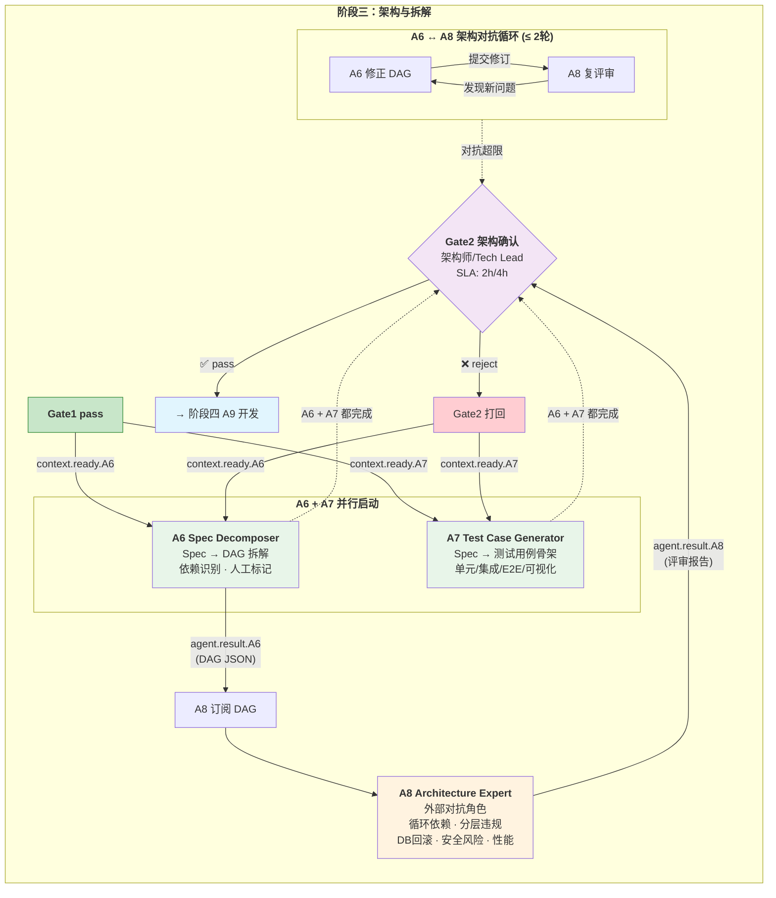
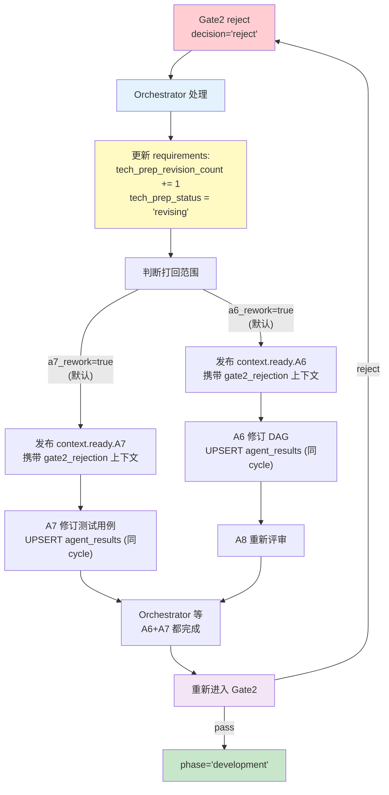
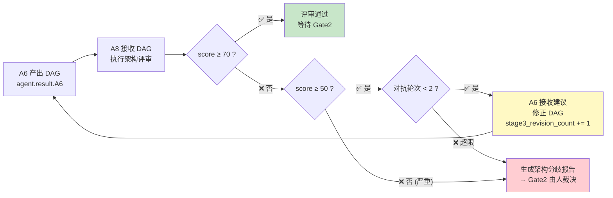

# 阶段三 PRD — 架构与拆解

## 文档信息
- **版本**: v1.0
- **日期**: 2026-07-15
- **作者**: 许清楚（产品经理）
- **状态**: 待评审
- **阶段**: P3（A6 / A7 / A8 / Gate2 / Orchestrator）
- **参考**:
  - [阶段一数据字典](./阶段一-数据字典.md)
  - [阶段二数据字典](./阶段二-数据字典.md)
  - [系统状态机与信息流设计](../系统架构/系统状态机与信息流设计.md)
  - [多Agent编排架构与设计规格](../AI-Native研发协同系统-02-多Agent编排架构与设计规格.md)

---

## 一、产品目标

| # | 目标 | 衡量标准 |
|---|------|---------|
| G1 | **自动将终版 Spec 拆解为可执行任务 DAG** | A6 可在 < 5 分钟内产出 DAG（含 LLM + fallback），覆盖率 ≥ 90% Spec 模块 |
| G2 | **自动生成覆盖单测/集成/E2E 的测试用例骨架** | A7 每个 Spec 模块至少产出 2 条用例，边界/异常场景覆盖率 ≥ 80% |
| G3 | **架构评审自动化 — 外部对抗角色 A8 拦截架构风险** | A8 可自动检测循环依赖、分层违规、DB 回滚缺失、安全风险、性能瓶颈，评审通过率 ≥ 70 分 |
| G4 | **架构师/Tech Lead 通过 Gate2 把关技术债底线** | Gate2 审批 SLA 2h/4h 升级，拒绝时自动触发 A6+A7 修订链路 |
| G5 | **阶段三内部修订不阻塞全链路 cycle 推进** | 使用独立的 `tech_prep_revision_count` 追踪阶段内返工，不改变 `cycle` |

---

## 二、用户故事

### US-1: Tech Lead 一键拆解技术方案

> **作为** Tech Lead，**我希望** 在 Gate1 通过后，系统自动将终版 Spec 拆解为带依赖关系、预估工时、并行标注的任务 DAG，**以便** 我能快速评估开发工作量、识别高风险任务，并在 Gate2 中做出审批决策。

**验收条件**:
- Gate1 pass 后，无需人工触发，A6 自动启动拆解
- DAG 至少包含 5 个任务节点，含 critical_path 和 parallel_groups
- 每个高复杂度（complexity=high）节点自动标记为"建议人工审核"
- DAG 节点字段包含：id、type、title、description、complexity、estimated_hours、agent、steps、needs_human_review

### US-2: 测试工程师提前获得测试骨架

> **作为** 测试工程师，**我希望** 在技术方案拆解的同时，系统自动基于 Spec + API 契约生成测试用例骨架（单测/集成/E2E），**以便** 我在开发启动前就能审查测试覆盖策略，并为 A11 自动化测试提供可执行资产。

**验收条件**:
- A7 在 Gate1 pass 后与 A6 并行启动
- 测试用例按 type（unit/integration/e2e/visual/api）和 priority（P0/P1/P2）分类
- 每条用例含标题、前置条件、步骤（action+expected）、标签
- 产出存入 `test_assets` 表，A11 可直接订阅复用

### US-3: 架构师通过 Gate2 把关技术风险

> **作为** 架构师，**我希望** 在 A6 产出 DAG 后，系统自动生成一份架构评审报告（含循环依赖、分层违规、DB 回滚、安全风险检测），**以便** 我快速定位架构问题并在 Gate2 中做出 pass/reject 决策。

**验收条件**:
- A8 订阅 A6 的 DAG 产出并自动执行架构评审
- 评审报告含：score（0-100）、violations（按 severity 分级）、suggestions、summary
- score < 70 或检测到循环依赖时，Gate2 必须要求人工裁决
- Gate2 审批页面展示 A8 报告全文，含逐条 violation 的详情和建议

### US-4: Gate2 打回后 A6+A7 重新产出

> **作为** Tech Lead，**我希望** 在 Gate2 拒绝后，A6 和 A7 自动接收拒绝原因并重新产出修订版 DAG 和测试用例，**以便** 快速迭代技术方案，减少人工协调成本。

**验收条件**:
- Gate2 reject 后，Orchestrator 同时发布 `context.ready.A6` 和 `context.ready.A7`
- context payload 携带 Gate2 拒绝原因（reject_reasons + revision_guidance）
- 修订后 A6/A7 在同一 cycle 内覆盖更新 agent_results（UPSERT）
- `tech_prep_revision_count` 递增，cycle 不变

---

## 三、需求池

### P0 — 必须实现

| 编号 | 需求 | 验收标准 |
|------|------|---------|
| **P0-01** | **A6 Spec Decomposer 核心逻辑** | 1) 接收 `context.ready.A6`（含完整 Spec）<br/>2) 调用 LLM 拆解为任务 DAG（nodes + edges + critical_path + parallel_groups）<br/>3) LLM 失败时 fallback 到关键词规则拆解<br/>4) 产物写入 `agent_results` (agent_key='A6') + `task_dags` 新表<br/>5) 发布 `agent.result.A6` |
| **P0-02** | **A7 Test Case Generator 核心逻辑** | 1) 接收 `context.ready.A7`（含 Spec + 可选 DAG 节点信息）<br/>2) 调用 LLM 生成测试用例（每个模块至少 2 条，含边界/异常）<br/>3) LLM 失败时 fallback 到规则生成<br/>4) 产物按类型分类写入 `agent_results` (agent_key='A7') + `test_assets` 表<br/>5) 发布 `agent.result.A7` |
| **P0-03** | **A8 Architecture Expert 核心逻辑** | 1) 订阅 A6 的 DAG 产出（agent.result.A6）异步触发<br/>2) 执行三阶段检查：静态分析（循环依赖/分层违规/DB回滚）→ LLM 架构评审 → 合并报告<br/>3) score < 70 或检测到循环依赖 → verdict='fail'<br/>4) 产物写入 `agent_results` (agent_key='A8')<br/>5) 发布 `agent.result.A8` |
| **P0-04** | **Gate2 架构审批** | 1) 接收 `context.ready.gate2`（含全部上游产物 + A8 评审报告）<br/>2) MC Backend 预创建 `approvals` (gate_level=2, status='pending')<br/>3) 审批人决策后写入 decision='pass'\|'reject' + a6_rework / a7_rework 标记<br/>4) 发布 `agent.result.gate2.pass` 或 `agent.result.gate2.reject`<br/>5) SLA: 2h 预警 / 4h 超时升级至技术总监 |
| **P0-05** | **Orchestrator 阶段三编排** | 1) Gate1 pass → 更新 `requirements.phase='tech_prep'`, `tech_prep_status='decomposing'`<br/>2) 并行发布 `context.ready.A6` 和 `context.ready.A7`<br/>3) 监听 `agent.result.A6` → 更新 `tech_prep_status='decomposed'`<br/>4) 监听 `agent.result.A7` → 更新 `tech_prep_status='test_ready'`（与 A6 完成状态独立判断）<br/>5) 监听 `agent.result.A8` → 不改变状态，仅累积产物<br/>6) A6+A7 都完成后 → build_context → 发布 `context.ready.gate2`<br/>7) Gate2 pass → 更新 `phase='development'` → 启动阶段四（A9）<br/>8) Gate2 reject → 递增 `tech_prep_revision_count` → 并行重发 `context.ready.A6` + `context.ready.A7` |
| **P0-06** | **数据库表扩展** | 1) `requirements` 表新增 `tech_prep_status` (VARCHAR) 和 `tech_prep_revision_count` (INT DEFAULT 0)<br/>2) `agent_results` 新增 agent_key 枚举 `'A6'`, `'A7'`, `'A8'`<br/>3) `approvals` 新增 gate_level=2 的审批行，新增 `a6_rework` / `a7_rework` 布尔字段<br/>4) 新建 `task_dags` 表（req_id/cycle/version/dag_json/status/created_at）<br/>5) 复用已有的 `test_assets` 表（A7 已部分实现写入逻辑）<br/>6) `event_log` 无需变更 |

### P1 — 应该实现

| 编号 | 需求 | 验收标准 |
|------|------|---------|
| **P1-01** | **A6 与 A8 架构对抗循环** | 1) A8 评审后若发现非致命问题（score ≥ 50 但 < 70），A6 接收 A8 建议进行 DAG 修正<br/>2) 对抗循环上限 2 轮，由 `stage3_revision_count` 追踪（区别于 Gate2 打回的 `tech_prep_revision_count`）<br/>3) 超限后生成《架构分歧报告》，推 Gate2 由人裁决 |
| **P1-02** | **A7 按模块对齐 DAG 分配测试** | 1) A7 初版生成后，等 A6 的 DAG 产出再补充分模块测试分配<br/>2) 每条 test case 的 `node_id` 字段关联到 DAG 节点<br/>3) 发布 `test.assets_ready` 事件时携带 `dag_node_mapping` |
| **P1-03** | **安全风险专项检查** | 1) A8 检查 DAG 中是否包含：认证/授权缺失、SQL 注入风险节点、敏感数据暴露、硬编码密钥<br/>2) 安全类 violation severity 视为 critical<br/>3) 安全红线检查结果独立展示在 Gate2 审批页 |
| **P1-04** | **性能风险预警** | 1) A8 检查 DAG 中是否存在 N+1 查询风险、缺少缓存层、未考虑分页<br/>2) 性能类 violation 归类为 warning |

### P2 — 可以延后

| 编号 | 需求 | 验收标准 |
|------|------|---------|
| **P2-01** | **DAG 可视化图形展示** | Gate2 审批页面以图形方式展示 DAG（节点+依赖边+人工标记），替代纯 JSON |
| **P2-02** | **测试覆盖率预测** | A7 基于 DAG 和 Spec 预估测试覆盖率目标，写入 `test_assets.coverage_targets` |
| **P2-03** | **架构评分趋势** | 同一 req 多次修订的 A8 评分变化趋势图，展示架构质量收敛过程 |
| **P2-04** | **人工介入任务自动通知** | A6 标记 `needs_human_review=true` 的节点，自动在飞书/TAPD 创建通知 |

---

## 四、信息流设计

### 4.1 核心并行/对抗关系



### 4.2 Gate2 打回链路



### 4.3 A6 ↔ A8 架构对抗循环（P1）



---

## 五、数据字典（增量变更）

### 5.1 requirements 表扩展

| 变更类型 | 字段 | 类型 | 说明 |
|---------|------|------|------|
| **新增** | `tech_prep_status` | VARCHAR(30) | 阶段三子状态枚举（见下方） |
| **新增** | `tech_prep_revision_count` | INT DEFAULT 0 | 阶段三内部修订计数（不改变 cycle） |

**tech_prep_status 枚举**:

| 值 | 含义 | 设置者 |
|----|------|--------|
| `decomposing` | A6 + A7 正在执行 | Orchestrator（Gate1 pass 后） |
| `decomposed` | A6 完成（DAG 已产出） | Orchestrator（收到 agent.result.A6） |
| `test_ready` | A7 完成（测试用例已产出） | Orchestrator（收到 agent.result.A7） |
| `reviewing` | A8 架构评审中 / 等待 Gate2 审批 | Orchestrator（A6+A7 都完成） |
| `revising` | Gate2 打回后 A6+A7 修订中 | Orchestrator（收到 agent.result.gate2.reject） |
| `tech_prep_completed` | Gate2 pass | Orchestrator（收到 agent.result.gate2.pass） |

**状态流转对照**:

```
Gate1 pass
  → phase = 'tech_prep'
  → tech_prep_status = 'decomposing'
  → tech_prep_revision_count = 0

A6 完成 (agent.result.A6)
  → tech_prep_status = 'decomposed'（若 A7 仍在跑）
  OR → tech_prep_status = 'reviewing'（若 A7 也已完成）

A7 完成 (agent.result.A7)
  → tech_prep_status = 'test_ready'（若 A6 仍在跑）
  OR → tech_prep_status = 'reviewing'（若 A6 也已完成）

Gate2 pass
  → phase = 'development'
  → tech_prep_status = 'tech_prep_completed'
  → tech_prep_revision_count 不再变化

Gate2 reject
  → tech_prep_status = 'revising'
  → tech_prep_revision_count += 1
  → A6/A7 并行重产出 → 回到 decomposing
```

### 5.2 agent_results 表扩展

表结构不变。新增 Agent Key：

| agent_key | 说明 | status 语义 |
|-----------|------|------------|
| `'A6'` | Spec 拆解 Agent | `'completed'` / `'empty'`（LLM+fallback 均失败） |
| `'A7'` | 测试用例生成 Agent | `'completed'` / `'skipped'`（Orchestrator 超时跳过） |
| `'A8'` | 架构评审 Agent | `'completed'` / `'skipped'` |

> **UPSERT 策略不变**：`INSERT ... ON CONFLICT (req_id, agent_key, cycle) DO UPDATE`。阶段三内部修订不改变 cycle，同 cycle 复用 UPSERT。

### 5.3 approvals 表扩展

新增 gate_level=2 的行。新增字段：

```sql
ALTER TABLE approvals ADD COLUMN a6_rework BOOLEAN DEFAULT true;
ALTER TABLE approvals ADD COLUMN a7_rework BOOLEAN DEFAULT true;
```

- `a6_rework`：Gate2 拒绝时是否需要 A6 返工（默认 true）
- `a7_rework`：Gate2 拒绝时是否需要 A7 返工（默认 true）
- 两字段分开控制，支持"仅需修订 DAG，测试用例可用"等场景

### 5.4 新增表：task_dags

```sql
CREATE TABLE task_dags (
    id              BIGSERIAL PRIMARY KEY,
    req_id          UUID NOT NULL REFERENCES requirements(id),
    cycle           INT NOT NULL DEFAULT 0,
    version         INT NOT NULL DEFAULT 1,         -- 修订版本号（A6↔A8 对抗或 Gate2 打回后递增）
    stage3_revision_count INT DEFAULT 0,            -- 阶段三内部修订计数器（对抗循环 + Gate2 打回后的再修订，区别于 version）
    dag_json        JSONB NOT NULL,                  -- 完整 DAG 结构（nodes/edges/critical_path/parallel_groups）
    node_count      INT,                             -- 节点总数
    critical_path_length INT,                        -- 关键路径长度
    total_estimated_hours NUMERIC(6,1),              -- 预估总工时
    human_review_nodes INT DEFAULT 0,                -- 标记为人工审核的节点数
    source          VARCHAR(20) DEFAULT 'llm',       -- 'llm' | 'llm_no_mcp' | 'fallback' | 'timeout'
    created_at      TIMESTAMPTZ DEFAULT NOW(),
    updated_at      TIMESTAMPTZ DEFAULT NOW(),

    UNIQUE (req_id, cycle, version)
);

CREATE INDEX idx_task_dags_req ON task_dags(req_id, cycle, version DESC);
```

**dag_json 结构规范**:

```json
{
  "nodes": [
    {
      "id": "task-01",
      "type": "planning|backend|frontend|db|testing|deployment",
      "title": "任务标题",
      "description": "任务描述",
      "complexity": "low|medium|high",
      "estimated_hours": 4,
      "agent": "A9",
      "steps": ["步骤1", "步骤2"],
      "needs_human_review": false,
      "human_review_reason": null
    }
  ],
  "edges": [
    {"from": "task-01", "to": "task-02", "type": "sequential|parallel"}
  ],
  "critical_path": ["task-01", "task-03", "task-05"],
  "parallel_groups": [
    {"name": "前后端并行开发", "tasks": ["task-02", "task-04"]}
  ],
  "total_estimated_hours": 48
}
```

### 5.5 复用表：test_assets（A7 已实现写入逻辑）

A7 现有代码已向 `test_assets` 表写入结构化测试资产。阶段三 PRD 确认此表为正式数据规范：

```sql
-- test_assets 表结构（确认 A7 现有实现）
CREATE TABLE test_assets (
    id                      BIGSERIAL PRIMARY KEY,
    req_id                  UUID NOT NULL REFERENCES requirements(id),
    unit_tests              JSONB,          -- 单元测试用例数组
    integration_tests       JSONB,          -- 集成测试用例数组
    e2e_tests               JSONB,          -- E2E 测试用例数组
    visual_tests            JSONB,          -- 可视化测试用例数组
    coverage_targets        JSONB,          -- 覆盖率目标 {overall, branches, lines}
    total_cases             INT,
    priority_distribution   JSONB,          -- {P0: n, P1: n, P2: n, P3: n}
    source                  VARCHAR(50) DEFAULT 'a7_generator',
    version                 INT DEFAULT 1,
    created_at              TIMESTAMPTZ DEFAULT NOW(),
    updated_at              TIMESTAMPTZ DEFAULT NOW()
);
```

---

## 六、NATS 事件规范

### 6.1 context.ready.A6（Orchestrator → A6）

```json
{
  "req_id": "uuid",
  "session_id": "uuid",
  "cycle": 0,
  "spec_package": {
    "spec_doc": {},
    "openapi_schema": {},
    "erd_diagram": {},
    "ddl_statements": "string"
  },
  "a1_output": { "requirement_draft": {} },
  "a2_output": { "feasibility_assessment": {} },
  "revision_context": {
    "is_revision": false,
    "tech_prep_revision_count": 0,
    "gate2_rejection": null,
    "previous_a8_report": null
  }
}
```

> **Gate2 打回时 revision_context**：`is_revision=true`，`gate2_rejection` 含 reject_reasons + revision_guidance，`previous_a8_report` 含最新 A8 评审报告。

### 6.2 context.ready.A7（Orchestrator → A7）

与 `context.ready.A6` 类似的 spec_package + revision_context 结构，**不包含 a1_output/a2_output**（A7 仅需 A5 产出的 Spec）。**额外注入 A6 DAG 节点预览**（若 A6 已先行完成）：

```json
{
  "req_id": "uuid",
  "session_id": "uuid",
  "cycle": 0,
  "spec_package": {},
  "dag_preview": {
    "nodes": [],
    "node_count": 8,
    "dag_available": true
  },
  "revision_context": {}
}
```

- `dag_preview.dag_available`：Gate1 pass 后首次调度时 A6 未完成，此值为 false。Gate2 打回时 A6 同时重修，A7 在收到修订 context 时此值可能为 false。
- A7 应支持 `dag_preview.dag_available=false` 的模式，先生成基础测试用例，待 `test.assets_ready` 发布后由 P1-02 异步补充分模块映射。

### 6.3 agent.result.A6（A6 → Orchestrator）

```json
{
  "req_id": "uuid",
  "session_id": "uuid",
  "cycle": 0,
  "dag": {
    "dag_id": "dag-{req_id}-{timestamp}",
    "nodes": [],
    "edges": [],
    "critical_path": [],
    "parallel_groups": [],
    "total_estimated_hours": 48,
    "source": "llm",
    "metadata": {
      "node_count": 8,
      "human_review_nodes": 2,
      "high_complexity_nodes": 1
    }
  },
  "timestamp": "ISO 8601"
}
```

### 6.4 agent.result.A7（A7 → Orchestrator）

```json
{
  "req_id": "uuid",
  "session_id": "uuid",
  "cycle": 0,
  "test_assets": {
    "test_asset_id": 42,
    "test_plan_id": "tp-{req_id}-{timestamp}",
    "total_cases": 24,
    "unit_tests": [],
    "integration_tests": [],
    "e2e_tests": [],
    "visual_tests": [],
    "coverage_targets": { "overall": 0.8, "branches": 0.75, "lines": 0.85 },
    "priority_distribution": { "P0": 5, "P1": 12, "P2": 7 }
  },
  "timestamp": "ISO 8601"
}
```

### 6.5 agent.result.A8（A8 → Orchestrator）

```json
{
  "req_id": "uuid",
  "session_id": "uuid",
  "cycle": 0,
  "review": {
    "review_id": "rev-{req_id}-{timestamp}",
    "verdict": "pass|fail",
    "score": 82,
    "gate2_required": false,
    "checks": {
      "cycle_dependency": {"passed": true},
      "layer_violation": {"passed": true, "count": 0},
      "db_rollback": {"passed": false, "count": 2},
      "security_risk": {"passed": true, "count": 0},
      "performance_risk": {"passed": false, "count": 1}
    },
    "violations": [
      {
        "rule": "DB-ROLLBACK-001",
        "severity": "critical|warning",
        "title": "违规标题",
        "detail": "详细说明",
        "suggestion": "修复建议",
        "affected_nodes": ["node_id"]
      }
    ],
    "suggestions": ["建议1", "建议2"],
    "summary": "评审总结"
  },
  "timestamp": "ISO 8601"
}
```

### 6.6 context.ready.gate2（Orchestrator → Gate2）

```json
{
  "req_id": "uuid",
  "session_id": "uuid",
  "cycle": 0,
  "a1_output": { "requirement_draft": {} },
  "a2_output": { "feasibility_assessment": {} },
  "a3_output": { "prototype_url": "string" },
  "a4_output": {
    "spec_doc": {},
    "openapi_schema": {},
    "erd_diagram": {},
    "ddl_statements": "string"
  },
  "a5_output": { "check_report": {} },
  "a6_output": { "dag": {} },
  "a7_output": { "test_assets": {} },
  "a8_output": { "review": {} },
  "tech_prep_revision_count": 0
}
```

### 6.7 agent.result.gate2.pass / agent.result.gate2.reject

```json
// pass
{
  "req_id": "uuid",
  "session_id": "uuid",
  "cycle": 0,
  "gate_level": 2,
  "decision": "pass",
  "reviewer_user_id": "string",
  "reviewer_name": "string",
  "reviewed_at": "ISO 8601"
}

// reject
{
  "req_id": "uuid",
  "session_id": "uuid",
  "cycle": 0,
  "gate_level": 2,
  "decision": "reject",
  "reject_reasons": [
    {
      "category": "dag_incomplete|architecture_issue|test_insufficient|security_concern|performance_risk|other",
      "description": "描述"
    }
  ],
  "revision_guidance": "修订指引",
  "a6_rework": true,
  "a7_rework": true,
  "reviewer_user_id": "string",
  "reviewer_name": "string",
  "reviewed_at": "ISO 8601"
}
```

### 6.8 Gate2 拒绝原因枚举

| category | 含义 | UI 标签 |
|----------|------|---------|
| `dag_incomplete` | DAG 任务拆分不完整，缺少关键任务 | DAG 不完整 |
| `architecture_issue` | 架构设计存在分层/依赖问题 | 架构问题 |
| `test_insufficient` | 测试用例覆盖不足 | 测试不足 |
| `security_concern` | 存在安全风险 | 安全问题 |
| `performance_risk` | 存在性能瓶颈风险 | 性能风险 |
| `other` | 其他原因 | 其他 |

### 6.9 context.ready.A8（Orchestrator → A8）

> A8 由 Orchestrator 在 A6+A7 都完成 GATHER 后发布此事件触发。详细结构见《阶段三-数据字典》§6.5。

```json
{
  "req_id": "uuid",
  "session_id": "uuid",
  "cycle": 0,
  "spec_package": {},
  "dag": { "nodes": [], "edges": [], "critical_path": [], "parallel_groups": [] },
  "a6_output": {},
  "a7_output": {},
  "revision_context": {
    "is_revision": false,
    "stage3_revision_count": 0
  }
}
```

| 字段 | 说明 |
|------|------|
| `dag` | A6 产出的完整 DAG（供 A8 逐节点检查） |
| `a6_output` | A6 的 agent_results 完整产物 |
| `a7_output` | A7 的 agent_results 完整产物 |
| `revision_context.stage3_revision_count` | 当前对抗轮次（0 表示首次评审） |

---

## 七、Orchestrator 编排逻辑

### 7.1 正常流程

```
Gate1 pass
  → 写入 event_log (direction='IN', event_name='agent.result.gate1.pass')
  → 更新 requirements: phase='tech_prep', tech_prep_status='decomposing'
  → 查询 DB（MAX cycle）: requirements + agent_results (A1-A5) + design_specs
  → build_context → 并行发布 NATS:
      - context.ready.A6
      - context.ready.A7
  → 写入 event_log (direction='OUT', event_name='context.ready.A6')
  → 写入 event_log (direction='OUT', event_name='context.ready.A7')

A6 完成 (agent.result.A6):
  → 写入 event_log (direction='IN', event_name='agent.result.A6')
  → 更新 requirements.tech_prep_status = 'decomposed'（若 A7 未完成）
  → 若 A7 已完成 → tech_prep_status = 'reviewing'
  → 检查 gather: A6 + A7 都完成？

A7 完成 (agent.result.A7):
  → 写入 event_log (direction='IN', event_name='agent.result.A7')
  → 更新 requirements.tech_prep_status = 'test_ready'（若 A6 未完成）
  → 若 A6 已完成 → tech_prep_status = 'reviewing'
  → 检查 gather: A6 + A7 都完成？

GATHER (A6 + A7 都完成):
  → 发布 context.ready.A8（携带 DAG 信息）
  → 写入 event_log (direction='OUT', event_name='context.ready.A8')

A8 完成 (agent.result.A8):
  → 写入 event_log (direction='IN', event_name='agent.result.A8')
  → 检查是否需要 A6↔A8 对抗循环（P1-01）
  → 查询 DB: 全部 A1-A8 产物
  → build_context → 发布 context.ready.gate2
  → 写入 event_log (direction='OUT', event_name='context.ready.gate2')
  → MC Backend 预创建 approvals (gate_level=2, status='pending')

Gate2 pass:
  → 写入 event_log (direction='IN', event_name='agent.result.gate2.pass')
  → 更新 requirements: phase='development', tech_prep_status='tech_prep_completed'
  → 启动阶段四 → 发布 context.ready.A9
```

### 7.2 Gate2 打回链路

```
Gate2 reject (agent.result.gate2.reject):
  → 写入 event_log (direction='IN', event_name='agent.result.gate2.reject')
  → 更新 requirements:
      - tech_prep_status = 'revising'
      - tech_prep_revision_count += 1
  → 从 payload 读取 a6_rework / a7_rework 标记
  → 查询 DB: gate2_rejection context + 当前最新 DAG + test_assets
  → build_context（含 revision_context）:
      ├── a6_rework=true → 发布 context.ready.A6
      └── a7_rework=true → 发布 context.ready.A7
  → 写入 event_log (direction='OUT')
  → 修订后完整重走 A6+A7 → A8 → Gate2 链路（cycle 不变）
```

### 7.3 超时降级

```
A6 超时（10 分钟）:
  → Orchestrator 重试 1 次 → 仍超时
  → 写入 agent_results (agent_key='A6', cycle, status='empty')
  → a6_output = {a6_missing: true}
  → 继续 Gate2（审批人见空 DAG，可打回）

A7 超时（10 分钟）:
  → Orchestrator 重试 1 次 → 仍超时
  → 写入 agent_results (agent_key='A7', cycle, status='skipped')
  → a7_output = {a7_missing: true}
  → 继续 Gate2

A8 超时（10 分钟）:
  → Orchestrator 重试 1 次 → 仍超时
  → 写入 agent_results (agent_key='A8', cycle, status='skipped')
  → a8_output = {a8_missing: true}
  → 继续 Gate2（无架构评审报告，审批人仅看 DAG + 测试用例）
```

---

## 八、NATS JetStream 配置

### 8.1 Stream 与 Subject

| 项目 | 值 | 说明 |
|------|-----|------|
| **Stream** | `AI_NATIVE_EVENTS` | 复用已有 Stream |
| **Subject 新增** | `context.ready.A6`, `context.ready.A7`, `context.ready.A8`, `agent.result.A6`, `agent.result.A7`, `agent.result.A8`, `context.ready.gate2`, `agent.result.gate2.pass`, `agent.result.gate2.reject`, `dag.created` | 阶段三事件 |
| **Nats-Msg-Id** | 所有 publish 必须携带 | 确保幂等 |
| **Durable Consumer** | `A6_consumer`, `A7_consumer`, `A8_consumer`, `gate2_consumer` | 固定命名 |

### 8.2 Consumer 配置

| Consumer | 订阅 Subject | 交付策略 |
|----------|-------------|---------|
| `A6_consumer` | `context.ready.A6` | All, 按 req_id 有序 |
| `A7_consumer` | `context.ready.A7` | All, 按 req_id 有序 |
| `A8_consumer` | `context.ready.A8` | All, 按 req_id 有序 |
| `gate2_consumer` | `context.ready.gate2` | All, 按 req_id 有序 |

> `context.ready.A8` 由 Orchestrator 在 A6+A7 都完成 GATHER 后发布。`dag.created` 是 A6 的成果广播事件，A8 不直接订阅。

---

## 九、与上下游衔接

### 9.1 上游（阶段二 → 阶段三）

```
Gate1 pass
  → requirements.phase: 'design' → 'tech_prep'
  → requirements.design_status: 'design_completed' → NULL
  → requirements.tech_prep_status: 'decomposing'
  → requirements.tech_prep_revision_count: 0
  → A6/A7 并行启动
```

### 9.2 下游（阶段三 → 阶段四）

```
Gate2 pass
  → requirements.phase: 'tech_prep' → 'development'
  → requirements.tech_prep_status: 'tech_prep_completed'
  → A6 DAG 节点作为 A9 任务分配依据
  → A7 test_assets 作为 A11 测试执行输入
  → 发布 context.ready.A9
```

---

## 十、待确认问题

以下问题需架构师在下一阶段澄清，暂不影响 P0 开发：

| # | 问题 | 影响范围 | 建议方向 |
|---|------|---------|---------|
| Q1 | **A7 是否需要等 A6 的 DAG 完成后才能按模块精确分配测试用例？** 当前设计是"A7 先行生成基础用例，后续补充分模块映射"，但 P1-02 的实现复杂度需要评估。 | A7 执行时序 | 先按 P0 方案（A7 不等 A6），P1-02 作为后续优化 |
| Q2 | **A6↔A8 对抗循环的触发条件是全自动还是需要人工确认？** 当前设计为"自动触发但 ≤ 2 轮"，但若 A8 评分接近阈值（如 68 分），是否值得自动触发？ | A6/A8 编排 | 建议设置阈值区间 [50, 70)，区间内自动触发对抗 |
| Q3 | **Gate2 的 a6_rework / a7_rework 是否允许独立控制？** 已设计为两个独立布尔字段，但实际场景中是否会出现"只需 A6 修订、A7 保持不变"的情况？ | Gate2 审批 UI | 保留字段但 Gate2 UI 初期可简化为一键打回（两字段同值） |
| Q4 | **A8 架构评审是否应只评 DAG，还是也评 A7 的测试用例覆盖策略？** 当前 A8 输入仅为 DAG，但测试用例覆盖不足也是架构风险。 | A8 输入范围 | 建议 A8 在 Gate2 前可访问 test_assets，P1-04 扩展安全/性能检查 |
| Q5 | **`stage3_revision_count`（对抗循环）与 `tech_prep_revision_count`（Gate2 打回）是否需要分开计数？** | **已解决**：两个计数器用途不同——`stage3_revision_count` 追踪单次 Gate2 审批周期内的 A6↔A8 对抗轮次（Gate2 打回后重置为 0），`tech_prep_revision_count` 追踪 Gate2 打回次数（跨周期累加）。详见完整设计 §8.2。 |
| Q6 | **DAG 节点数上限是否有限制？** LLM 可能会生成过多过细的节点，影响 A9 调度效率。 | A6 prompt 设计 | 建议 prompt 中限制 5-20 个节点，超过 20 个提示合并 |

---

## 十一、非功能性需求

| 类别 | 要求 |
|------|------|
| **性能** | A6/A7/A8 单次执行 ≤ 5 分钟（含 LLM 调用），超时 10 分钟重试 1 次 |
| **可用性** | LLM 不可用时 A6/A7 fallback 到规则模式，A8 fallback 到静态分析 |
| **幂等性** | 所有 agent_results 写入使用 UPSERT，同一 (req_id, agent_key, cycle) 可覆盖 |
| **可追溯** | event_log 记录全部 NATS 收发，task_dags 按 version 保留每版 DAG |
| **安全性** | A8 安全红线检查结果独立展示，Gate2 审批人必审 |

---

**文档维护**: AI-Native团队
**最后更新**: 2026-07-15
**版本**: v1.0
