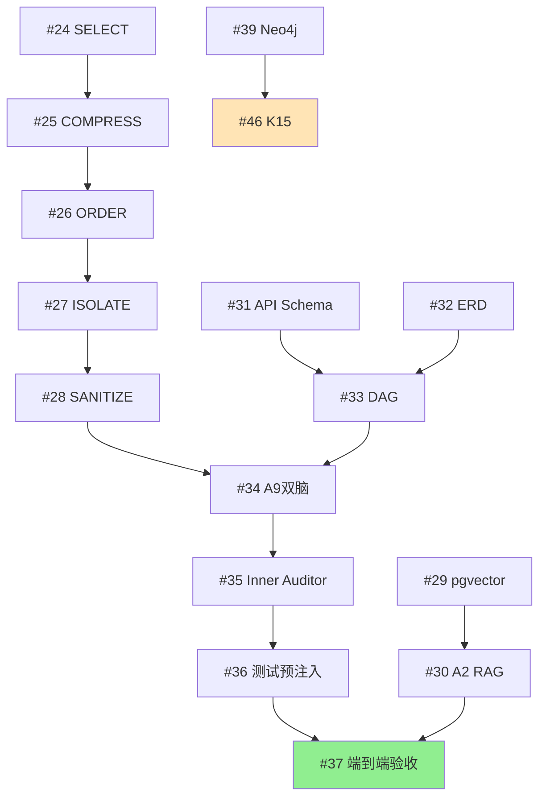

# AI-Native 研发协同系统 Phase 6/7 实施计划

> **版本**: v1.0  
> **目标**: 从 60% 实现度提升到生产就绪  
> **时间跨度**: 12 周（6 个 Sprint × 2 周）  
> **总工作量**: 104 人日

---

## 📋 执行摘要

### 当前状态
- ✅ **已完成**: 4-Gate 审批、Fast Track 分类器、15 个 Agent 骨架、NATS 事件总线、Prometheus Metrics
- ⚠️ **部分实现**: Context Builder（简化版）、熔断引擎（计数器完整，策略升级缺失）、可观测性（Metrics 完整，Tracing 缺失）
- ❌ **关键缺失**: Context Builder 完整流程、70% Skills API、RAG 知识检索、Dev Agent IDE 集成、测试资产预注入

### Phase 6 目标（核心阻塞项）
**里程碑**: 真实需求从飞书输入，经完整流程到 GitHub PR，所有 Agent 使用真实工具（无 Mock）

**关键成果**:
- Context Builder 5 步完整流程（SELECT/COMPRESS/ORDER/ISOLATE/SANITIZE）
- RAG 知识检索（pgvector + 语义搜索）
- A4/A6 核心 Skills（API Schema、ERD、DAG 构建器）
- A9 Dev Agent 双脑架构（Coder ↔ Auditor 隔离）
- A7 → A9 → A11 测试资产预注入闭环

### Phase 7 目标（生产就绪）
**里程碑**: 生产环境 3 个月稳定运行，平均需求周期时间 ≤8h，AI 贡献度 ≥60%

**关键成果**:
- OpenTelemetry 分布式追踪（Jaeger 后端）
- Neo4j 知识图谱（K14/K15 依赖分析）
- MC 前端交互闭环（原型标注 + 测试用例编辑）
- 熔断策略升级（Few-shot 注入 + 强模型切换）
- Prometheus AlertManager（自动告警到飞书）

---

## 🎯 Phase 6: 核心阻塞项（任务 #24-#37）

**工作量**: 46 人日  
**时间**: 6 周（Sprint 1-3）

### 任务清单

#### 6.1 Context Builder 完整实现（任务 #24-#28，20人日）

**#24: SELECT 步骤** (8人日)
- 从 PostgreSQL/Neo4j/pgvector 多源查询候选上下文
- 验收：3个数据源查询成功，耗时<500ms，覆盖率≥80%

**#25: COMPRESS 步骤** (3人日，依赖#24)
- LLM压缩器 + 代码压缩器 + 去重算法
- 验收：token减少40-60%，关键信息不丢失，耗时<2s

**#26: ORDER 步骤** (3人日，依赖#25)
- 相关性打分算法（语义0.4+时间0.2+引用0.2+依赖0.2）
- 验收：Top-10相关性≥85%，不同Agent不同排序，耗时<300ms

**#27: ISOLATE 步骤** (3人日，依赖#26)
- 风险评估规则引擎，决策NONE/WORKTREE/CONTAINER
- 验收：DB迁移100%判定CONTAINER，UI设计100%判定NONE，误判率<10%

**#28: SANITIZE 步骤** (3人日，依赖#27)
- 敏感信息检测引擎（API Key/密码/PII）
- 验收：100%检出API Key和DB连接串，PII准确率≥95%

#### 6.2 RAG 知识检索（任务 #29-#30，8人日）

**#29: pgvector部署 + Embedding服务** (5人日)
- PostgreSQL启用pgvector扩展，创建向量表
- 实现Embedding服务（DeepSeek/GLM API）
- 验收：语义检索准确率≥85%，缓存命中率≥60%

**#30: A2知识分析器RAG集成** (3人日，依赖#29)
- 调用pgvector语义检索，输出结构化知识包
- 验收：覆盖率≥80%，LLM总结质量≥4/5分，耗时<10s

#### 6.3 A4/A6 核心Skills（任务 #31-#33，13人日）

**#31: API Schema生成器** (4人日)
- Few-shot Prompting生成OpenAPI 3.1 JSON
- 验收：通过openapi-spec-validator，生成质量≥4/5分

**#32: ERD设计器** (4人日)
- 生成Mermaid ERD图 + PostgreSQL DDL
- 验收：DDL通过sqlparse验证，外键100%正确

**#33: DAG构建器** (5人日)
- 依赖分析算法 + 拓扑排序，输出任务DAG
- 验收：无循环依赖，DB迁移100%排在代码任务之前

#### 6.4 A9 Dev Agent双脑架构（任务 #34-#36，17人日）

**#34: IDE集成 + 双脑架构** (8人日，依赖#33,#28)
- Coder：Claude Code CLI，worktree隔离
- Auditor：独立进程，ESLint/mypy/Semgrep集成
- 验收：Approval rate≥60%，端到端耗时<5min

**#35: Inner Auditor工具链** (5人日，依赖#34)
- 集成ESLint/mypy/golangci-lint/Semgrep
- 验收：能检出SQL注入/XSS漏洞，工具超时控制生效

**#36: 测试资产预注入** (4人日，依赖#34,#28)
- A7结构化测试资产 → A9 TDD模式 → A11执行+补强
- 验收：端到端测试通过率≥85%，覆盖率不足时A11生成补充用例

#### 6.5 端到端验收（任务 #37，3人日）

**#37: Phase 6完整验收** (3人日，依赖#24-#36)
- 3个真实需求（简单/中等/复杂）全流程测试
- 验收：简单需求<2h，中等需求<8h，代码质量≥4/5分，覆盖率≥70%

---

## 🎯 Phase 7: 生产就绪（任务 #38-#47）

**工作量**: 58 人日  
**时间**: 6 周（Sprint 4-6）

### 任务清单

**#38: OpenTelemetry Tracing** (10人日) - Jaeger后端 + 跨Agent调用链
**#39: Neo4j知识图谱** (8人日) - 9种节点+8种关系+K14/K15集成
**#40: 原型标注交互** (6人日) - MC标注→A3热更新，平均收敛≤3轮
**#41: 测试用例UI交互** (8人日) - MC编辑→A7校验→A11补强
**#42: Agent活动直播SSE** (4人日) - 实时推送延迟<1s
**#43: 熔断策略升级** (4人日) - Few-shot注入成功率提升≥30%
**#44: A12 Security Scanner** (4人日) - Bandit/Semgrep真实集成
**#45: 变异测试引擎** (6人日) - Stryker/mutmut + A11 Critic模式
**#46: K15变更传播** (6人日，依赖#39) - Neo4j依赖分析
**#47: AlertManager** (2人日) - 告警规则+飞书通知

---

## 📅 实施顺序（6个Sprint）

### Sprint 1 (Week 1-2): Context Builder + RAG基础
- 任务: #24→#25→#26→#27→#28, #29
- 并行: #30（RAG集成）在#29完成后立即开始
- 输出: Context Builder完整可用，A2能查询历史知识

### Sprint 2 (Week 3-4): Skills API + DAG编排
- 任务: #31, #32, #33
- 并行: #34（A9双脑）可在本Sprint开始，但需#33完成后集成
- 输出: A4/A6核心Skills完成，DAG可驱动A9

### Sprint 3 (Week 5-6): Dev Agent + 测试闭环
- 任务: #34→#35→#36→#37
- 输出: **Phase 6验收通过**，真实需求端到端可运行

### Sprint 4 (Week 7-8): 可观测性 + 知识图谱
- 任务: #38, #39, #42
- 输出: 完整分布式追踪 + 知识图谱 + 实时活动流

### Sprint 5 (Week 9-10): 用户交互闭环
- 任务: #40, #41, #43
- 输出: MC前端交互闭环，熔断自动升级

### Sprint 6 (Week 11-12): 质量保障 + 告警
- 任务: #44, #45, #46, #47
- 输出: **Phase 7验收通过**，系统生产就绪

---

## 🔗 依赖关系图

---

## ⚠️ 风险与建议

### 高风险项
1. **Context Builder缺失** - 阻塞所有Agent高质量执行，最高优先级
2. **A9 双脑隔离** - Coder ↔ Auditor必须独立进程，否则无法实现"看不到思考过程"
3. **Skills API占位符** - 22/30个Skills为Mock，必须优先实现A4/A6核心Skills

### 实施建议
1. **严格按Sprint顺序** - Context Builder是最高优先级
2. **并行开发** - #34可与#31-#33并行开始，但需#33完成后才能集成
3. **验证频率** - 每个Sprint结束前运行端到端测试
4. **资源分配** - 建议2-3人全职投入，每Sprint完成15-20人日任务

### 验收原则
- 每个任务完成后立即验证验收标准
- 发现阻塞性Bug立即修复，不拖到下个Sprint
- Phase 6验收通过是进入Phase 7的硬性前提

---

## 📊 工作量汇总

| 阶段 | 任务数 | 人日 | 周数 |
|------|--------|------|------|
| Phase 6 | 14 | 46 | 6 |
| Phase 7 | 10 | 58 | 6 |
| **总计** | **24** | **104** | **12** |

---

**文档版本**: v1.0  
**最后更新**: 2026-07-02  
**下一步**: 立即执行Sprint 1任务（#24-#30）

---

## 🏗️ 已有基础设施（172.27.78.109）

### 已部署组件
- ✅ **PostgreSQL + pgvector**: `pgvector/pgvector:pg16` (端口 5432)
  - Extension: vector 0.8.3 已启用
  - Database: ai_native
  - User/Password: ai_native/ai_native_dev
  
- ✅ **Neo4j**: `neo4j:5-community` (端口 7474/7687)
  - User/Password: neo4j/ai-native-2026
  - 图数据库已就绪，等待 Schema 初始化
  
- ✅ **Redis**: `redis:7-alpine` (端口 6379)
  - 用于 Embedding 缓存 + WebSocket
  
- ✅ **Prometheus**: 端口 9090，已采集 MC Backend metrics
- ✅ **Grafana**: 端口 3000，2 个 Dashboard 已配置
- ✅ **NATS**: 端口 4222，事件总线运行中

### 需新建的组件
- ⚠️ **Jaeger** (Task #38) - OpenTelemetry Tracing
- ⚠️ **AlertManager** (Task #47) - Prometheus 告警路由

### 复用策略
- **Task #29** (pgvector): 跳过 docker-compose 修改，直接创建表结构
- **Task #39** (Neo4j): 跳过部署，直接初始化 Schema + 导入数据
- **Task #24** (Context Builder): 直接连接到已有 PostgreSQL/Neo4j/Redis

---

**文档最后更新**: 2026-07-02 15:00  
**当前执行**: Sprint 1 任务 #24, #29, #31 并行中
