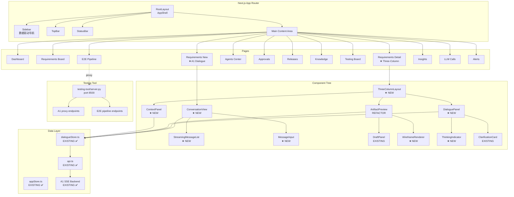
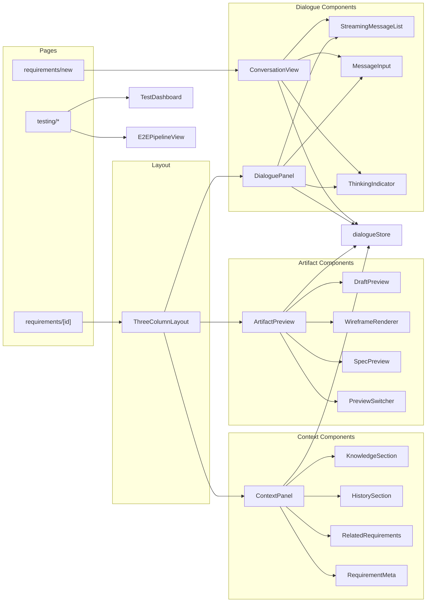
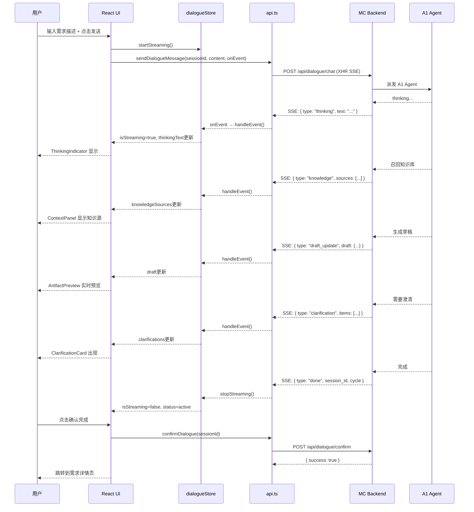
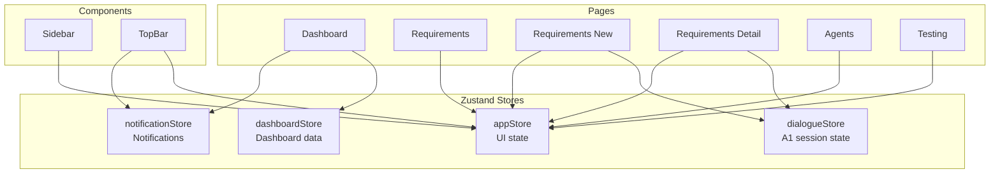

# AI-Native 前端架构重设计划 — 完整 SPEC

> **版本**: v1.0  
> **日期**: 2026-07-17  
> **状态**: Ready for Implementation  
> **作者**: AI-Native 前端团队

---

## 目录

1. [现状分析](#1-现状分析)
2. [问题诊断](#2-问题诊断)
3. [A1 Agent 就绪度评估](#3-a1-agent-就绪度评估)
4. [目标架构设计](#4-目标架构设计)
5. [路由重设计](#5-路由重设计)
6. [组件架构](#6-组件架构)
7. [三栏布局详情设计](#7-三栏布局详情设计)
8. [数据流设计](#8-数据流设计)
9. [Testing Tool 迁移方案](#9-testing-tool-迁移方案)
10. [实施计划](#10-实施计划)
11. [附录：关键组件 API 合约](#11-附录关键组件-api-合约)

---

## 1. 现状分析

### 1.1 项目概况

| 维度 | 详情 |
|------|------|
| 框架 | Next.js 16.2.9 (App Router) |
| 运行时 | React 19.2.4 |
| 状态管理 | Zustand 5.0.14 |
| 样式方案 | Tailwind CSS 4 |
| 可视化 | ECharts 6.1.0, @xyflow/react 12.11.1 |
| 动效 | framer-motion 12.42.0 |
| 布局 | react-grid-layout 2.2.3 |

### 1.2 路由页面完整清单（27 个 page.tsx）

#### 根层级（无侧边栏，仅 TopBar + StatusBar）

| 路由 | 行数 | 功能 | 状态 |
|------|------|------|------|
| `/` | ~20 | 重定向到 `/mc` | 占位 |
| `/requirements` | — | 需求看板 | **与 MC 重复** |
| `/requirements/[id]` | ~918 | 需求详情（三栏布局，但用旧 Chat API） | **需重构** |
| `/agents` | — | Agent 总览 | 功能重复 |
| `/approvals` | — | 审批列表 | 功能重复 |
| `/approvals/[id]` | — | 审批详情 | — |
| `/releases` | — | 版本发布 | 功能重复 |
| `/insights` | — | 效能仪表盘 | 功能重复 |
| `/alerts` | — | 告警中心 | 功能重复 |
| `/knowledge` | — | 知识库 | — |

#### MC Layout（深色主题侧边栏，9 个导航项）

| 路由 | 行数 | 功能 |
|------|------|------|
| `/mc` | — | Dashboard 首页 |
| `/mc/requirements` | — | 需求流总览（看板） |
| `/mc/agents` | — | Agent 中心（SwarmView 等 15 个组件） |
| `/mc/approvals` | — | 审批中心 |
| `/mc/insights` | — | 效能仪表盘 |
| `/mc/alerts` | — | 告警中心 |
| `/mc/releases` | — | 版本发布 |
| `/mc/llm-calls` | — | LLM 调用监控（列表） |
| `/mc/llm-calls/[call_id]` | — | LLM 调用详情 |
| `/mc/prototype` | — | 原型预览 |

#### Workbench Layout（蓝色主题侧边栏，5 个导航项）

| 路由 | 行数 | 功能 |
|------|------|------|
| `/workbench` | — | 我的工作台首页 |
| `/workbench/requirements` | — | 需求流（开发视角） |
| `/workbench/requirements/[id]` | ~896 | 需求详情 + 原型标注（三栏，旧 Chat API） |
| `/workbench/knowledge` | — | 知识库 |
| `/workbench/testing` | ~229 | 测试工作台 — 需求列表 |
| `/workbench/testing/[id]` | ~1828 | 测试工作台 — 单需求测试详情 |

#### 独立路由

| 路由 | 行数 | 功能 |
|------|------|------|
| `/workspace` | — | 协作空间 |

### 1.3 组件清单（24 个）

#### 布局组件（3 个）
| 组件 | 路径 | 功能 |
|------|------|------|
| `TopBar` | `layout/TopBar.tsx` | 全局顶部栏（搜索、通知、用户） |
| `Sidebar` | `layout/Sidebar.tsx` | 通用侧边栏组件（被两套 layout 分别内联替代） |
| `StatusBar` | `layout/StatusBar.tsx` | 全局底部状态栏 |

#### Agent 组件（15 个）
| 组件 | 功能 |
|------|------|
| `AgentCenterApp` | Agent 中心主容器 |
| `SwarmView` | Agent 群组视图 |
| `SwarmCard` | 单个 Agent 群组卡片 |
| `TopologyView` | Agent 拓扑视图 |
| `ViewSwitcher` | 视图切换器（Swarm/Topology/LiveTail） |
| `ActionBar` | Agent 操作栏 |
| `ActivityTimeline` | Agent 活动时间线 |
| `StatsBar` | Agent 统计栏 |
| `StatusDot` | Agent 状态指示灯 |
| `CodeDiffViewer` | 代码差异查看器 |
| `DiffHunkRenderer` | Diff 块渲染器 |
| `DiffLineRow` | Diff 单行渲染 |
| `LiveTailView` | 实时日志尾随视图 |
| `RequirementDetailPanel` | 需求详情面板（Agent 视角） |
| `AgentStatsBar` | Agent 统计条 |

#### 通用组件（7 个）
| 组件 | 功能 |
|------|------|
| `ActivityStream` | 活动流 |
| `ClarificationCard` | AI 澄清卡片 |
| `CodePreview` | 代码预览 |
| `DraftPanel` | 需求草稿预览面板 |
| `MarkdownRenderer` | Markdown 渲染器 |
| `PrototypeAnnotator` | 原型标注器 |
| `TestCaseEditor` | 测试用例编辑器 |

### 1.4 Store 清单（4 个）

| Store | 功能 | 状态 |
|-------|------|------|
| `appStore` | 全局 UI 状态（sidebar/dark/view/search/notification） | ✅ 正常使用 |
| `dialogueStore` | **A1 SSE 对话状态管理**（完整实现） | ⚠️ 零 UI 消费者 |
| `dashboardStore` | Dashboard 数据 | 有限使用 |
| `notificationStore` | 通知数据 | 有限使用 |

### 1.5 API 客户端（api.ts，417 行）

| 方法组 | 端点 | 状态 |
|--------|------|------|
| **Requirements** | CRUD `/api/requirements` | ✅ |
| **Dialogue (A1)** | `POST /api/dialogue/chat` (SSE) | ✅ API 层就绪 |
| | `POST /api/dialogue/confirm` | ✅ |
| | `GET /api/dialogue/history/{id}` | ✅ |
| | `GET /api/dialogue/current/{req_id}` | ✅ |
| **Agents** | CRUD | ✅ |
| **Approvals** | CRUD | ✅ |
| **Releases** | CRUD | ✅ |

### 1.6 Testing Tool 目录

| 文件 | 功能 | 关键性 |
|------|------|--------|
| `server.py` | FastAPI (port 8500)，E2E pipeline + A1 dialogue 代理端点 | ⚡ 核心 |
| `static/index.html` | A1 Dialogue Test Dashboard (~800 行 vanilla JS) | ⚡ **唯一 A1 SSE UI** |
| `static/e2e.html` | E2E Pipeline Test 页面 | ⚡ |
| `utils/mc_client.py` | MC Backend API 包装器 | 基础设施 |
| `tests/` | 完整测试套件（单元 + 集成） | 测试资产 |

---

## 2. 问题诊断

### 2.1 核心问题矩阵

| 问题 | 严重度 | 影响 |
|------|--------|------|
| **3 套独立 Layout** | 🔴 严重 | 代码重复 3x，导航体验割裂，维护噩梦 |
| **需求看板实现 4 次** | 🔴 严重 | `/requirements`、`/mc/requirements`、`/workbench/requirements`、workbench detail |
| **A1 Dialogue 零前端集成** | 🔴 严重 | Store 和 API 已就绪但无任何 React 页面调用 |
| **Testing 仅存在于 workbench 下** | 🟡 中等 | 测试功能应该是一级入口，不是 workbench 的子页面 |
| **无统一侧边栏** | 🟡 中等 | `Sidebar.tsx` 组件存在但未被使用，逻辑硬编码在各 layout |
| **旧 Chat API 使用** | 🟡 中等 | 需求详情页使用旧的非 SSE Chat API，需替换为 A1 Dialogue |
| **根层级遗留路由** | 🟢 低 | 重定向 `/` → `/mc`，多个顶层页面只是空壳 |

### 2.2 用户核心诉求 vs 现状差距

| 用户诉求 | 现状 | 差距 |
|----------|------|------|
| 新建需求 → A1 对话流 | 无此页面 | **完全缺失** |
| 需求详情三栏布局 | 存在但用旧 API | 需替换为 A1 SSE |
| 后端交互式对话 (SSE) | Store+API 就绪 | 需构建 UI 消费层 |
| 评估 A1 Agent 支持度 | — | 需系统性评估 |
| 包含 testing-tool 页面 | 独立部署 | 需迁移到统一前端 |

---

## 3. A1 Agent 就绪度评估

### 3.1 分层就绪度

```
┌──────────────────────────────────────────────┐
│           A1 Agent 全栈就绪度评估             │
├──────────────┬─────────┬─────────────────────┤
│ MC Backend   │ ✅ 100% │ POST /api/dialogue/ │
│              │         │ chat (SSE), confirm, │
│              │         │ history, current     │
├──────────────┼─────────┼─────────────────────┤
│ SSE Events   │ ✅ 100% │ thinking, knowledge, │
│              │         │ draft_update,        │
│              │         │ clarification,       │
│              │         │ wireframe, done, err │
├──────────────┼─────────┼─────────────────────┤
│ 前端 API     │ ✅ 100% │ api.ts 中 5 个方法   │
│              │         │ 全部就绪             │
├──────────────┼─────────┼─────────────────────┤
│ 前端 Store   │ ✅ 95%  │ dialogueStore.ts     │
│              │         │ handleEvent() 完整   │
├──────────────┼─────────┼─────────────────────┤
│ 前端 UI      │ ❌ 0%   │ 无任何 React 页面    │
│              │         │ 消费 dialogueStore   │
├──────────────┼─────────┼─────────────────────┤
│ Testing Tool │ ⚠️ 60%  │ index.html 是唯一    │
│              │         │ A1 SSE 消费者，但    │
│              │         │ 不是 React 组件      │
└──────────────┴─────────┴─────────────────────┘
```

### 3.2 SSE 事件 → UI 映射

| SSE Event | 含义 | 目标 UI 组件 | 就绪度 |
|-----------|------|-------------|--------|
| `thinking` | A1 正在推理 | `ThinkingIndicator` (NEW) | ❌ |
| `knowledge` | 召回知识源 | `ContextPanel` → KnowledgeSection | ❌ |
| `draft_update` | 草稿增量更新 | `ArtifactPreview` → DraftPanel | ⚠️ 组件存在，未集成 SSE |
| `clarification` | 需要澄清 | `DialoguePanel` → ClarificationCard | ⚠️ 组件存在 |
| `wireframe` | 生成线框图 | `ArtifactPreview` → WireframeRenderer (NEW) | ❌ |
| `done` | 对话完成 | 全局对话状态切换 | ❌ |
| `error` | 出现错误 | 全局错误提示 | ❌ |

### 3.3 结论

**A1 Agent 的后端能力已 100% 就绪**，前后端数据通道完全打通。唯一的缺口是 **前端 React UI 层**—需要构建新建需求对话页和三栏详情页来消费已有的 `dialogueStore` 和 SSE API。

---

## 4. 目标架构设计

### 4.1 统一 AppShell 架构

```
┌──────────────────────────────────────────────────────┐
│                   RootLayout                         │
│  ┌────────────────────────────────────────────────┐  │
│  │                  TopBar                         │  │
│  │  [Logo] [Search] ... [Notifications] [User]    │  │
│  ├──────────┬─────────────────────────────────────┤  │
│  │          │                                     │  │
│  │ Sidebar  │         Main Content                │  │
│  │          │                                     │  │
│  │ [可折叠] │    ┌─────────────────────────────┐   │  │
│  │          │    │                             │   │  │
│  │ ▼ 需求   │    │   Page Content              │   │  │
│  │ ▼ Agent  │    │                             │   │  │
│  │ ▼ 测试   │    │                             │   │  │
│  │ ▼ 审批   │    │                             │   │  │
│  │ ▼ 发布   │    │                             │   │  │
│  │ ▼ 知识   │    │                             │   │  │
│  │ ▼ 监控   │    │                             │   │  │
│  │ ▼ 告警   │    │                             │   │  │
│  │          │    │                             │   │  │
│  │          │    └─────────────────────────────┘   │  │
│  ├──────────┴─────────────────────────────────────┤  │
│  │                StatusBar                        │  │
│  └────────────────────────────────────────────────┘  │
└──────────────────────────────────────────────────────┘
```

**核心变化**：
- 删除 `app/mc/layout.tsx` 和 `app/workbench/layout.tsx`
- `app/layout.tsx` 从 "仅 TopBar" 升级为 "TopBar + Sidebar + Content + StatusBar" 的完整 AppShell
- Sidebar 统一使用现有的 `Sidebar.tsx` 组件（重构为数据驱动）
- 通过路由段识别当前上下文，高亮侧边栏项目

### 4.2 目标路由树

```
/app/                           → AppShell (统一 Layout)
├── page.tsx                    → /app → Dashboard 首页（原 /mc）
├── requirements/
│   ├── page.tsx                → 需求总览看板（合并所有重复）
│   ├── new/
│   │   └── page.tsx            → NEW: 新建需求 — A1 对话流
│   └── [id]/
│       └── page.tsx            → 需求详情 — 三栏 A1 对话
├── agents/
│   └── page.tsx                → Agent 中心（合并重复）
├── approvals/
│   ├── page.tsx                → 审批中心
│   └── [id]/
│       └── page.tsx            → 审批详情
├── releases/
│   └── page.tsx                → 版本发布
├── knowledge/
│   └── page.tsx                → 知识库（合并重复）
├── testing/
│   ├── page.tsx                → 测试工作台（从 workbench 提升）
│   ├── [id]/
│   │   └── page.tsx            → 测试详情
│   └── e2e/
│       └── page.tsx            → NEW: E2E Pipeline（从 testing-tool 迁移）
├── insights/
│   └── page.tsx                → 效能仪表盘
├── llm-calls/
│   ├── page.tsx                → LLM 调用监控
│   └── [call_id]/
│       └── page.tsx            → LLM 调用详情
└── alerts/
    └── page.tsx                → 告警中心
```

### 4.3 架构 Mermaid 图



---

## 5. 路由重设计

### 5.1 完整 Old → New 映射表

| 旧路由 | 新路由 | 操作 | 备注 |
|--------|--------|------|------|
| `/` | `/app` | **重定向** | `/` 永久重定向到 `/app` |
| `/mc` | `/app` | **迁移** | Dashboard 首页 |
| `/mc/requirements` | `/app/requirements` | **合并** | 与根层级、workbench 版本合并 |
| `/mc/agents` | `/app/agents` | **迁移** | Agent 中心 |
| `/mc/approvals` | `/app/approvals` | **迁移** | 审批中心 |
| `/mc/insights` | `/app/insights` | **迁移** | 效能仪表盘 |
| `/mc/alerts` | `/app/alerts` | **迁移** | 告警中心 |
| `/mc/releases` | `/app/releases` | **迁移** | 版本发布 |
| `/mc/llm-calls` | `/app/llm-calls` | **迁移** | LLM 调用监控 |
| `/mc/llm-calls/[call_id]` | `/app/llm-calls/[call_id]` | **迁移** | LLM 调用详情 |
| `/mc/prototype` | **删除** | **并入** | 原型功能并入需求详情 ArtifactPreview |
| `/workbench` | **删除** | **废弃** | 无独立 Dashboard 首页 |
| `/workbench/requirements` | `/app/requirements` | **合并** | 需求看板统一入口 |
| `/workbench/requirements/[id]` | `/app/requirements/[id]` | **重构** | 替换为 A1 SSE 三栏布局 |
| `/workbench/knowledge` | `/app/knowledge` | **合并** | 知识库统一入口 |
| `/workbench/testing` | `/app/testing` | **迁移** | 提升为一级入口 |
| `/workbench/testing/[id]` | `/app/testing/[id]` | **迁移** | 测试详情 |
| `/requirements` | `/app/requirements` | **合并** | 根层级重复，合并 |
| `/requirements/[id]` | `/app/requirements/[id]` | **重构** | 替换为 A1 SSE 三栏布局 |
| `/agents` | `/app/agents` | **合并** | 根层级重复，合并 |
| `/approvals` | `/app/approvals` | **合并** | 根层级重复，合并 |
| `/approvals/[id]` | `/app/approvals/[id]` | **迁移** | — |
| `/releases` | `/app/releases` | **合并** | 根层级重复，合并 |
| `/insights` | `/app/insights` | **合并** | 根层级重复，合并 |
| `/alerts` | `/app/alerts` | **合并** | 根层级重复，合并 |
| `/knowledge` | `/app/knowledge` | **合并** | 根层级重复，合并 |
| `/workspace` | **删除** | **废弃** | 功能待评估 |
| — | `/app/requirements/new` | **新建** | ★ A1 对话新建需求 |
| — | `/app/testing/e2e` | **新建** | ★ 从 testing-tool/static/e2e.html 迁移 |

### 5.2 统计

| 类别 | 数量 |
|------|------|
| 删除路由 | 15 个（所有 `/mc/*`、`/workbench/*`、`/workspace`、重复根路由） |
| 迁移页面 | 10 个 |
| 新建页面 | 2 个（`requirements/new`、`testing/e2e`） |
| **最终路由数** | **17 个**（从 27 降至 17） |
| **Layout 数** | **1 个 AppShell**（从 3 套降至 1 套） |

---

## 6. 组件架构

### 6.1 新组件目录结构

```
frontend/src/components/
├── layout/
│   ├── TopBar.tsx              # 保留，微调
│   ├── Sidebar.tsx             # 重构：数据驱动导航
│   ├── StatusBar.tsx           # 保留
│   └── AppShell.tsx            # NEW: 组合 TopBar + Sidebar + StatusBar
│
├── dialogue/                   # NEW: A1 对话组件族
│   ├── ConversationView.tsx    # 全屏对话视图（新建需求页）
│   ├── DialoguePanel.tsx       # 三栏布局中的对话栏
│   ├── StreamingMessage.tsx    # SSE 流式消息气泡
│   ├── ThinkingIndicator.tsx   # A1 思考动画指示器
│   ├── MessageInput.tsx        # 消息输入框（含确认/跳过按钮）
│   ├── KnowledgeSourceList.tsx # 知识源列表
│   └── CycleNavigator.tsx      # 对话轮次导航
│
├── artifact/                   # NEW: 产物预览组件族
│   ├── ArtifactPreview.tsx     # 产物预览容器
│   ├── DraftPreview.tsx        # 需求草稿预览（整合 DraftPanel）
│   ├── WireframeRenderer.tsx   # 线框图渲染器（NEW）
│   ├── SpecPreview.tsx         # Spec 文档预览
│   └── PreviewSwitcher.tsx     # 产物切换器（Draft/Wireframe/Spec）
│
├── context/                    # NEW: 上下文面板组件族
│   ├── ContextPanel.tsx        # 上下文面板容器
│   ├── KnowledgeSection.tsx    # 知识源区域
│   ├── HistorySection.tsx      # 历史对话区域
│   ├── RelatedRequirements.tsx # 关联需求区域
│   └── RequirementMeta.tsx     # 需求元信息
│
├── requirements/               # 需求相关组件
│   ├── RequirementCard.tsx     # 需求卡片
│   ├── RequirementBoard.tsx    # 需求看板（Kanban）
│   ├── RequirementFilters.tsx  # 需求筛选器
│   └── RequirementCreateButton.tsx # 新建需求入口按钮
│
├── testing/                    # NEW: 测试工作台组件
│   ├── TestDashboard.tsx       # 测试总览
│   ├── TestCaseList.tsx        # 测试用例列表
│   ├── TestResultViewer.tsx    # 测试结果查看器
│   ├── E2EPipelineView.tsx     # E2E Pipeline 视图
│   └── TestRunLauncher.tsx     # 测试运行启动器
│
├── agents/                     # 保留现有 15 个组件
│   └── ...                     # 不移动，路径不变
│
├── shared/                     # NEW: 共享组件
│   ├── MarkdownRenderer.tsx    # 整合现有组件
│   ├── CodePreview.tsx         # 整合现有组件
│   ├── ActivityStream.tsx      # 整合现有组件
│   ├── Badge.tsx               # 通用徽章
│   └── EmptyState.tsx          # 空状态占位
│
└── three-column/               # NEW: 三栏布局
    ├── ThreeColumnLayout.tsx   # 可拖拽三栏容器
    └── ColumnResizer.tsx       # 栏宽调整器
```

### 6.2 组件依赖图



---

## 7. 三栏布局详情设计

### 7.1 三栏整体结构

```
┌──────────────────────────────────────────────────────────────┐
│  TopBar                                [返回需求列表] [状态] │
├────────────┬──────────────────────┬──────────────────────────┤
│            │                      │                          │
│ Context    │   Dialogue           │   Artifact Preview       │
│ Panel     │   Panel              │                          │
│ (30%)     │   (40%)             │   (30%)                  │
│            │                      │                          │
│ ┌────────┐ │  ┌────────────────┐  │  ┌────────────────────┐  │
│ │ 需求元  │ │  │ [A1 头像]      │  │  │ [Draft|Wireframe   │  │
│ │ 信息   │ │  │ 我正在分析...  │  │  │  |Spec] 切换器     │  │
│ └────────┘ │  │ ████████░░░░  │  │  └────────────────────┘  │
│ ┌────────┐ │  └────────────────┘  │  ┌────────────────────┐  │
│ │ 知识源  │ │  ┌────────────────┐  │  │                    │  │
│ │ · doc1  │ │  │ [用户] 请创建  │  │  │  需求草稿预览      │  │
│ │ · doc2  │ │  │ 一个用户管理  │  │  │                    │  │
│ │ · doc3  │ │  │ 模块的需求... │  │  │  ## 概述           │  │
│ └────────┘ │  └────────────────┘  │  │  ...              │  │
│ ┌────────┐ │  ┌────────────────┐  │  │                    │  │
│ │ 历史    │ │  │ [A1] 以下是    │  │  │  ## 功能需求       │  │
│ │ 对话   │ │  │ 需求草稿...    │  │  │  ...              │  │
│ │ Round 1 │ │  └────────────────┘  │  │                    │  │
│ │ Round 2 │ │  ┌────────────────┐  │  └────────────────────┘  │
│ └────────┘ │  │ [输入框]       │  │                          │
│ ┌────────┐ │  │ [发送] [确认] │  │                          │
│ │ 关联    │ │  └────────────────┘  │                          │
│ │ 需求   │ │                      │                          │
│ └────────┘ │                      │                          │
│            │                      │                          │
├────────────┴──────────────────────┴──────────────────────────┤
│  StatusBar                                                    │
└──────────────────────────────────────────────────────────────┘
```

### 7.2 ContextPanel（左侧 30%）

**功能**：展示当前需求的上下文信息

| 区域 | 内容 | 数据来源 |
|------|------|----------|
| 需求元信息 | 标题、状态、创建时间、处理人、标签 | `GET /api/requirements/{id}` |
| 知识源 | A1 召回的相关文档/代码 | `dialogueStore.knowledgeSources` |
| 历史对话 | 对话轮次列表，可切换 | `dialogueStore.cycles` |
| 关联需求 | 父子/关联需求链接 | `GET /api/requirements/{id}/related` |

**交互**：
- 点击历史轮次 → 切换 DialoguePanel 显示对应历史
- 点击知识源 → 展开查看详情
- 可折叠各区域

### 7.3 DialoguePanel（中间 40%）

**功能**：A1 对话交互核心

| 子组件 | 功能 |
|--------|------|
| `StreamingMessageList` | 渲染 SSE 流式消息，自动滚动到底部 |
| `ThinkingIndicator` | 当 `isStreaming=true` 且收到 `thinking` 事件时显示脉冲/扫描动画 |
| `ClarificationCard` | 当收到 `clarification` 事件时渲染可交互的澄清卡片 |
| `MessageInput` | 底部的消息输入框，支持 [发送] [确认完成] [跳过] |
| `CycleNavigator` | 轮次间导航，显示 "Round 1 / 3" |

**流式渲染时序**：
```
1. 用户发送消息 → POST /api/dialogue/chat (SSE)
2. SSE: { type: "thinking", text: "分析需求关键词..." }
   → ThinkingIndicator 显示脉冲动画 + 文本
3. SSE: { type: "knowledge", sources: [...] }
   → ContextPanel 更新知识源列表
4. SSE: { type: "draft_update", draft: {...} }
   → ArtifactPreview 增量更新草稿
5. SSE: { type: "clarification", items: [...] }
   → DialoguePanel 渲染 ClarificationCard
6. SSE: { type: "wireframe", data: {...} }
   → ArtifactPreview 切换到 Wireframe 视图
7. SSE: { type: "done", session_id: "xxx", cycle: 2 }
   → 关闭 ThinkingIndicator，更新轮次
```

### 7.4 ArtifactPreview（右侧 30%）

**功能**：实时预览 A1 生成的产物

| 视图 | 组件 | 触发条件 |
|------|------|----------|
| 需求草稿 | `DraftPreview` | `draft_update` 事件 |
| 线框图 | `WireframeRenderer` | `wireframe` 事件 |
| Spec 文档 | `SpecPreview` | 需求确认后的最终文档 |

**交互**：
- `PreviewSwitcher` 在顶部切换 Draft / Wireframe / Spec
- 无内容时显示 `EmptyState`："等待 A1 生成内容..."
- 已确认完成后可导出（PDF/Markdown）

### 7.5 栏宽可调整

使用 `react-grid-layout` 或自定义拖拽手柄：
- 默认比例：30% / 40% / 30%
- 最小宽度：250px / 350px / 250px
- 拖动时平滑过渡

---

## 8. 数据流设计

### 8.1 A1 对话数据流



### 8.2 Store 依赖关系



### 8.3 新建需求对话流程

```
┌──────────────────────────────────────────────────────────────┐
│              新建需求 — A1 对话流程                           │
│                                                              │
│  1. 用户输入标题（可选）或直接输入需求描述                     │
│  2. 前端调用 createDialogueRequirement(title)                 │
│     → 后端创建 Requirement + A1 Dialogue Session             │
│     → 返回 { req_id, session_id }                             │
│  3. 前端将 (req_id, session_id) 写入 dialogueStore           │
│  4. 用户发送第一条消息（需求描述）                             │
│     → 前端调用 sendDialogueMessage(session_id, content)       │
│     → SSE 事件流开始                                          │
│  5. 对话过程中：                                              │
│     - thinking → 显示 ThinkingIndicator                       │
│     - knowledge → 更新知识源列表                              │
│     - draft_update → 实时预览草稿                             │
│     - clarification → 交互式澄清卡片                          │
│     - wireframe → 线框图渲染                                  │
│     - done → 本轮完成，等待用户确认或继续                     │
│  6. 用户确认 → confirmDialogue(session_id)                   │
│     → 需求状态从 draft → confirmed                           │
│     → 跳转到需求详情页 /app/requirements/{req_id}            │
└──────────────────────────────────────────────────────────────┘
```

---

## 9. Testing Tool 迁移方案

### 9.1 迁移策略

**保持 testing-tool 独立部署**，前端通过 API 代理调用：

```
┌──────────────────────┐     proxy      ┌─────────────────────┐
│   Next.js Frontend   │ ──────────────→ │  testing-tool       │
│   /app/testing/e2e   │  /api/testing/*  │  FastAPI :8500      │
│                       │ ←────────────── │                     │
│   React E2EPipeline-  │     JSON        │  /api/e2e/*         │
│   View 组件            │                 │  /api/dialogue/*    │
└──────────────────────┘                 └─────────────────────┘
```

### 9.2 待迁移页面

| 原位置 | 新位置 | 迁移方式 |
|--------|--------|----------|
| `testing-tool/static/index.html` | `/app/testing` | 用 React 重写 A1 Dialogue Test Dashboard |
| `testing-tool/static/e2e.html` | `/app/testing/e2e` | 用 React 重写 E2E Pipeline Test |

### 9.3 Next.js API 代理配置

```typescript
// next.config.ts 或 middleware.ts
// 将 /api/testing/* 代理到 testing-tool:8500
```

### 9.4 新 React 组件

| 组件 | 功能 | 对应原文件 |
|------|------|-----------|
| `TestDashboard` | 需求选择 + 健康状态面板 + E2E 运行历史 | `index.html` 侧边栏 + 主区域 |
| `A1DialogueTestView` | A1 对话测试界面（SSE 实时展示） | `index.html` 对话流部分 |
| `E2EPipelineView` | E2E Pipeline 执行视图（阶段进度条） | `e2e.html` |
| `TestRunLauncher` | 测试运行启动器（触发新 E2E run） | — |

---

## 10. 实施计划

### Phase 1: 基础设施搭建（1-2 天）

| # | Task | 文件 | 优先级 |
|---|------|------|--------|
| 1.1 | 重构 `layout/Sidebar.tsx` 为数据驱动导航组件 | `Sidebar.tsx` | P0 |
| 1.2 | 创建 `layout/AppShell.tsx` 统一布局容器 | `AppShell.tsx` (NEW) | P0 |
| 1.3 | 重构 `app/layout.tsx` — 集成 AppShell | `app/layout.tsx` | P0 |
| 1.4 | 创建 `app/app/layout.tsx` — 带侧边栏的次级 Layout | `app/app/layout.tsx` (NEW) | P0 |
| 1.5 | 创建新路由目录结构（`app/app/` 下所有子目录） | 文件夹 | P0 |
| 1.6 | 配置 `/` → `/app` 重定向 | `app/page.tsx` | P1 |

### Phase 2: 重复页面合并（1-2 天）

| # | Task | 文件 | 优先级 |
|---|------|------|--------|
| 2.1 | 合并所有需求看板代码 → `app/app/requirements/page.tsx` | 新页面 | P0 |
| 2.2 | 迁移 Agent 中心 → `app/app/agents/page.tsx` | 迁移 | P1 |
| 2.3 | 迁移审批中心 → `app/app/approvals/` | 迁移 | P1 |
| 2.4 | 迁移版本发布 → `app/app/releases/page.tsx` | 迁移 | P1 |
| 2.5 | 合并知识库 → `app/app/knowledge/page.tsx` | 迁移 | P1 |
| 2.6 | 迁移效能仪表盘 → `app/app/insights/page.tsx` | 迁移 | P2 |
| 2.7 | 迁移告警中心 → `app/app/alerts/page.tsx` | 迁移 | P2 |
| 2.8 | 迁移 LLM 监控 → `app/app/llm-calls/` | 迁移 | P2 |
| 2.9 | **删除**所有旧路由文件（`/mc/**`, `/workbench/**`, 根层级重复） | 删除 | P0 |

### Phase 3: A1 对话组件族构建（2-3 天）

| # | Task | 文件 | 优先级 |
|---|------|------|--------|
| 3.1 | 创建 `StreamingMessageList` + `StreamingMessage` | `dialogue/` (NEW) | P0 |
| 3.2 | 创建 `ThinkingIndicator` 动画组件 | `dialogue/` (NEW) | P0 |
| 3.3 | 创建 `MessageInput`（含确认/跳过按钮） | `dialogue/` (NEW) | P0 |
| 3.4 | 创建 `KnowledgeSourceList` | `dialogue/` (NEW) | P1 |
| 3.5 | 创建 `CycleNavigator` | `dialogue/` (NEW) | P1 |
| 3.6 | 组装 `ConversationView`（全屏对话） | `dialogue/` (NEW) | P0 |
| 3.7 | 组装 `DialoguePanel`（三栏版） | `dialogue/` (NEW) | P0 |

### Phase 4: 三栏布局 & 产物预览（2 天）

| # | Task | 文件 | 优先级 |
|---|------|------|--------|
| 4.1 | 创建 `ThreeColumnLayout` + `ColumnResizer` | `three-column/` (NEW) | P0 |
| 4.2 | 创建 `ContextPanel` + 子组件 | `context/` (NEW) | P0 |
| 4.3 | 重构 `DraftPreview`（基于 DraftPanel） | `artifact/` (NEW) | P0 |
| 4.4 | 创建 `WireframeRenderer` | `artifact/` (NEW) | P1 |
| 4.5 | 创建 `PreviewSwitcher` | `artifact/` (NEW) | P1 |
| 4.6 | 组装 `ArtifactPreview` 容器 | `artifact/` (NEW) | P0 |

### Phase 5: 关键页面实现（2-3 天）

| # | Task | 文件 | 优先级 |
|---|------|------|--------|
| 5.1 | 实现 `/app/requirements/new` — A1 对话新建需求页 | 新页面 | P0 |
| 5.2 | 重写 `/app/requirements/[id]` — 三栏 A1 对话详情页 | 重写 | P0 |
| 5.3 | 迁移 `/app/testing` — 测试工作台 | 迁移 | P1 |
| 5.4 | 迁移 `/app/testing/[id]` — 测试详情 | 迁移 | P1 |
| 5.5 | 实现 `/app/testing/e2e` — E2E Pipeline（从 testing-tool） | 新页面 | P2 |

### Phase 6: 清理 & 打磨（1-2 天）

| # | Task | 优先级 |
|---|------|--------|
| 6.1 | 删除所有旧路由目录（`mc/`, `workbench/`, `workspace/`） | P0 |
| 6.2 | 删除未使用的组件（评估是否可移除） | P1 |
| 6.3 | 统一 Tailwind 主题变量（色板、间距、字体） | P1 |
| 6.4 | 添加路由过渡动画（framer-motion） | P2 |
| 6.5 | 响应式适配（移动端侧边栏折叠） | P2 |
| 6.6 | 无障碍性审计（aria-label, keyboard nav） | P2 |
| 6.7 | 构建 & 部署验证 | P0 |

### 时间线概览

```
Week 1: Phase 1 (基础设施) + Phase 2 (页面合并)
Week 2: Phase 3 (A1 对话组件) + Phase 4 (三栏布局)
Week 3: Phase 5 (关键页面) + Phase 6 (清理打磨)
```

---

## 11. 附录：关键组件 API 合约

### 11.1 DialoguePanel

```typescript
interface DialoguePanelProps {
  /** 需求 ID，用于首次创建 session */
  reqId?: string;
  /** 已有的 session ID（详情页复用） */
  sessionId?: string;
  /** 是否为嵌入模式（三栏中 vs 全屏） */
  variant: 'embedded' | 'fullscreen';
  /** 对话完成回调 */
  onConfirmed?: (reqId: string) => void;
}
```

### 11.2 ContextPanel

```typescript
interface ContextPanelProps {
  reqId: string;
  /** 需求基本信息 */
  requirement?: {
    title: string;
    status: string;
    created_at: string;
    assignee?: string;
    tags: string[];
  };
  /** 当前对话轮次 */
  currentCycle?: number;
  /** 切换历史轮次回调 */
  onCycleChange?: (cycle: number) => void;
}
```

### 11.3 ArtifactPreview

```typescript
interface ArtifactPreviewProps {
  /** 当前激活的产物类型 */
  activeView: 'draft' | 'wireframe' | 'spec';
  /** 需求草稿数据 */
  draft: RequirementDraft | null;
  /** 线框图数据 */
  wireframe: WireframeData | null;
  /** 是否正在流式更新 */
  isStreaming: boolean;
  /** 切换视图回调 */
  onViewChange: (view: 'draft' | 'wireframe' | 'spec') => void;
}
```

### 11.4 ThinkingIndicator

```typescript
interface ThinkingIndicatorProps {
  /** 思考文本 */
  text: string;
  /** 是否活跃 */
  isActive: boolean;
  /** 动画变体 */
  variant?: 'pulse' | 'scan' | 'dots';
}
```

### 11.5 WireframeRenderer

```typescript
interface WireframeRendererProps {
  data: WireframeData;
  /** 页面切换 */
  activePageIndex?: number;
  onPageChange?: (index: number) => void;
}
```

### 11.6 ConversationView

```typescript
interface ConversationViewProps {
  /** 初始需求标题（可选，可为空） */
  initialTitle?: string;
  /** 对话完成后的回调 */
  onComplete: (reqId: string, sessionId: string) => void;
  /** 取消回调 */
  onCancel: () => void;
}
```

### 11.7 AppShell

```typescript
interface AppShellProps {
  children: React.ReactNode;
}

// 内部使用 usePathname() 确定当前路由
// 通过 appStore 管理侧边栏状态
```

---

## 变更日志

| 版本 | 日期 | 变更 |
|------|------|------|
| v1.0 | 2026-07-17 | 初始版本，完整架构设计与实施计划 |

---

> **下一步**：按 Phase 1 开始实施，优先完成基础设施搭建和 A1 对话组件构建。
