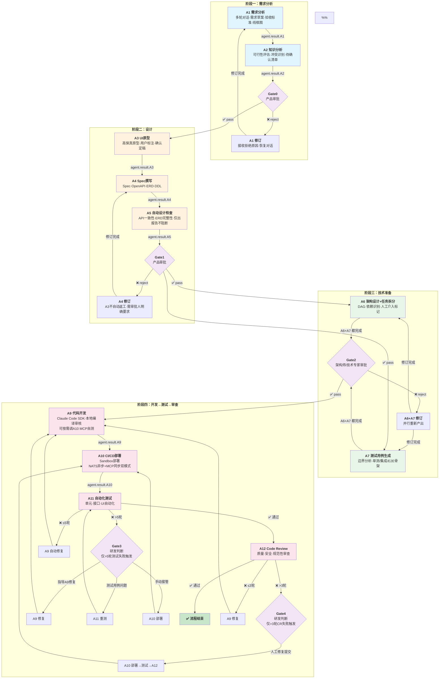

# AI-Native 系统状态机与信息流设计

**文档版本**: v2.4
**创建日期**: 2026-07-09
**维护团队**: AI-Native架构组
**目标读者**: 技术负责人、系统架构师

---

## 📋 文档概述

本文档以**业务流程**为主线，定义AI-Native研发协同系统中各Agent与Gate节点的职责边界、事件交互协议和状态流转规则。

### 通信架构

```
┌──────────┐  HTTP + SSE Stream   ┌──────────────┐   NATS (统一调度)   ┌──────────────┐
│   前端    │ ◄──────────────────► │  MC Backend  │ ◄─────────────────► │ Orchestrator │
│  (用户)   │                      │   (含A1)     │                     │   + Gate     │
└──────────┘                      └──────────────┘                     └──────────────┘
                                                                              │
                                                                     NATS (调度通信)
                                                                              │
                                                                      ┌───────┴───────┐
                                                                      │ Agent Workers │
                                                                      │ A2~A12        │
                                                                      └───────────────┘
```

- **用户 ↔ A1**: HTTP + SSE Stream 多轮对话
- **NATS**: 所有节点统一通过 NATS 收发调度事件（含 A1 的修订调度）
- **A10**: 同时提供 NATS 异步（Orchestrator 调度）和 MCP 同步（A9 自测调用）两种模式

---

## 一、全流程 Mermaid 图



---

## 二、业务流程详解（按节点维度）

### 2.1 节点总览

```
阶段一                阶段二                 阶段三                   阶段四
需求分析              设计                   技术准备                 开发→测试→审查
┌─────┐    ┌──────┐ ┌──────┐ ┌──────┐    ┌──────────┐    ┌──────────────────────────┐
│ A1  │ →  │  A3  │→│  A6  │          │  │  A9 → A10 → A11 ⇄ A12  │
│  ↓  │    │  ↓   │ │  +   │→ Gate2 →│  │    ↑          ↓         │
│ A2  │    │  A4  │→│  A7  │          │  │    └─Gate3    └─Gate4   │
│  ↓  │    │  ↓   │ │(并行) │          │  │========================│
│Gate0│    │  A5  │→│      │          │  │ 内循环≤5轮  外循环≤3轮   │
└─────┘    │  ↓   │ └──────┘          │  └──────────────────────────┘
           │Gate1 │                   │
           └──────┘                   │
```

### 2.2 阶段一：需求分析

#### A1 — 需求分析Agent

| 维度 | 内容 |
|------|------|
| **职责** | 通过多轮对话引导用户完善需求，产出结构化需求草案 |
| **交互方式** | HTTP + SSE Stream（用户对话），NATS（接收调度/发布结果） |
| **关键行为** | 1. 引导用户描述需求背景与目标<br/>2. 拆解用户故事和验收标准（Given-When-Then）<br/>3. 必要时生成低保真线框图辅助理解<br/>4. 用户确认后入库，通知 Orchestrator |

| 方向 | 事件 | 触发条件 |
|------|------|---------|
| ⬇ 订阅 | `context.ready.A1` | Orchestrator 调度（首次创建 / Gate0 打回后修订） |
| ⬆ 发布 | `agent.result.A1` | 用户确认完成 |

| 产出物 | 存储位置 |
|--------|---------|
| 需求草案（标题、描述、实体、用例、验收标准 GWT） | `requirements.requirement_draft` + `agent_results` (agent_key='A1') |
| 低保真线框图 URL（必要时） | `agent_results` (agent_key='A1') |
| 置信度评分 | `agent.result.A1` payload |

| 返工场景 | 说明 |
|---------|------|
| Gate0 拒绝 | 收到 `context.ready.A1`（含拒绝原因），会话状态进入 REOPENED，用户修订后重新走 A1→A2→Gate0 链路 |

---

#### A2 — 知识分析Agent

| 维度 | 内容 |
|------|------|
| **职责** | 检索企业知识库，评估需求的技术与业务可行性，识别与现有系统的冲突 |
| **交互方式** | NATS 调度，内部调用知识库 MCP 服务 |
| **关键行为** | 1. 读取 A1 需求草案<br/>2. 调用知识库 MCP 检索历史需求、相关代码、已知问题<br/>3. 评估可行性（技术/业务/风险级别）<br/>4. 生成待确认清单与冲突点报告 |

| 方向 | 事件 | 触发条件 |
|------|------|---------|
| ⬇ 订阅 | `context.ready.A2` | Orchestrator build_context(A1产出) 后 |
| ⬆ 发布 | `agent.result.A2` | 知识分析完成 |

| 产出物 | 存储位置 |
|--------|---------|
| 可行性评估（技术/业务/风险级别） | `agent_results` (agent_key='A2') |
| 待确认清单 | `agent_results` (agent_key='A2') |
| 冲突点列表（关联系统、冲突描述） | `agent_results` (agent_key='A2') |

> **异常处理**：A2 超时 10 分钟 → 重试 1 次，仍失败则跳过 A2 直接进 Gate0（context 中标记 A2 缺失）。

---

#### Gate0 — 产品审批节点

| 维度 | 内容 |
|------|------|
| **角色** | 产品经理 / 需求负责人 |
| **职责** | 审批 A1 需求草案和 A2 可行性分析是否通过 |

| 方向 | 事件 | 触发条件 |
|------|------|---------|
| ⬇ 订阅 | `context.ready.gate0` | A2 完成后 Orchestrator build_context |
| ⬆ 发布 | `agent.result.gate0.pass` | 审批通过 |
| ⬆ 发布 | `agent.result.gate0.reject` | 审批拒绝（含拒绝原因 + 修订指引） |

| 通过后流转 | 拒绝后流转 |
|-----------|-----------|
| → A3（DESIGNING_A3） | → Orchestrator 发布 `context.ready.A1`，A1 会话 REOPENED |

| SLA | 超时策略 |
|-----|---------|
| 1 小时 | 通知但不自动通过，必须人工审批 |

---

### 2.3 阶段二：设计

#### A3 — UI原型Agent

| 维度 | 内容 |
|------|------|
| **职责** | 根据需求生成高保真 UI 原型，支持用户在页面上标注调整或上传最终文档 |
| **关键行为** | 1. 读取 A1+A2 产出<br/>2. 生成高保真原型<br/>3. 用户在页面上标注调整或上传定稿<br/>4. 用户确认后入库 |

| 方向 | 事件 | 触发条件 |
|------|------|---------|
| ⬇ 订阅 | `context.ready.A3` | Gate0 通过后 Orchestrator build_context(A1+A2) |
| ⬆ 发布 | `agent.result.A3` | 用户确认原型定稿 |

| 产出物 | 存储位置 |
|--------|---------|
| 高保真原型 URL | `agent_results` (agent_key='A3') |

> **注**：A3 不在 Gate1 的自动返工路径中。如果 Gate1 涉及原型修改，需审批人在拒绝原因中明确要求，由人工触发 A3 返工。

---

#### A4 — Spec撰写Agent

| 维度 | 内容 |
|------|------|
| **职责** | 根据需求+原型产出完整技术规格（Spec、OpenAPI、ERD、DDL） |
| **关键行为** | 1. 读取 A1+A2+A3 产出<br/>2. 编写结构化 Spec 文档<br/>3. 生成 OpenAPI 规范<br/>4. 设计 ERD 并产出 DDL |

| 方向 | 事件 | 触发条件 |
|------|------|---------|
| ⬇ 订阅 | `context.ready.A4` | A3 完成后 / Gate1 打回后 |
| ⬆ 发布 | `agent.result.A4` | Spec 撰写完成 |

| 产出物 | 存储位置 |
|--------|---------|
| Spec 文档（含状态机） | `agent_results` (agent_key='A4') → `requirements.spec` 根键 |
| OpenAPI Schema | `agent_results` (agent_key='A4') |
| ERD 实体关系图 | `agent_results` (agent_key='A4') |
| DDL SQL 语句 | `agent_results` (agent_key='A4') |

| 返工场景 | 说明 |
|---------|------|
| Gate1 拒绝 | 收到 `context.ready.A4`（含 A5 检查报告 + Gate1 拒绝原因），修订后重新走 A4→A5→Gate1 |

---

#### A5 — 自动设计检查Agent

| 维度 | 内容 |
|------|------|
| **职责** | 对 A3+A4 产出做自动化检查，出具结论报告作为 Gate1 审批参考 |
| **不阻断** | 无论检查结果如何，流程都会继续进入 Gate1 |

| 方向 | 事件 | 触发条件 |
|------|------|---------|
| ⬇ 订阅 | `context.ready.A5` | A4 完成后 Orchestrator build_context |
| ⬆ 发布 | `agent.result.A5` | 设计检查完成 |

| 产出物 | 存储位置 |
|--------|---------|
| 设计检查报告（API一致性、ERD字段完整性、状态机闭合性等） | `agent_results` (agent_key='A5') |

---

#### Gate1 — 产品审批节点

| 维度 | 内容 |
|------|------|
| **角色** | 产品经理 |
| **职责** | 审批完整设计产出（原型+Spec+检查报告），A5 报告作为辅助决策依据 |

| 方向 | 事件 | 触发条件 |
|------|------|---------|
| ⬇ 订阅 | `context.ready.gate1` | A5 完成后 Orchestrator build_context(A1+A2+A3+A4+A5) |
| ⬆ 发布 | `agent.result.gate1.pass` | 审批通过 |
| ⬆ 发布 | `agent.result.gate1.reject` | 审批拒绝（含拒绝原因） |

| 通过后流转 | 拒绝后流转 |
|-----------|-----------|
| → A6+A7 并行（PREPARING_A6_A7） | → A4 修订（不自动返工 A3） |

| SLA | 超时策略 |
|-----|---------|
| 4 小时 | 超时后发通知，给 1 小时宽限期；宽限期后仍等待人工审批 |

---

### 2.4 阶段三：技术准备

#### A6 — 架构设计+任务拆分Agent

| 维度 | 内容 |
|------|------|
| **职责** | 将终版 Spec 拆解为可执行任务 DAG，识别依赖关系，标记需人工介入节点 |
| **与 A7 并行** | A6 和 A7 同时接收调度，互不依赖 |

| 方向 | 事件 | 触发条件 |
|------|------|---------|
| ⬇ 订阅 | `context.ready.A6` | Gate1 通过后 / Gate2 打回后 |
| ⬆ 发布 | `agent.result.A6` | 架构设计+任务拆分完成 |

| 产出物 | 存储位置 |
|--------|---------|
| 架构设计文档 | `agent_results` (agent_key='A6') |
| 任务拆分 DAG（节点 ID、标题、依赖边、预估工时） | `agent_results` (agent_key='A6') |

---

#### A7 — 测试用例生成Agent

| 维度 | 内容 |
|------|------|
| **职责** | 分析边界条件，生成单测/集成/E2E 用例骨架 |
| **与 A6 并行** | A7 和 A6 同时接收调度，互不依赖 |

| 方向 | 事件 | 触发条件 |
|------|------|---------|
| ⬇ 订阅 | `context.ready.A7` | Gate1 通过后 / Gate2 打回后 |
| ⬆ 发布 | `agent.result.A7` | 测试用例生成完成 |

| 产出物 | 存储位置 |
|--------|---------|
| 测试用例骨架（单元/集成/E2E） | `agent_results` (agent_key='A7') |

---

#### Gate2 — 架构师审批节点

| 维度 | 内容 |
|------|------|
| **角色** | 架构师 / 技术专家 |
| **职责** | 审批架构设计、任务拆分 DAG 和测试用例覆盖度 |

| 方向 | 事件 | 触发条件 |
|------|------|---------|
| ⬇ 订阅 | `context.ready.gate2` | A6+A7 都完成后 Orchestrator build_context |
| ⬆ 发布 | `agent.result.gate2.pass` | 审批通过 |
| ⬆ 发布 | `agent.result.gate2.reject` | 审批拒绝（含拒绝原因） |

| 通过后流转 | 拒绝后流转 |
|-----------|-----------|
| → A9（DEVELOPING） | → A6+A7 重新并行产出 |

| SLA | 超时策略 |
|-----|---------|
| 4 小时 | 同 Gate1 |

---

### 2.5 阶段四：开发→测试→审查 循环

#### A9 — 代码开发Agent

| 维度 | 内容 |
|------|------|
| **职责** | 通过 Claude Code SDK 进行代码开发，本地编译、审核、校验 |
| **关键行为** | 1. 读取全部上游产出 + 开发环境信息<br/>2. 使用 Claude Code SDK 生成代码<br/>3. 本地编译和自检<br/>4. 开发过程中可按需调用 A10 MCP 进行自测部署<br/>5. 产出代码项目并提交 commit |

| 方向 | 事件 | 触发条件 |
|------|------|---------|
| ⬇ 订阅 | `context.ready.A9` | Gate2 通过后 / A11 测试失败(≤5轮) / A12 CR不通过(≤3轮) / Gate3 决策→A9 |
| ⬆ 发布 | `agent.result.A9` | 代码开发完成并提交 |

| 产出物 | 存储位置 |
|--------|---------|
| 代码 diff 摘要 | `agent_results` (agent_key='A9') |
| commit 信息 | `agent_results` (agent_key='A9') |

| 返工场景 | 触发方 | 说明 |
|---------|--------|------|
| A11 测试失败 | Orchestrator 自动判断 | ≤5 轮自动循环，>5 轮升级 Gate3 |
| A12 CR 不通过 | Orchestrator 自动判断 | ≤3 轮自动循环，>3 轮升级 Gate4 |
| Gate3 决策→A9 修复 | Gate3 人工 | 人工给出修复思路后调度 |

---

#### A10 — CI/CD部署Agent

| 维度 | 内容 |
|------|------|
| **职责** | 将 A9 产出的代码通过 Sandbox 部署到测试环境 |
| **双模式** | NATS 异步（Orchestrator 调度）+ MCP 同步（A9 自测调用） |

| 方向 | 事件 | 触发条件 |
|------|------|---------|
| ⬇ 订阅 | `context.ready.A10` | A9 完成后 / Gate3 手动接管后 / Gate4 修复后 |
| ⬆ 发布 | `agent.result.A10` | 部署完成 |

| 产出物 | 存储位置 |
|--------|---------|
| 部署状态 | `agent_results` (agent_key='A10') |
| Sandbox URL | `agent_results` (agent_key='A10') |

| 模式 | 协议 | 使用场景 | 调用方 |
|------|------|---------|--------|
| NATS 异步 | `context.ready.A10` → `agent.result.A10` | 正式流程中的部署步骤 | Orchestrator |
| MCP 同步 | MCP 工具调用 | A9 开发过程中自测部署 | A9 (Claude Code SDK) |

> **部署失败处理**：A10 内部人工介入，暂不体现在状态转换表中。

---

#### A11 — 自动化测试Agent

| 维度 | 内容 |
|------|------|
| **职责** | 执行单元测试、接口测试、UI 自动化测试，产出测试报告 |
| **关键行为** | 1. 读取 A7 测试用例 + 部署后的代码<br/>2. 按 test_cases 的定义执行测试<br/>3. 汇总通过/失败/跳过统计<br/>4. 产出可追溯的测试报告 |

| 方向 | 事件 | 触发条件 |
|------|------|---------|
| ⬇ 订阅 | `context.ready.A11` | A10 部署完成后 / Gate3 决策→A11 重测 / Gate4 修复后的测试回归 |
| ⬆ 发布 | `agent.result.A11` | 测试执行完成 |

| 产出物 | 存储位置 |
|--------|---------|
| 测试报告（总数/通过/失败/跳过/覆盖率） | `agent_results` (agent_key='A11') |
| 失败用例详情 | `agent.result.A11` payload |

| 结果 | Orchestrator 处理 | 计数器 |
|------|------------------|--------|
| 通过 | → A12 Code Review | — |
| 不通过 ≤5 轮 | → 自动回到 A9 修复 | 内循环 +1 |
| 不通过 >5 轮 | → 升级到 Gate3 人工判断 | Gate3 触发 |

---

#### Gate3 — 测试兜底审批节点

| 维度 | 内容 |
|------|------|
| **角色** | 普通研发 |
| **职责** | 当自动化测试反复失败超过 5 轮时，人工判断问题根因 |

| 方向 | 事件 | 触发条件 |
|------|------|---------|
| ⬇ 订阅 | `context.ready.gate3` | A11 测试失败 >5 轮 |
| ⬆ 发布 | `agent.result.gate3.A9` | 决策→A9 按指导思路修复 |
| ⬆ 发布 | `agent.result.gate3.A11`（action=retest） | 决策→测试用例有问题，A11 重测 |
| ⬆ 发布 | `agent.result.gate3.A11`（action=manual_fix） | 决策→手动接管代码，A10 部署 |

| SLA | 超时策略 |
|-----|---------|
| 2 小时 | 通知但不自动通过 |

---

#### A12 — Code Review Agent

| 维度 | 内容 |
|------|------|
| **职责** | 审查代码质量、安全性、规范性，产出 CR 报告 |
| **关键行为** | 1. 读取 A9 产出 + A11 测试报告<br/>2. 按审查维度（正确性/安全/性能/规范/可维护性）逐项检查<br/>3. 产出结构化审查报告（问题分级 + 修复建议） |

| 方向 | 事件 | 触发条件 |
|------|------|---------|
| ⬇ 订阅 | `context.ready.A12` | A11 测试通过后 / Gate4 修复→测试回归→通过后 |
| ⬆ 发布 | `agent.result.A12` | CR 完成 |

| 产出物 | 存储位置 |
|--------|---------|
| 审查报告（问题列表+严重度+建议） | `agent_results` (agent_key='A12') |

| 结果 | Orchestrator 处理 | 计数器 |
|------|------------------|--------|
| 通过 | ✅ 完整流程结束 | — |
| 不通过 ≤3 轮 | → 自动回到 A9 修复 | 外循环 +1 |
| 不通过 >3 轮 | → 升级到 Gate4 人工判断 | Gate4 触发 |

---

#### Gate4 — CR兜底审批节点

| 维度 | 内容 |
|------|------|
| **角色** | 普通研发 |
| **职责** | 当 Code Review 反复不通过超过 3 轮时，人工介入修复代码 |

| 方向 | 事件 | 触发条件 |
|------|------|---------|
| ⬇ 订阅 | `context.ready.gate4` | A12 CR 不通过 >3 轮 |
| ⬆ 发布 | `agent.result.gate4.pass` | 人工修复代码并提交 |

| 修复后流转 | 说明 |
|-----------|------|
| → A10（部署）→ A11（测试回归）→ A12（重新CR） | 人工修复的代码必须经过完整测试验证后再进入 CR |

| SLA | 超时策略 |
|-----|---------|
| 2 小时 | 通知但不自动通过 |

---

## 三、循环计数器规则

系统维护两个独立计数器，共同决定自动修复上限：

| 计数器 | 管辖范围 | 上限 | 超限目标 |
|--------|---------|:--:|---------|
| **内循环** | A11 测试失败 → A9 修复 | 5 | Gate3 |
| **外循环** | A12 CR 不通过 → A9 修复 | 3 | Gate4 |

**重置规则**：

| 触发事件 | 内循环 | 外循环 | 原因 |
|---------|:-----:|:-----:|------|
| A11 测试失败 → A9 | +1 | 不变 | 普通内循环 |
| A12 CR 不通过 → A9 | **归零** | +1 | 新开发周期，重新计数测试 |
| Gate3 → A9 修复 | **归零** | 不变 | 人工介入视为新基线 |
| Gate3 → A11 重测 | **归零** | 不变 | 测试用例修正后重新开始 |
| Gate3 → 手动接管 | **归零** | 不变 | 人工代码视为新基线 |
| Gate4 → 人工修复 | **归零** | 不变 | 人工代码视为新基线 |

> **原则**：每次从非「A11 失败」路径进入 DEVELOPING 时，内循环归零。

---

## 四、事件协议总览

### 4.1 命名规范

- `context.ready.{target}` — Orchestrator 发出的调度指令
- `agent.result.{source}` — Agent 完成后的产出通知
- `agent.result.{gate}.{action}` — Gate 审批结果

### 4.2 完整事件清单

| 事件 | 发布者 → 订阅者 | 触发时机 | 携带产物 |
|------|----------------|---------|---------|
| `agent.result.A1` | A1 → Orchestrator | 需求确认 | 《需求草案》《验收标准(GWT)》《低保真线框图》(可选) |
| `context.ready.A2` | Orchestrator → A2 | 调度 A2 | 《需求草案》《验收标准(GWT)》《低保真线框图》 |
| `agent.result.A2` | A2 → Orchestrator | 知识分析完成 | 《可行性评估》《待确认清单》《冲突点报告》 |
| `context.ready.gate0` | Orchestrator → Gate | 调度 Gate0 | 《需求草案》《验收标准》《可行性评估》《待确认清单》《冲突点报告》 |
| `agent.result.gate0.pass` | Gate → Orchestrator | Gate0 通过 | —（无新增产物） |
| `agent.result.gate0.reject` | Gate → Orchestrator | Gate0 拒绝 | 《Gate0审批意见》（拒绝原因 + 分类/严重度 + 修订指引） |
| `context.ready.A1` | Orchestrator → A1 | 调度 A1 修订 | 《需求草案》(原版)《可行性评估》《Gate0审批意见》 |
| `context.ready.A3` | Orchestrator → A3 | 调度 A3 | 《需求草案》《验收标准》《可行性评估》《冲突点报告》 |
| `agent.result.A3` | A3 → Orchestrator | 原型定稿 | 《高保真原型》 |
| `context.ready.A4` | Orchestrator → A4 | 调度 A4（首次） | 《需求草案》《验收标准》《可行性评估》《高保真原型》 |
| | | 调度 A4（Gate1返工） | 上述全部 +《设计检查报告》+《Gate1审批意见》 |
| `agent.result.A4` | A4 → Orchestrator | Spec 完成 | 《Spec文档》《OpenAPI规范》《ERD实体关系图》《DDL建表语句》 |
| `context.ready.A5` | Orchestrator → A5 | 调度 A5 | 《高保真原型》《Spec文档》《OpenAPI规范》《ERD》《DDL》 |
| `agent.result.A5` | A5 → Orchestrator | 设计检查完成 | 《设计检查报告》（API一致性 / ERD字段完整性 / 状态机闭合性 等检查结论） |
| `context.ready.gate1` | Orchestrator → Gate | 调度 Gate1 | 《需求草案》《验收标准》《可行性评估》《高保真原型》《Spec》《OpenAPI》《ERD》《DDL》《设计检查报告》 |
| `agent.result.gate1.pass` | Gate → Orchestrator | Gate1 通过 | —（无新增产物） |
| `agent.result.gate1.reject` | Gate → Orchestrator | Gate1 拒绝 | 《Gate1审批意见》（拒绝原因 + 是否要求A3返工） |
| `context.ready.A6` | Orchestrator → A6 | 调度 A6（与A7并行） | 《需求草案》至《设计检查报告》全部上游产物 |
| `context.ready.A7` | Orchestrator → A7 | 调度 A7（与A6并行） | 《需求草案》至《设计检查报告》全部上游产物 |
| `agent.result.A6` | A6 → Orchestrator | 架构设计完成 | 《架构设计文档》《任务拆分DAG》（节点/依赖/工时/人工介入标记） |
| `agent.result.A7` | A7 → Orchestrator | 测试用例完成 | 《测试用例》（单元测试 / 集成测试 / E2E 用例骨架） |
| `context.ready.gate2` | Orchestrator → Gate | 调度 Gate2 | 《需求草案》至《测试用例》全部上游产物（含《设计检查报告》） |
| `agent.result.gate2.pass` | Gate → Orchestrator | Gate2 通过 | —（无新增产物） |
| `agent.result.gate2.reject` | Gate → Orchestrator | Gate2 拒绝 | 《Gate2审批意见》（拒绝原因） |
| `context.ready.A9` | Orchestrator → A9 | 调度 A9（首次） | 《需求草案》至《测试用例》全部上游产物 + 开发环境配置 |
| | | 调度 A9（A11测试失败返工） | 上述全部 +《测试报告》（失败用例及错误详情） |
| | | 调度 A9（A12 CR返工） | 上述全部 +《Code Review报告》（问题列表及修复建议） |
| `agent.result.A9` | A9 → Orchestrator | 代码提交 | 《代码项目》+《commit记录》（hash / 分支 / 变更文件） |
| `context.ready.A10` | Orchestrator → A10 | 调度 A10 部署 | 《代码项目》commit信息 |
| `agent.result.A10` | A10 → Orchestrator | 部署完成 | 《部署结果》（部署状态 + Sandbox地址） |
| `context.ready.A11` | Orchestrator → A11 | 调度 A11 测试 | 《测试用例》+ Sandbox地址 |
| `agent.result.A11` | A11 → Orchestrator | 测试完成 | 《测试报告》（通过/失败/跳过/覆盖率 + 失败用例详情） |
| `context.ready.gate3` | Orchestrator → Gate | 调度 Gate3 | 《代码项目》+ 最近5轮《测试报告》汇总 |
| `agent.result.gate3.A9` | Gate → Orchestrator | Gate3 决策→A9修复 | 《Gate3决策》（修复思路与方向） |
| `agent.result.gate3.A11` | Gate → Orchestrator | Gate3 决策→A11重测 | 《Gate3决策》（action=retest：测试用例修正说明） |
| | | Gate3 决策→手动接管 | 《Gate3决策》（action=manual_fix：人工修复后的《commit记录》） |
| `context.ready.A12` | Orchestrator → A12 | 调度 A12 | 《代码项目》(diff) +《测试报告》 |
| `agent.result.A12` | A12 → Orchestrator | CR 完成 | 《Code Review报告》（问题列表 / 严重度 / 分类 / 修复建议 + 是否通过） |
| `context.ready.gate4` | Orchestrator → Gate | 调度 Gate4 | 《代码项目》+《测试报告》+ 最近3轮《Code Review报告》汇总 |
| `agent.result.gate4.pass` | Gate → Orchestrator | Gate4 修复完成 | 《人工修复commit》 |

---

## 五、异常处理

| 场景 | 超时 | 策略 |
|------|------|------|
| A1 会话无活动 | 24h | 标记 abandoned |
| A2 知识分析超时 | 10min | 重试 1 次，仍失败跳过 A2 进 Gate0 |
| Agent 执行超时 | 30min | 重试 1 次，连续 2 次超时通知升级 |
| Gate0 审批超时 | 1h | 通知，继续等待 |
| Gate1/Gate2 审批超时 | 4h+1h 宽限 | 通知→宽限期→继续等待 |
| Gate3/Gate4 审批超时 | 2h | 通知，继续等待 |
| A10 部署失败 | 10min | A10 内部人工介入 |
| NATS 投递失败 | 30s | Outbox 重试，5 次入死信队列 |

---

**文档状态**: ✅ v2.2 完成
**下一步**: 技术评审 → 同步更新 Orchestrator 规格 → 实施
